# 
COURSE PROJECT

    <strong>Universidad Peruana de Ciencias Aplicadas</strong> 
    </img> 
    <strong>Ingeniería de Software - 2025-20</strong> 
    <strong>Desarrollo de Soluciones IoT - 3428</strong> 
    <strong>Profesor: Leon Baca, Marco Antonio</strong> 

    <strong>Startup: HealthSync</strong> 
    <strong>Producto: MediTrack</strong>

    <h3>Team Members:</h3>
    <table align="center">
        <tr>
            <th style="text-align:center;">Member</th>
            <th style="text-align:center;">Code</th>
        </tr>
        <tr>
            <td>Ayquipa Ubaldo, Abraham Israel</td>
            <td>U202218475</td>
        </tr>
        <tr>
            <td>Cruz Ticona, Aaron Alejandro</td>
            <td>U202213502</td>
        </tr>
        <tr>
            <td>Durand Vera, Gianfranco Angel</td>
            <td>U20201f640</td>
        </tr>
        <tr>
            <td>Luza Carhuamaca, Jose Adrian</td>
            <td>U202213404</td>
        </tr>
        <tr>
            <td>Ticona Panduro, Estrella del Pilar</td>
            <td>U202210659</td>
        </tr>
    </table>

<b>
Septiembre, 2025
</b>

 

<h1 align="center">Registro de versiones del Informe</h1>
 
<table>
  <thead>
    <tr>
      <th>Versión</th>
      <th>Fecha</th>
      <th>Autor</th>
      <th>Descripción de modificaciones</th>
    </tr>
  </thead>
  <tbody>
    <tr>
      <td>
        #1 – TB1 
      </td>
      <td>
        19/09/2025
      </td>
      <td>
        Ayquipa Ubaldo, Abraham Israel 
      </td>
      <td>

        - [Capítulo I: Introducción]
        - [1.1. Startup Profile]
        - [1.1.1. Descripción de la Startup]
        - [1.1.2. Perfiles de integrantes del equipo]
        - [1.2. Solution Profile]
        - [1.2.1 Antecedentes y problemática]
        - [1.2.2 Lean UX Process]
        - [1.2.2.1. Lean UX Problem Statements]
        - [1.2.2.2. Lean UX Assumptions]
        - [1.2.2.3. Lean UX Hypothesis Statements]
        - [1.2.2.4. Lean UX Canvas]
        - [1.3. Segmentos objetivo]
        [Capítulo II: Requirements Elicitation & Analysis]
        - [2.1. Competidores]
        - [2.1.1. Análisis competitivo]
        - [2.1.2. Estrategias y tácticas frente a competidores]
        - [2.2. Entrevistas]
        - [2.2.1. Diseño de entrevistas]
        - [2.2.2. Registro de entrevistas]
        - [2.2.3. Análisis de entrevistas]

  </tbody>
  <tbody>
    <tr>
      <td>
        #1 – TB1 
      </td>
      <td>
        19/09/2025
      </td>
      <td>
        Durand Vera, Gianfranco Angel	
      </td>
      <td>

        - [2.3. Needfinding]
        - [2.3.1. User Personas]
        - [2.3.2. User Task Matrix]
        - [2.3.3. User Journey Mapping]
        - [2.3.4. Empathy Mapping]
        - [2.4. Big Picture EventStorming]
        - [2.5. Ubiquitous Language]

  </tbody>
  <tbody>
    <tr>
      <td>
        #1 – TB1 
      </td>
      <td>
        19/09/2025
      </td>
      <td>
        Cruz Ticona, Aarón Alejandro
      </td>
      <td>

        -[Capítulo III: Requirements Specification]
        - To-Be Scenario Mapping]
        - User Stories]
        - Product Backlog]
        - o IV: Solution Software Design]
        - Strategic-Level Domain-Driven Design]
        - .1.1. Design-Level EventStorming]
        - - [4.1.1.1. Candidate Context Discovery]
        - - [4.1.1.2. Domain Message Flows Modeling]
        - - [4.1.1.3. Bounded Context Canvases]
        - .1.2. Context Mapping]
        - .1.3. Software Architecture]
        - - [4.1.3.1. Software Architecture System Landscape Diagram]
        - - [4.1.3.2. Software Architecture Context Level Diagrams]
        - - [4.1.3.2. Software Architecture Container Level Diagrams]
        - - [4.1.3.3. Software Architecture Deployment Diagrams]

  </tbody>
  <tbody>
    <tr>
      <td>
        #1 – TB1 
      </td>
      <td>
        19/09/2025
      </td>
      <td>
        Ticona Panduro, Estrella del Pilar
      </td>
      <td>

        - [4.1.2. Context Mapping]
        - [4.1.3. Software Architecture]
        - [4.1.3.1. Software Architecture System Landscape Diagram]
        - [4.1.3.2. Software Architecture Context Level Diagrams]
        - [4.1.3.2. Software Architecture Container Level Diagrams]
        - [4.1.3.3. Software Architecture Deployment Diagrams]
        - [4.2. Tactical-Level Domain-Driven Design]
        - [4.2.X. Bounded Context: <Bounded Context Name>]
        - [4.2.X.1. Domain Layer](#42x1-domain-layer)

  </tbody>
  <tbody>
    <tr>
      <td>
        #1 – TB1 
      </td>
      <td>
        19/09/2025
      </td>
      <td>
        Luza Carhuamaca Jose Adrian
      </td>
      <td>

        - [4.2.X.2. Interface Layer]
        - [4.2.X.3. Application Layer]
        - [4.2.X.4. Infrastructure Layer]
        - [4.2.X.5. Bounded Context Software Architecture Component Level Diagrams]
        - [4.2.X.6. Bounded Context Software Architecture Code Level Diagrams]
        - [4.2.X.6.1. Bounded Context Domain Layer Class Diagrams]
        - [4.2.X.6.2. Bounded Context Database Design Diagram]

  </tbody>
</table>

# Project Report Collaboration Insights

  

# Contenido
[Student Outcome](#student-outcome)

[Capítulo I: Introducción](#capitulo-i-introducción)
- [1.1. Startup Profile](#11-startup-profile)
  - [1.1.1. Descripción de la Startup](#111-descripción-de-la-startup)
  - [1.1.2. Perfiles de integrantes del equipo](#112-perfiles-de-integrantes-del-equipo)
- [1.2. Solution Profile](#12-solution-profile)
  - [1.2.1 Antecedentes y problemática](#121-antecedentes-y-problemática)
  - [1.2.2 Lean UX Process](#122-lean-ux-process)
    - [1.2.2.1. Lean UX Problem Statements](#1221-lean-ux-problem-statements)
    - [1.2.2.2. Lean UX Assumptions](#1222-lean-ux-assumptions)
    - [1.2.2.3. Lean UX Hypothesis Statements](#1223-lean-ux-hypothesis-statements)
    - [1.2.2.4. Lean UX Canvas](#1224-lean-ux-canvas)
- [1.3. Segmentos objetivo](#13-segmentos-objetivo)

[Capítulo II: Requirements Elicitation & Analysis](#capítulo-ii-requirements-elicitation--analysis)
- [2.1. Competidores](#21-competidores)
  - [2.1.1. Análisis competitivo](#211-análisis-competitivo)
  - [2.1.2. Estrategias y tácticas frente a competidores](#212-estrategias-y-tácticas-frente-a-competidores)
- [2.2. Entrevistas](#22-entrevistas)
  - [2.2.1. Diseño de entrevistas](#221-diseño-de-entrevistas)
  - [2.2.2. Registro de entrevistas](#222-registro-de-entrevistas)
  - [2.2.3. Análisis de entrevistas](#223-análisis-de-entrevistas)
- [2.3. Needfinding](#23-needfinding)
  - [2.3.1. User Personas](#231-user-personas)
  - [2.3.2. User Task Matrix](#232-user-task-matrix)
  - [2.3.3. User Journey Mapping](#233-user-journey-mapping)
  - [2.3.4. Empathy Mapping](#234-empathy-mapping)
- [2.4. Big Picture EventStorming](#24-big-picture-eventstorming)
- [2.5. Ubiquitous Language](#25-ubiquitous-language)

[Capítulo III: Requirements Specification](#capítulo-iii-requirements-specification)
- [3.1. User Stories](#31-user-stories)
- [3.2. Impact Mapping](#32-impact-mapping)
- [3.3. Product Backlog](#33-product-backlog)

[Capítulo IV: Solution Software Design](#capítulo-iv-solution-software-design)
- [4.1. Strategic-Level Domain-Driven Design](#41-strategic-level-domain-driven-design)
    - [4.1.1. Design-Level EventStorming](#411-design-level-eventstorming)
        - [4.1.1.1. Candidate Context Discovery](#4111-candidate-context-discovery)
        - [4.1.1.2. Domain Message Flows Modeling](#4112-domain-message-flows-modeling)
        - [4.1.1.3. Bounded Context Canvases](#4113-bounded-context-canvases)
    - [4.1.2. Context Mapping](#412-context-mapping)
    - [4.1.3. Software Architecture](#413-software-architecture)
        - [4.1.3.1. Software Architecture System Landscape Diagram](#4131-software-architecture-system-landscape-diagram)
        - [4.1.3.2. Software Architecture Context Level Diagrams](#4132-software-architecture-context-level-diagrams)
        - [4.1.3.2. Software Architecture Container Level Diagrams](#4132-software-architecture-container-level-diagrams)
        - [4.1.3.3. Software Architecture Deployment Diagrams](#4133-software-architecture-deployment-diagrams)
- [4.2. Tactical-Level Domain-Driven Design](#42-tactical-level-domain-driven-design)
    - [4.2.X. Bounded Context: <Bounded Context Name>](#42x-bounded-context--bounded-context-name)
        - [4.2.X.1. Domain Layer](#42x1-domain-layer)
        - [4.2.X.2. Interface Layer](#42x2-interface-layer)
        - [4.2.X.3. Application Layer](#42x3-application-layer)
        - [4.2.X.4. Infrastructure Layer](#42x4-infrastructure-layer)
        - [4.2.X.5. Bounded Context Software Architecture Component Level Diagrams](#42x5-bounded-context-software-architecture-component-level-diagrams)
        - [4.2.X.6. Bounded Context Software Architecture Code Level Diagrams](#42x6-bounded-context-software-architecture-code-level-diagrams)
        - [4.2.X.6.1. Bounded Context Domain Layer Class Diagrams](#42x61-bounded-context-domain-layer-class-diagrams)
        - [4.2.X.6.2. Bounded Context Database Design Diagram](#42x62-bounded-context-database-design-diagram)

[Capítulo V: Solution UI/UX Design](#capítulo-v-solution-uiux-design)
- [5.1. Style Guidelines](#51-style-guidelines)
    - [5.1.1. General Style Guidelines](#511-general-style-guidelines)
    - [5.1.2. Web, Mobile and IoT Style Guidelines](#512-web-mobile-and-iot-style-guidelines)
- [5.2. Information Architecture](#52-information-architecture)
    - [5.2.1. Organization Systems](#521-organization-systems)
    - [5.2.2. Labeling Systems](#522-labeling-systems)
    - [5.2.3. SEO Tags and Meta Tags](#523-seo-tags-and-meta-tags)
    - [5.2.4. Searching Systems](#524-searching-systems)
    - [5.2.5. Navigation Systems](#525-navigation-systems)
- [5.3. Landing Page UI Design](#53-landing-page-ui-design)
    - [5.3.1. Landing Page Wireframe](#531-landing-page-wireframe)
    - [5.3.2. Landing Page Mock-up](#532-landing-page-mock-up)
- [5.4. Applications UX/UI Design](#54-applications-uxui-design)
    - [5.4.1. Applications Wireframes](#541-applications-wireframes)
    - [5.4.2. Applications Wireflow Diagrams](#542-applications-wireflow-diagrams)
    - [5.4.2. Applications Mock-ups](#542-applications-mock-ups)
    - [5.4.3. Applications User Flow Diagrams](#543-applications-user-flow-diagrams)
- [5.5. Applications Prototyping](#55-applications-prototyping)

[Capítulo VI: Product Implementation, Validation & Deployment](#capítulo-vi-product-implementation-validation--deployment)
- [6.1. Software Configuration Management](#61-software-configuration-management)
  - [6.1.1. Software Development Environment Configuration](#611-software-development-environment-configuration)
  - [6.1.2. Source Code Management](#612-source-code-management)
  - [6.1.3. Source Code Style Guide & Conventions](#613-source-code-style-guide--conventions)
  - [6.1.4. Software Deployment Configuration](#614-software-deployment-configuration)
- [6.2. Landing Page, Services & Applications Implementation](#62-landing-page-services--applications-implementation)
  - [6.2.X. Sprint n](#62x-sprint-n)
    - [6.2.X.1. Sprint Planning n](#62x1-sprint-planning-n)
    - [6.2.X.2. Aspect Leaders and Collaborators](#62x2-aspect-leaders-and-collaborators)
    - [6.2.X.3. Sprint Backlog n](#62x3-sprint-backlog-n)
    - [6.2.X.4. Development Evidence for Sprint Review](#62x4-development-evidence-for-sprint-review)
    - [6.2.X.5. Testing Suite Evidence for Sprint Review](#62x5-testing-suite-evidence-for-sprint-review)
    - [6.2.X.6. Execution Evidence for Sprint Review](#62x6-execution-evidence-for-sprint-review)
    - [6.2.X.7. Services Documentation Evidence for Sprint Review](#62x7-services-documentation-evidence-for-sprint-review)
    - [6.2.X.8. Software Deployment Evidence for Sprint Review](#62x8-software-deployment-evidence-for-sprint-review)
    - [6.2.X.9. Team Collaboration Insights during Sprint](#62x9-team-collaboration-insights-during-sprint)
- [6.3. Validation Interviews](#63-validation-interviews)
  - [6.3.1. Diseño de Entrevistas](#631-diseño-de-entrevistas)
  - [6.3.2. Registro de Entrevistas](#632-registro-de-entrevistas)
  - [6.3.3. Evaluaciones según heurísticas](#633-evaluaciones-según-heurísticas)
- [6.4. Video About-the-Product](#64-video-about-the-product)

[Conclusiones](#conclusiones)
- [Conclusiones y recomendaciones](#conclusiones-y-recomendaciones)
- [Video About-the-Team](#video-about-the-team)

[Bibliografía](#bibliografía)

[Anexos](#anexos)

# Student Outcome  
ABET – EAC - Student Outcome 5

**Criterio:** La capacidad de funcionar efectivamente en un equipo cuyos miembros juntos proporcionan liderazgo, crean un entorno de colaboración e inclusivo, establecen objetivos, planifican tareas y cumplen objetivos.

<table>
  <tr>
    <td><b>Criterio específico</b></td>
    <td><b>Acciones realizadas</b></td>
    <td><b>Conclusiones</b></td>
  </tr>
  <tbody>
    <tr>
      <td><b>Trabaja en equipo para proporcionar liderazgo en forma conjunta.</b></td>
      <td>
        
<b>Abraham Ayquipa Ubaldo</b>

        
<b>TB1:</b> Contribuí activamente en la elaboración de los capítulos iniciales del proyecto, definiendo el perfil de la startup, los integrantes del equipo y aplicando el proceso Lean UX. También participé en el análisis competitivo, entrevistas y segmentación de usuarios, trabajando en conjunto con el equipo para alinear la solución y fortalecer el liderazgo compartido.

         
        
<b>Aaron Cruz Ticona</b>

        
<b>TB1:</b> Aporté al momento de definir los 4 Bounded Contexts que estructuran nuestro dominio (IAM, Devices, Notifications e Inventory). Lideré la construcción del Impact Mapping, conectando los objetivos de negocio con las funcionalidades a desarrollar. Esto facilitó que el equipo tuviera una visión compartida y alineada sobre el impacto y el propósito de nuestro trabajo.

         
        
<b>Gianfranco Durand Vera</b>

        
<b>TB1:</b> Utilce metodologías como Needfinding, User Personas permitió obtener una comprensión integral y compartida del protecto. A través de estas técnicas se identificaron las necesidades reales de los usuarios. Asimismo, se construyó un lenguaje común que facilita la comunicación entre usuarios y desarrolladores.

         
        
<b>Jose Luza Carhuamaca</b>

        
<b>TB1:</b> Como líder del equipo, me aseguré de promover una comunicación fluida entre todos los miembros. Facilitamos reuniones semanales donde cada miembro podía compartir sus avances y desafíos. Me encargué de orientar a los miembros más nuevos, brindándoles herramientas y recursos para que pudieran desarrollarse en el equipo. Además, utilicé un enfoque colaborativo en la toma de decisiones, fomentando la participación de todos para que las soluciones fueran más integrales.

         
        
<b>Estrella Ticona Panduro</b>

        
<b>TB1:</b> En la primera entrega de la TB1, colaboré en la creación del modelo C4, tanto a nivel contexto y contenedores. Mi rol reflejó mi capacidad de liderazgo compartido y colaboración en la ejecución de las tareas. 
 

      </td>
      <td>
        
<b>TB1:</b> Como grupo, establecimos una dinámica de trabajo conjunta y estructurada, en la que cada integrante asumió funciones concretas que contribuyeron de forma valiosa al progreso del proyecto SmartSuite. Gracias a una asignación clara de tareas, al compromiso personal y a una comunicación fluida, logramos avanzar con eficacia, manteniendo nuestras metas alineadas con los principios de la metodología Agile.

      </td>
    </tr>
    <tr>
      <td><b>Crea un entorno colaborativo e inclusivo, establece metas, planifica tareas y cumple objetivos.</b></td>
      <td>
        
<b>Abraham Ayquipa Ubaldo</b>

        
<b>TB1:</b> Contribuí a crear un entorno colaborativo al definir metas claras junto al equipo, estructurar tareas en los capítulos iniciales del proyecto y asegurar el cumplimiento de objetivos. Participé activamente en la planificación del perfil de la startup, el proceso Lean UX y el análisis competitivo, promoviendo la inclusión de ideas y el trabajo coordinado.

         
        
<b>Aaron Cruz Ticona</b>

        
<b>TB1:</b> Participé en la creación de un entorno enfocado en resultados al establecer una meta de negocio clara y medible. Planifiqué las tareas de forma estructurada mediante un Impact Mapping que desglosó el objetivo. Y tambien el contenido detallado de los Bounded Context Canvases, habilitando la siguiente fase de diseño colaborativo en Miro.

         
        
<b>Gianfranco Durand Vera</b>

        
<b>TB1:</b> Cree la organizacion y estructura de repositorios en GitHub para poder avanzar con el desarrollo del reporte y código, lo que permitió a mis compañeros un rápido trabajo en colaboración.

         
        
<b>Jose Luza Carhuamaca</b>

        
<b>TB1:</b> Me aseguré de que todos los miembros del equipo tuvieran acceso igualitario a las oportunidades y recursos disponibles. Establecí metas claras para el equipo, las cuales se alinearon con los objetivos generales del proyecto. Para alcanzar estas metas, desglosé las tareas en pasos alcanzables y asigné responsabilidades de manera equitativa. También mantuve un seguimiento constante del progreso, proporcionando retroalimentación constructiva cuando fue necesario.

         
        
<b>Estrella Ticona Panduro</b>

        
<b>TB1:</b> En esta entrega aporte con la landing page, optimizada para la usabilidad y la claridad de los objetivos del sistema. El proceso culminó con el despliegue exitoso de la página web.

      </td>
      <td>
        
<b>TB1:</b> Durante el desarrollo de SmartSuite, el equipo consolidó un ambiente colaborativo e inclusivo que permitió la participación activa de todos sus miembros. Desde el inicio se definieron metas claras y se asignaron tareas según las fortalezas individuales, fortaleciendo el compromiso y la cohesión grupal.

      </td>
    </tr>
  </tbody>
</table>

# Capítulo I: Introducción
## 1.1. Startup Profile
### 1.1.1. Descripción de la Startup
HealthSync es una startup creada con el propósito de transformar la gestión de inventarios médicos en instituciones de salud. Conscientes de los desafíos que enfrentan hospitales, clínicas y centros médicos debido al desabastecimiento, las pérdidas por caducidad o la falta de trazabilidad en insumos críticos, hemos desarrollado **MediTrack**, una solución inteligente basada en **Internet of Things (IoT)**.  

A través de sensores de temperatura, humedad y geolocalización, MediTrack permite monitorear en tiempo real las condiciones de almacenamiento y traslado de medicamentos, insumos quirúrgicos y equipos delicados. Los datos recolectados se integran en una plataforma digital que ofrece alertas automáticas, reportes detallados y análisis predictivos para la toma de decisiones oportunas.  

Con nuestra propuesta, buscamos reducir pérdidas económicas, garantizar la seguridad del paciente y facilitar el cumplimiento de normas sanitarias, fortaleciendo así la eficiencia operativa de las instituciones de salud. HealthSync combina innovación tecnológica y compromiso con la salud pública para brindar una alternativa confiable, transparente y sostenible en la gestión hospitalaria.  

## Misión
Nuestra misión es optimizar la administración de inventarios médicos mediante soluciones basadas en IoT que garanticen la disponibilidad, conservación y trazabilidad de insumos críticos, mejorando la seguridad del paciente y la eficiencia de las instituciones de salud.  

## Visión
Aspiramos a posicionarnos como líderes en innovación para la gestión hospitalaria en Latinoamérica, reconocidos por nuestra capacidad de integrar tecnología, salud y sostenibilidad, ofreciendo soluciones inteligentes que eleven la calidad en los servicios de atención médica.  

### 1.1.2. Perfiles de integrantes del equipo

<table>
  <tr>
    <th>
      
    </th>
    <td valign="top">
      
<b>Durand Vera, Gianfranco Angel</b>

      
Estudiante de 8vo ciclo. Me considero una persona curiosa y proactiva, apasionado por el desarrollo de software y la creación de aplicaciones que sean útiles y escalables. Me interesa aprender nuevas tecnologías y mejorar constantemente mis habilidades en proyectos tanto académicos como personales.

    </td>
  </tr>
  <tr>
    <th>
      
    </th>
    <td valign="top">
      
<b>Cruz Ticona, Aaron Alejandro</b>

      
Soy estudiante de Ingeniería de Software, actualmente en el 8vo ciclo de carrera. Me especializo en el desarrollo backend, con un enfoque en lenguajes como Java y Python que permiten desarrollar aplicaciones seguras, escalables y de alto rendimiento. Tengo un interés particular en las arquitecturas basadas en microservicios, por su modularidad e integración sencilla. Asimismo, me motiva la investigación de nuevas tecnologías en la nube y la aplicación de buenas prácticas de ingeniería, buscando siempre optimizar los procesos de desarrollo y aportar soluciones eficientes dentro de un equipo.

    </td>
  </tr>
  <tr>
    <th>
      
    </th>
    <td valign="top">
      
<b>Ticona Panduro, Estrella del Pilar</b>

      
Soy estudiante de Ingeniería de Software, actualmente en el 8vo ciclo. Mi interés está orientado al análisis de datos y la implementación de soluciones de machine learning que permitan transformar información en valor estratégico. Manejo herramientas estadísticas, Python con librerías como Pandas y Scikit-learn, y me interesa el uso de APIs para integrar modelos predictivos en aplicaciones reales. Además, me enfoco en el cumplimiento de estándares de calidad y en metodologías ágiles para gestionar proyectos, buscando entregar soluciones innovadoras que respondan a problemáticas concretas en los negocios.

    </td>
  </tr>
  <tr>
    <th>
      
    </th>
    <td valign="top">
      
<b>Luza Carhuamaca, Jose Adrian</b>

      
Soy estudiante de Ingeniería de Software, actualmente en el 8vo ciclo de la carrera. A lo largo de mi formación, he desarrollado un gran interés por el desarrollo backend, especialmente utilizando Python y Java, ya que considero que estos lenguajes ofrecen soluciones eficientes y escalables. Me atrae especialmente trabajar con arquitecturas de microservicios, ya que permiten una mayor modularidad, flexibilidad y escalabilidad en las aplicaciones, facilitando su mantenimiento y evolución. Además, me enfoco en la implementación de buenas prácticas de programación y metodologías ágiles, buscando siempre optimizar los procesos de desarrollo y asegurar una mejora continua en la calidad del software, adaptándome a las necesidades cambiantes del entorno tecnológico.

    </td>
  </tr>
  <tr>
    <th>
      
    </th>
    <td valign="top">
      
<b>Ayquipa Ubaldo, Abraham Israel</b>

      
Soy estudiante de la carrera de ingeniería de software, actualmente cursando el 8to ciclo de carrera. Aunque soy fullstack developer, tengo más inclinación por el desarrollo frontend. Mi stack arranca con Next.js(Framework de React) + Typescript para el front y Node.js + Express.js + MongoDB para el back. Como todo buen programador, me considero un eterno estudiante, por lo que me encuentro en este momento estudiando Docker y Redis. 

    </td>
  </tr>
</table>

## 1.2. Solution Profile
### 1.2.1. Antecedentes y problemática
### Antecedentes  
La gestión de inventarios médicos ha sido un reto constante en el sector salud debido a la necesidad de asegurar la disponibilidad continua de insumos críticos y su adecuada conservación. Históricamente, muchos hospitales han utilizado sistemas manuales o registros digitales básicos para el control de existencias. Sin embargo, estos métodos presentan limitaciones en cuanto a precisión, trazabilidad y capacidad de respuesta ante incidencias como el desabastecimiento, el vencimiento de medicamentos o el deterioro de productos sensibles.  

En los últimos años, la creciente complejidad de los servicios hospitalarios, la diversificación de insumos y las estrictas regulaciones sanitarias han generado la necesidad de adoptar tecnologías más avanzadas. El Internet of Things (IoT) ha surgido como una solución viable y eficiente, al permitir el monitoreo en tiempo real de variables críticas como temperatura, humedad, localización y niveles de stock. Esto abre la posibilidad de transformar la administración de inventarios en una gestión más proactiva, segura y transparente.  

### Problemática (Método 5W y 2H)  
Reconoceremos nuestra problemática mediante el método 5W y 2H. 

- **What (¿Qué?):**  
Existen dificultades en la administración de inventarios médicos delicados, especialmente en el monitoreo de condiciones de almacenamiento, la trazabilidad de insumos y la prevención de pérdidas por caducidad o deterioro.  

- **Why (¿Por qué?):**  
Los métodos tradicionales no permiten un control en tiempo real ni una capacidad preventiva. Esto provoca fallas en la disponibilidad, incumplimiento de normas sanitarias y riesgos para la seguridad del paciente.  

- **Who (¿Quién?):**  
El problema afecta principalmente a hospitales, clínicas, farmacias hospitalarias y laboratorios, impactando directamente a pacientes, personal médico, farmacéuticos y administradores logísticos.  

- **When (¿Cuándo?):**  
La problemática se presenta de forma continua durante la gestión diaria del inventario, desde el momento de la adquisición de insumos hasta su uso final, con puntos críticos durante el almacenamiento y transporte.  

- **Where (¿Dónde?):**  
Surge en todas las áreas vinculadas a la cadena de suministro médica, incluyendo farmacias hospitalarias, almacenes centrales, quirófanos, unidades de cuidados intensivos y centros de distribución.  

- **How (¿Cómo?):**  
Se manifiesta en forma de quiebres de stock, deterioro de insumos de cadena de frío, falta de alertas oportunas, exceso de inventario no utilizado y dificultades para coordinar con proveedores.  

- **How much (¿Cuánto?):**  
Las consecuencias tienen un alto costo económico por pérdidas de insumos, además de un impacto crítico en la atención al paciente. El gasto puede traducirse en millones anuales dependiendo del tamaño de la institución, sumado al costo intangible de una posible afectación a la salud de los pacientes.  

### 1.2.2. Lean UX Process
El enfoque Lean UX se centra en comprender la propuesta de valor del modelo de negocio que sustenta nuestro proyecto, cuyo eje principal es el desarrollo de software. A lo largo de este capítulo y del documento en general, se analizan componentes esenciales de dicho enfoque.

Se inicia con la formulación de los "Problem Statements", los cuales incluyen elementos como el área temática, los grupos de clientes, sus necesidades no satisfechas, las oportunidades de mejora, la estrategia general y el público objetivo inicial. En línea con la metodología Lean UX, también se incorporan las "Assumptions Statements" y las "Hypothesis Statements" como parte del proceso.

#### 1.2.2.1. Lean UX Problem Statements
### Problem Statement  
La administración de inventarios médicos delicados en hospitales y clínicas presenta deficiencias en la trazabilidad, el monitoreo en tiempo real y la preservación de insumos críticos (como medicamentos de cadena de frío, material quirúrgico estéril y equipos de soporte vital). Esta situación genera pérdidas económicas significativas, incumplimiento de normas sanitarias y, lo más grave, riesgos directos para la seguridad del paciente.  

### Dominio  
Sector salud, enfocado en la gestión hospitalaria y la cadena de suministro médico, con atención en procesos de almacenamiento, distribución y consumo de insumos delicados.  

### Segmentos de Clientes  
- **Ecosistema del sector salud** que incluye hospitales y clínicas (públicas y privadas), farmacias hospitalarias, laboratorios y proveedores/distribuidores de insumos médicos, todos con la necesidad de garantizar disponibilidad, conservación, trazabilidad y cumplimiento normativo de inventarios delicados.dos en mejorar la cadena logística con mayor trazabilidad y transparencia.  

### Puntos de Dolor  
- Desabastecimiento inesperado de insumos esenciales.  
- Pérdidas económicas por caducidad, deterioro o fallas en la cadena de frío.  
- Falta de trazabilidad en la gestión de inventario.  
- Incumplimiento de regulaciones sanitarias.  
- Dificultades para coordinar con proveedores en tiempo real.  
- Limitada visibilidad y monitoreo en áreas críticas como UCI y quirófanos.  

### Visión/Estrategia  
Implementar un ecosistema de gestión inteligente de inventarios médicos basado en IoT, que permita monitorear en tiempo real condiciones de almacenamiento (temperatura, humedad, ubicación), generar alertas tempranas, automatizar reportes y facilitar la toma de decisiones. La estrategia apunta a optimizar el uso de recursos, reducir pérdidas, fortalecer la seguridad del paciente y garantizar el cumplimiento normativo, impulsando modelos de gestión hospitalaria más transparentes y eficientes.  

### Segmento Inicial  
El proyecto se orientará inicialmente a **farmacias hospitalarias y unidades críticas (UCI y quirófanos)** de hospitales de mediana y gran escala, por ser los espacios con mayor riesgo clínico y económico debido al uso intensivo de insumos delicados.  

#### 1.2.2.2. Lean UX Assumptions
En esta parte, analizaremos las suposiciones relacionadas con nuestra solución, abarcando desde las funcionalidades que debería incorporar hasta los resultados esperados, tanto desde nuestra visión como desde la experiencia del usuario.

### Features  
- Sensores IoT para monitoreo de temperatura, humedad y ubicación en tiempo real.  
- Plataforma digital centralizada para gestión de inventarios médicos delicados.  
- Alertas automáticas ante desvíos en condiciones de almacenamiento o niveles críticos de stock.  
- Reportes inteligentes y analítica predictiva para prevenir desabastecimientos.  
- Integración con sistemas de gestión hospitalaria (ERP, HCE).  
- Panel de control accesible desde dispositivos móviles y web.  

### Business Outcomes  
- Reducción de pérdidas económicas por caducidad, deterioro o mala gestión.  
- Cumplimiento de normas sanitarias y regulatorias.  
- Mejora en la eficiencia operativa y reducción de tiempos en la administración de inventarios.  
- Fortalecimiento de la relación con proveedores mediante trazabilidad transparente.  
- Incremento en la satisfacción y confianza de pacientes al garantizar disponibilidad de tratamientos y materiales.  

### Users  
- Farmacéuticos hospitalarios encargados del control de insumos.  
- Personal médico y de enfermería dependiente de la disponibilidad de materiales críticos.  
- Administradores de hospitales responsables de costos y cumplimiento normativo.  
- Proveedores que requieren coordinación correcta con las instituciones de salud.  

### User Outcomes & Benefits  
- Disponibilidad garantizada de insumos esenciales en cualquier momento.  
- Acceso a un sistema de alertas preventivas que facilita la toma de decisiones.  
- Reducción del riesgo de errores médicos por falta de insumos.  
- Ahorro de tiempo en tareas administrativas gracias a la automatización.  
- Confianza en la conservación adecuada de medicamentos y equipos delicados.  

### Business Assumptions  
- Las instituciones de salud están dispuestas a invertir en soluciones IoT para optimizar costos a mediano y largo plazo.  
- La capacitación del personal será suficiente para adoptar la plataforma con rapidez.  
- Los beneficios de ahorro por reducción de pérdidas superarán la inversión inicial en infraestructura IoT.  
- Los hospitales valorarán la solución como un diferenciador competitivo en calidad y cumplimiento regulatorio.  
- La escalabilidad del sistema permitirá adaptarse a diferentes tamaños de instituciones (pequeñas clínicas hasta grandes hospitales).  

#### 1.2.2.3. Lean UX Hypothesis Statements
A partir de los datos obtenidos sobre los resultados de negocio, perfiles de usuarios, beneficios esperados y funcionalidades propuestas, es posible construir nuestras hipótesis, cada una enfocada en una característica específica que se busca desarrollar.

1. Creemos que **la implementación de sensores IoT en el almacenamiento y transporte de insumos médicos** permitirá monitorear en tiempo real condiciones críticas (temperatura, humedad, ubicación), lo cual reducirá significativamente las pérdidas por deterioro o caducidad.  

2. Creemos que **los farmacéuticos y administradores hospitalarios** usarán la plataforma digital para obtener reportes automáticos y alertas tempranas, lo que les permitirá optimizar el control de inventarios y prevenir desabastecimientos.  

3. Creemos que **los hospitales y clínicas**, al reducir pérdidas económicas y mejorar la trazabilidad, verán un retorno de inversión positivo en un periodo de corto a mediano plazo.  

4. Creemos que **la integración de la plataforma IoT con sistemas de gestión hospitalaria ya existentes (ERP/HCE)** facilitará la adopción de la solución, evitando duplicidades y reduciendo la resistencia al cambio tecnológico.  

5. Creemos que **el personal de salud** (farmacéuticos, enfermeras, médicos) valorará el ahorro de tiempo en tareas administrativas gracias a la automatización, lo que incrementará su satisfacción y eficiencia operacional.  

6. Creemos que **los proveedores y distribuidores de insumos médicos** adoptarán la solución al percibir un aumento en la transparencia logística y una mejor coordinación con las instituciones de salud.  

7. Creemos que **la mejora en la disponibilidad y conservación de insumos delicados** impactará de manera positiva en la seguridad del paciente, aumentando la confianza y la calidad percibida del servicio hospitalario.  

#### 1.2.2.4. Lean UX Canvas

| **Business Problem** | Ineficiencia en la administración de inventarios médicos delicados que genera pérdidas económicas, riesgos de seguridad del paciente e incumplimiento normativo. |
|-----------------------|-----------------------------------------------------------------------------------------------------------------------------------------------------------------|
| **Solutions** | Implementación de sensores IoT (temperatura, humedad, ubicación), plataforma digital centralizada con alertas automáticas e integración a sistemas hospitalarios (ERP/HCE). |
| **Business Outcomes** | Reducir pérdidas por caducidad/deterioro, garantizar cumplimiento normativo, optimizar procesos logísticos, mejorar coordinación con proveedores y aumentar la seguridad del paciente. |

| **Users** | **Hypotheses** | **User Outcomes & Benefits** |
|-----------|----------------|-------------------------------|
| Farmacéuticos hospitalarios | Creemos que usarán reportes y alertas para prevenir desabastecimientos. | Ahorran tiempo, reducen errores y mejoran la trazabilidad. |
| Administradores hospitalarios | Creemos que verán un retorno de inversión positivo al reducir pérdidas. | Optimización de recursos y cumplimiento normativo. |
| Personal médico/enfermería | Creemos que valorarán la disponibilidad constante de insumos. | Evitan interrupciones en la atención, garantizan seguridad del paciente. |
| Proveedores/distribuidores | Creemos que adoptarán la solución al obtener mayor transparencia y trazabilidad. | Coordinación más eficiente y confianza en la cadena logística. |

| **7. What's the most important thing we need to learn first?** | Validar si los hospitales están dispuestos a adoptar e invertir en soluciones IoT para la gestión de insumos médicos delicados. |
|---------------------------------------------------------------|-----------------------------------------------------------------------------------------------------------------------------------|
| **8. What's the least amount of work we need to do to learn the next most important thing?** | Desarrollar un prototipo mínimo (dashboard con alertas simuladas de stock y condiciones de almacenamiento) y probarlo con usuarios clave (farmacéuticos y administradores). |  

## 1.3. Segmentos objetivo
Con base en los perfiles de usuarios que hemos supuesto, identificamos el siguiente segmento específico del mercado a los que está orientada nuestra solución.

1. **Trabajadores del sector salud:**  
  conformado por personas que trabajan en hospitales y clínicas (públicas y privadas), farmacias hospitalarias, laboratorios y proveedores/distribuidores de insumos médicos, quienes comparten la necesidad de asegurar la disponibilidad, conservación adecuada, trazabilidad y cumplimiento normativo en la gestión de inventarios delicados.

# Capítulo II: Requirements Elicitation & Analysis 
En este capítulo, nos centraremos en los requerimientos que necesita cumplir nuestra solución para que sea viable, y los análisis necesarios.   

## 2.1. Competidores
1. **Zebra Technologies:** Líder en trazabilidad mediante RFID, códigos de barras y soluciones IoT aplicadas a la cadena de suministro médica.
2. **LogiTag Medical Solutions:** Proveedor de sistemas de RFID e IoT para control de stock y monitorización de cadenas de frío en hospitales y laboratorios.
3. **Siemens Healthineers:** Ofrece sistemas integrados para hospitales que incluyen gestión de suministros y equipos médicos con trazabilidad.

### 2.1.1. Análisis competitivo
<table>
  <tr>
    <th colspan="7" valign="top"><b>Competitive Analysis Landscape</b></th>
  </tr>
  <tr>
    <td colspan="2" rowspan="2">¿Por qué llevar a cabo este análisis?</td>
    <td colspan="5">Identificar las características, fortalezas y debilidades de los competidores en el sector salud (gestión de inventarios con IoT) para resaltar el valor diferenciador de MediTrack.</td>
  </tr>
  <tr>
    <td colspan="5">Este análisis se realiza con el fin de detectar oportunidades de innovación y construir ventaja competitiva frente a soluciones ya consolidadas en el mercado global.</td>
  </tr>
  <tr>
    <td colspan="3">(En la cabecera colocar por cada competidor nombre y logo)</td>
    <td colspan="1" valign="top" style="font-weight: bold;">
        Zebra Technologies
         
        

                
        

    </td>
    <td colspan="1" valign="top" style="font-weight: bold;">
        LogiTag Medical Solutions
         
        

                
        

    </td>
    <td colspan="1" valign="top" style="font-weight: bold;">
        Siemens Healthineers
         
        

                
        

    </td>
    <td colspan="1" valign="top" style="font-weight: bold;">
        MediTrack (nuestra solución)
         
    </td>
  </tr>
  <tr>
    <td colspan="1" rowspan="2">
Perfil
</td>
    <td colspan="2">Overview</td>
    <td valign="top">Soluciones globales de trazabilidad mediante RFID y códigos de barras aplicadas a cadena de suministro médico.</td>
    <td valign="top">Proveedor especializado en RFID e IoT para inventarios hospitalarios y monitoreo de cadena de frío.</td>
    <td valign="top">Corporación multinacional con soluciones integradas de gestión hospitalaria y equipos médicos conectados.</td>
    <td valign="top">Plataforma IoT enfocada en administración inteligente de inventarios médicos delicados, con reportes predictivos y adaptables a hospitales medianos y grandes.</td>
  </tr>
  <tr>
    <td colspan="2">Ventaja competitiva</td>
    <td valign="top">Liderazgo global en rastreo y trazabilidad con alta precisión. Amplia adopción en diferentes industrias.</td>
    <td valign="top">Alta especialización en salud, fuerte enfoque en cadena de frío y stock crítico hospitalario.</td>
    <td valign="top">Integración completa con sistemas hospitalarios y reputación mundial en tecnología médica.</td>
    <td valign="top">Agilidad, flexibilidad y costo-eficiencia, pensado específicamente para optimizar procesos hospitalarios locales y regionales con escalabilidad modular.</td>
  </tr>
  <tr>
    <td rowspan="2">
Perfil de Marketing
</td>
    <td colspan="2">Mercado objetivo</td>
    <td valign="top">Hospitales y distribuidores globales que requieren trazabilidad avanzada en logística médica.</td>
    <td valign="top">Hospitales, clínicas y laboratorios que requieren control estricto de medicamentos sensibles.</td>
    <td valign="top">Hospitales de gran escala y sistemas de salud con alto presupuesto que buscan digitalización total.</td>
    <td valign="top">Hospitales, clínicas y laboratorios en mercados emergentes que buscan eficiencia, menor coste y cumplimiento normativo sin inversiones masivas.</td>
  </tr>
  <tr>
    <td colspan="2">Estrategias de marketing</td>
    <td valign="top">Reputación global, marketing B2B y relaciones con grandes distribuidores.</td>
    <td valign="top">Enfoque en clientes hospitalarios de nicho; ventas directas en el sector salud.</td>
    <td valign="top">Branding global respaldado por Siemens y alianzas con gobiernos y aseguradoras de salud.</td>
    <td valign="top">Marketing directo a hospitales y clínicas regionales, demostraciones de ROI, alianzas con entidades de salud pública y privada.</td>
  </tr>
  <tr>
    <td rowspan="3">
Perfil de Producto
</td>
    <td colspan="2">Productos & Servicios</td>
    <td valign="top">Hardware de rastreo RFID/códigos, software de trazabilidad logística multi-industria.</td>
    <td valign="top">Sistemas IoT especializados en salud, con control de cadena de frío y stock hospitalario crítico.</td>
    <td valign="top">Portafolio amplio que integra desde diagnóstico hasta logística hospitalaria.</td>
    <td valign="top">Software IoT escalable con dashboards inteligentes, alertas, analítica predictiva e integración ERP/HCE.</td>
  </tr>
  <tr>
    <td colspan="2">Precios & Costos</td>
    <td valign="top">Costos altos, enfoque corporativo global.</td>
    <td valign="top">Costos medios-altos, especializado para hospitales de gran capacidad.</td>
    <td valign="top">Muy altos, soluciones premium para sistemas hospitalarios robustos.</td>
    <td valign="top">Precios competitivos y flexibles, orientado a optimizar el retorno de inversión. Ideal para instituciones medianas y grandes con restricciones presupuestales.</td>
  </tr>
  <tr>
    <td colspan="2">Canales de distribución (Web y/o Móvil)</td>
    <td valign="top">Web y móvil con fuerte soporte de hardware RFID.</td>
    <td valign="top">Web con aplicaciones específicas en entorno hospitalario, soporte de hardware.</td>
    <td valign="top">Sistemas integrados dentro de infraestructura hospitalaria, con soporte en software y hardware.</td>
    <td valign="top">Plataforma web y móvil de fácil integración, acceso remoto y escalabilidad modular.</td>
  </tr>
  <tr>
    <td rowspan="5">
Análisis SWOT
</td>
    <td colspan="6">Análisis de fortalezas, debilidades, oportunidades y amenazas de cada competidor con respecto a MediTrack.</td>
  </tr>
  <tr>
    <td colspan="2">Fortalezas</td>
    <td valign="top">Liderazgo global, experiencia en trazabilidad multi-industria.</td>
    <td valign="top">Especialización en sector salud, fuerte control de cadena de frío.</td>
    <td valign="top">Integración hospitalaria completa y marca de prestigio mundial.</td>
    <td valign="top">Agilidad, costos más bajos, diseño específico para mercados emergentes con dashboards predictivos.</td>
  </tr>
  <tr>
    <td colspan="2">Debilidades</td>
    <td valign="top">Poca personalización para hospitales pequeños y medianos.</td>
    <td valign="top">Presencia geográfica limitada; costos que excluyen a mercados emergentes.</td>
    <td valign="top">Soluciones costosas y complejas, difícil adopción por instituciones con bajo presupuesto.</td>
    <td valign="top">Marca nueva, menor reconocimiento internacional frente a gigantes globales.</td>
  </tr>
  <tr>
    <td colspan="2">Oportunidades</td>
    <td valign="top">Expansión en sector salud en países en desarrollo.</td>
    <td valign="top">Mayor demanda de control de cadena de frío tras la pandemia.</td>
    <td valign="top">Gobiernos digitalizando sistemas de salud; alianzas globales.</td>
    <td valign="top">Demanda creciente en hospitales medianos y públicos que buscan eficiencia, digitalización y cumplimiento normativo a bajo costo.</td>
  </tr>
  <tr>
    <td colspan="2">Amenazas</td>
    <td valign="top">Competidores especializados en salud con mayor personalización.</td>
    <td valign="top">Gigantes globales con mayor alcance y respaldo financiero.</td>
    <td valign="top">Soluciones más ágiles y económicas que disputen mercado emergente.</td>
    <td valign="top">Alta competencia y barreras de adopción tecnológica; necesidad de demostrar rápido ROI.</td>
  </tr>
</table>

### 2.1.2. Estrategias y tácticas frente a competidores

**Estrategia 1: Diferenciación mediante especialización en monitoreo en tiempo real**  
Tácticas:  
- Incorporar sensores IoT avanzados para monitorear temperatura, humedad y ubicación con precisión superior a la competencia.  
- Desarrollar una plataforma intuitiva con alertas automáticas y reportes personalizados que faciliten la toma de decisiones rápidas.  
- Garantizar integración fluida con sistemas hospitalarios existentes (ERP, HCE) para minimizar la resistencia al cambio.  

**Estrategia 2: Competitividad en costo y escalabilidad**  
Tácticas:  
- Ofrecer modelos modulares y escalables adaptados a hospitales de diferentes tamaños y presupuestos, desde clínicas pequeñas hasta grandes hospitales.  
- Implementar una estructura de precios competitiva que permita retornos de inversión claros y medibles para las instituciones de salud.  
- Brindar opciones de implementación por fases para facilitar la adopción progresiva y reducir barreras económicas.  

**Estrategia 3: Fortalecimiento de la relación con clientes y usuarios finales**  
Tácticas:  
- Desarrollar un servicio de atención al cliente especializado, con soporte técnico rápido y capacitación continua para el personal hospitalario.  
- Crear programas de fidelización y acompañamiento que refuercen la confianza en la solución y fomenten el uso constante.  
- Realizar talleres y webinars enfocados en la optimización del uso del sistema y las mejores prácticas en la gestión de inventarios delicados.  

**Estrategia 4: Innovación continua y adaptación del producto**  
Tácticas:  
- Establecer un equipo de innovación que monitoree tendencias tecnológicas y regulatorias para asegurar actualización constante del producto.  
- Reactivar ciclos de retroalimentación con usuarios para incorporar mejoras y nuevas funcionalidades basadas en sus necesidades reales.  
- Investigar alianzas estratégicas con startups HealthTech para complementar la oferta con tecnologías emergentes.  

**Estrategia 5: Marketing enfocado en valor y resultados medibles**  
Tácticas:  
- Comunicar claramente los beneficios en ahorro de costos, seguridad del paciente y cumplimiento normativo a través de casos de éxito y evidencias concretas.  
- Participar en ferias, congresos y eventos del sector salud para posicionar la marca como referente en gestión inteligente de inventarios médicos.  
- Generar contenido educativo y técnico que demuestre expertise y diferencie la solución frente a competidores globales.  

Estas estrategias y tácticas buscan posicionar la solución como una alternativa innovadora, accesible y confiable que atienda las necesidades específicas de los clientes hospitalarios, superando tanto las limitaciones de costo como las barreras tecnológicas y operativas que presentan los competidores actuales.

## 2.2. Entrevistas
### 2.2.1. Diseño de entrevistas
En esta parte se registran las preguntas empleadas durante las entrevistas, incluyendo tanto aquellas de carácter general que aplican a todos los segmentos objetivo como las formuladas específicamente para cada uno de ellos.

#### **Preguntas Generales**

1. ¿Cuál es tu nombre?
2. ¿Qué edad tienes?
3. ¿Dónde vives actualmente?
4. ¿A qué te dedicas especificamenente dentro de tu rubro?

#### **Preguntas segmento 1**: Trabajadores del sector salud

1. ¿Cuál es su rol específico dentro de su institución?

2. ¿Cuáles son los principales retos que enfrentan actualmente para controlar y garantizar la conservación de insumos delicados, como medicamentos de cadena de frío o material quirúrgico?

3. ¿Qué tecnologías o métodos utilizan actualmente para monitorear las condiciones de almacenamiento y asegurar la trazabilidad?

4. ¿Con qué frecuencia se presentan pérdidas o desabastecimientos de insumos importantes y cómo impactan en la atención al paciente?

5. ¿Qué beneficios cree que aportaría una solución basada en IoT que monitoree en tiempo real la temperatura, humedad y ubicación de los insumos?

6. ¿Cuáles serían las principales dificultades para implementar una solución tecnológica nueva en su institución, y qué apoyo necesitarían?

7. ¿Qué tan importante considera para su institución contar con reportes automáticos y alertas que faciliten la toma de decisiones en la gestión del inventario?

### 2.2.2. Registro de entrevistas
A continuación, se documentaron todas las entrevistas llevadas a cabo para nuestra solución, organizadas por segmento objetivo y acompañadas de un resumen que resalta las observaciones y comentarios relevantes sobre el proyecto.

#### **Segmento: Trabajadores del sector salud**

**Entrevista 1:**

- **Nombres:** Ernie Fabian
- **Apellidos:** Cossio Soto
- **Edad:** 29
- **Lugar de residencia:** Miraflores, Lima

**Evidencia de la entrevista:**  

**Enlace de la entrevista:** [https://upcedupe-my.sharepoint.com/:v:/g/personal/u202213404_upc_edu_pe/EZyZXwQjGWFAvmQgLvIn82sB4XdvL7Qtspq4vkSbumW2Hg?nav=eyJyZWZlcnJhbEluZm8iOnsicmVmZXJyYWxBcHAiOiJPbmVEcml2ZUZvckJ1c2luZXNzIiwicmVmZXJyYWxBcHBQbGF0Zm9ybSI6IldlYiIsInJlZmVycmFsTW9kZSI6InZpZXciLCJyZWZlcnJhbFZpZXciOiJNeUZpbGVzTGlua0NvcHkifX0&e=4SyDhX](https://upcedupe-my.sharepoint.com/:v:/g/personal/u202213404_upc_edu_pe/EZyZXwQjGWFAvmQgLvIn82sB4XdvL7Qtspq4vkSbumW2Hg?nav=eyJyZWZlcnJhbEluZm8iOnsicmVmZXJyYWxBcHAiOiJPbmVEcml2ZUZvckJ1c2luZXNzIiwicmVmZXJyYWxBcHBQbGF0Zm9ybSI6IldlYiIsInJlZmVycmFsTW9kZSI6InZpZXciLCJyZWZlcnJhbFZpZXciOiJNeUZpbGVzTGlua0NvcHkifX0&e=4SyDhX)

**Resumen de la entrevista:**  
Durante la entrevista, Ernie Cossio se presentó como un profesional enfocado en la innovación en el sector salud, especialmente en la mejora de la gestión de inventarios médicos mediante tecnologías avanzadas. Su trabajo se centra en optimizar el control de insumos críticos en hospitales y clínicas, utilizando IoT para mejorar la trazabilidad, conservación y disponibilidad de estos.

En cuanto a su rol, explicó que se dedica a validar y mejorar los procesos en la gestión de insumos, identificando puntos críticos y proponiendo soluciones tecnológicas. Destacó los principales desafíos del sector, como la falta de monitoreo en tiempo real, la dependencia de registros manuales, y la dificultad para anticipar desabastecimientos y pérdidas por vencimiento o deterioro.

En relación con los métodos actuales, mencionó que muchos centros de salud aún utilizan hojas de cálculo o sistemas básicos, con poca integración y capacidades limitadas de trazabilidad. La frecuencia de pérdidas y desabastecimientos es alta, lo que impacta negativamente en la seguridad del paciente, la continuidad de los tratamientos y los costos.

Al evaluar una solución basada en IoT, resaltó sus beneficios como el monitoreo en tiempo real, la reducción de pérdidas, y la mejora de la trazabilidad, lo que facilita la toma de decisiones. Sin embargo, identificó desafíos como la inversión inicial, la capacitación del personal y la integración con sistemas existentes, sugiriendo que el apoyo necesario incluye soporte técnico y formación. Finalmente, destacó la importancia de los reportes automáticos y las alertas, ya que permiten una gestión preventiva y aseguran la disponibilidad de insumos en condiciones óptimas para una mejor atención al paciente.

**Entrevista 2:**

- **Nombres:** Kevin
- **Apellidos:** Pardo
- **Edad:** 25
- **Lugar de residencia:** Cañete, Lima

**Evidencia de la entrevista:**  

**Enlace de la entrevista:** [Lihttps://upcedupe-my.sharepoint.com/:v:/g/personal/u202213502_upc_edu_pe/ETtC5h2QGA1LgjkZ4Q8WEIABucd5rAHsdkQ2CerG-UjGtQ?e=aMAA6j&nav=eyJyZWZlcnJhbEluZm8iOnsicmVmZXJyYWxBcHAiOiJTdHJlYW1XZWJBcHAiLCJyZWZlcnJhbFZpZXciOiJTaGFyZURpYWxvZy1MaW5rIiwicmVmZXJyYWxBcHBQbGF0Zm9ybSI6IldlYiIsInJlZmVycmFsTW9kZSI6InZpZXcifX0%3Dnk](https://upcedupe-my.sharepoint.com/:v:/g/personal/u202213502_upc_edu_pe/ETtC5h2QGA1LgjkZ4Q8WEIABucd5rAHsdkQ2CerG-UjGtQ?e=aMAA6j&nav=eyJyZWZlcnJhbEluZm8iOnsicmVmZXJyYWxBcHAiOiJTdHJlYW1XZWJBcHAiLCJyZWZlcnJhbFZpZXciOiJTaGFyZURpYWxvZy1MaW5rIiwicmVmZXJyYWxBcHBQbGF0Zm9ybSI6IldlYiIsInJlZmVycmFsTW9kZSI6InZpZXcifX0%3D)

**Resumen de la entrevista:**  
Kevin Pardo, el encargado de administrar y conservar medicamentos en una institución de salud en Cañete expuso que su principal reto es garantizar la correcta conservación de los insumos, especialmente aquellos que requieren una cadena de frío, ya que los equipos actuales no son del todo fiables y los métodos de control son manuales, como registros en papel y mediciones periódicas con termómetros, lo que impide detectar a tiempo fallas críticas. Desde su perspectiva, una solución de monitoreo en tiempo real a través de IoT sería de gran ayuda, pues brindaría tranquilidad al saber el estado constante de los medicamentos, permitiría reaccionar rápidamente ante cualquier anomalía, reduciría las pérdidas económicas y, en última instancia, mejoraría la calidad del servicio a los pacientes. Sin embargo, identificó como principales dificultades para su implementación el costo inicial de la tecnología y la necesidad de capacitar al personal para que se adapte a la nueva herramienta. Finalmente, Kevin subrayó la gran importancia de contar con reportes automáticos y alertas, ya que considera que serían fundamentales para tomar decisiones rápidas, prevenir el deterioro de los medicamentos y optimizar la gestión de inventario.

**Entrevista 3:**

- **Nombres:** Natanael David
- **Apellidos:** Soto salis
- **Edad:** 24
- **Lugar de residencia:** Santiago de Surco, Lima

**Evidencia de la entrevista:**  

**Enlace de la entrevista:**
[https://upcedupe-my.sharepoint.com/personal/u202218475_upc_edu_pe/_layouts/15/stream.aspx?id=%2Fpersonal%2Fu202218475_upc_edu_pe%2FDocuments%2FTEAM%20SOFTWARE%20PROCESS%2FENTREVISTAS%2FABRAHAM%20AYQUIPA%20-%202DO%20SEGMENTO%2Emp4&referrer=StreamWebApp%2EWeb&referrerScenario=AddressBarCopied%2Eview%2E9336584c-0401-42f5-9db3-d3d03ee17a42](https://upcedupe-my.sharepoint.com/personal/u202218475_upc_edu_pe/_layouts/15/stream.aspx?id=%2Fpersonal%2Fu202218475_upc_edu_pe%2FDocuments%2FTEAM%20SOFTWARE%20PROCESS%2FENTREVISTAS%2FABRAHAM%20AYQUIPA%20-%202DO%20SEGMENTO%2Emp4&referrer=StreamWebApp%2EWeb&referrerScenario=AddressBarCopied%2Eview%2E9336584c-0401-42f5-9db3-d3d03ee17a42)  

**Resumen de la entrevista:**  
Durante la entrevista, Natanael, un joven profesional de 24 años residente en Santiago de Surco, Lima, compartió su experiencia en la gestión de insumos médicos dentro de instituciones de salud de mediana escala. Señaló que uno de los principales problemas a los que se enfrenta es la falta de visibilidad en tiempo real del estado de los medicamentos y dispositivos, lo que suele generar retrasos en la disponibilidad y complica la planificación de los recursos.

Comentó que actualmente se depende de métodos manuales y sistemas poco integrados, lo que limita el control adecuado del inventario y genera riesgos tanto de desabastecimiento como de acumulación de productos próximos a vencer. En su opinión, el uso de tecnologías como IoT permitiría una supervisión mucho más eficiente, reduciendo errores humanos y asegurando una mayor confiabilidad en la gestión.

Respecto a los beneficios, destacó que contar con un sistema automatizado de reportes y alertas optimizaría la toma de decisiones y garantizaría la disponibilidad oportuna de los medicamentos, lo que impactaría directamente en la seguridad y continuidad de la atención a los pacientes. No obstante, también identificó obstáculos, principalmente el costo de implementación y la resistencia inicial del personal a adoptar nuevas herramientas, por lo que considera esencial un plan de capacitación y soporte técnico constante.

En conclusión, subrayó que herramientas de monitoreo en tiempo real no solo mejorarían la eficiencia operativa, sino que serían clave para brindar un servicio más seguro, confiable y humanizado en el sector salud.

### 2.2.3. Análisis de entrevistas
Para finalizar, en la sección de análisis se utilizaron métricas derivadas de las respuestas obtenidas, así como la frecuencia con la que ciertos temas fueron mencionados durante las entrevistas.

### Obstáculos para la implementación
En esta tabla se consolidan las principales dificultades que los entrevistados prevén al adoptar soluciones IoT, como la inversión inicial, la capacitación necesaria, las dificultades de integración tecnológica y la resistencia al cambio. Se detalla la ocurrencia en cada entrevista y el porcentaje de recurrencia.

  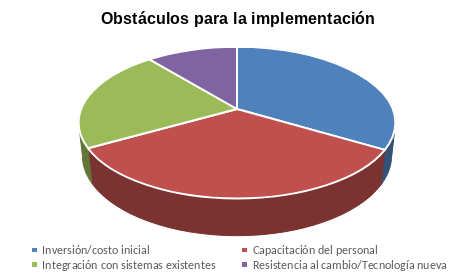

**Interpretación**:
La inversión inicial y la capacitación aparecen como los obstáculos más universales (100%), indicando que cualquier estrategia de implementación debe enfrentar estos retos de manera prioritaria. Los problemas de integración tecnológica y la resistencia al cambio son relevantes para algunos (66% y 33%), lo que sugiere la necesidad de acompañamiento técnico y de gestión del cambio en los proyectos de digitalización.

### Tabla de problemas identificados
La tabla muestra los principales problemas que enfrentan los entrevistados en la gestión de inventarios médicos, tales como la falta de monitoreo en tiempo real, la dependencia de registros manuales, el riesgo de desabastecimiento, las pérdidas por vencimiento o deterioro, la confiabilidad de los equipos en la cadena de frío y la baja integración entre sistemas. Se indica para cada problema si fue mencionado en cada entrevista y se cuantifica su recurrencia en porcentaje.

  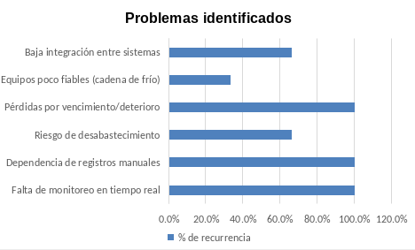

**Interpretación**:
Los problemas más críticos (falta de monitoreo, registro manual y pérdidas por vencimiento/deterioro) aparecen en todas las entrevistas (100%), lo que evidencia que son desafíos transversales en el sector. El riesgo de desabastecimiento y la baja integración son señalados por dos de los tres entrevistados (66%), y la confiabilidad de los equipos de refrigeración sólo por uno (33%). Estos resultados sugieren que la digitalización y integración de procesos son necesidades urgentes y generalizadas en la gestión actual de insumos médicos.

### Beneficios esperados del IoT
La tabla sintetiza las ventajas que los entrevistados asocian a la implementación de soluciones IoT en el sector salud, como el monitoreo en tiempo real, reducción de pérdidas económicas, mejora de la trazabilidad, mejor toma de decisiones y mayor seguridad para los pacientes. Cada beneficio se marca según su presencia en las entrevistas y su porcentaje de recurrencia.

  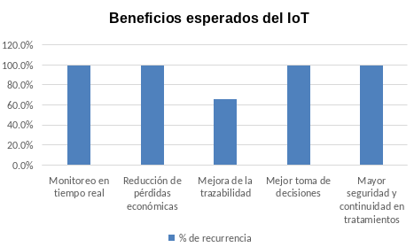

**Interpretación**:
Todos los entrevistados califican el monitoreo en tiempo real, la reducción de pérdidas, la mejor toma de decisiones y el impacto positivo en el tratamiento como beneficios clave (100%), reafirmando el potencial de estas tecnologías para transformar la administración de insumos y medicamentos. La mejora de la trazabilidad es relevante para la mayoría (66%), lo que indica una tendencia hacia procesos más transparentes y flujos de información confiables.

### Necesidades prioritarias
La última tabla enumera las necesidades más urgentes que los entrevistados consideran fundamentales para optimizar la gestión de insumos con tecnología IoT: reportes automáticos, alertas preventivas, soporte técnico constante y capacitación continua. Se exponen el grado de coincidencia y el porcentaje.

  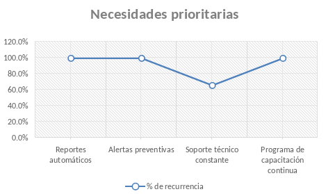

**Interpretación**:
Reportes automáticos, alertas preventivas y capacitación continua reciben unanimidad (100%), mostrando que los entrevistados valoran las herramientas que promuevan prevención, control oportuno y formación del personal. El soporte técnico es importante para la mayoría (66%), lo que resalta la necesidad de servicios postventa robustos y acompañamiento durante la fase de adopción tecnológica.

## 2.3. Needfinding
### 2.3.1. User Personas

### 2.3.2. User Task Matrix

La siguiente matriz organiza las **tareas clave de los usuarios** en relación con su **frecuencia** y **criticidad** para el sistema de gestión de inventario médico con IoT. Esto permite priorizar el desarrollo de funcionalidades.

| **Tarea del Usuario**                     | **Descripción**                                                                 | **Frecuencia** | **Criticidad** |
|-------------------------------------------|---------------------------------------------------------------------------------|----------------|----------------|
| Monitorear condiciones en tiempo real      | Verificar temperatura, humedad y estado de insumos críticos desde el dashboard. | Alta           | Alta           |
| Recibir alertas preventivas                | Notificaciones sobre fallos de equipos, riesgo de desabastecimiento o vencimiento. | Alta        | Alta           |
| Generar reportes automáticos               | Obtener reportes diarios/semanales sobre stock, pérdidas y estado de conservación. | Media       | Alta           |
| Registrar entrada/salida de insumos        | Controlar movimientos de inventario para mantener trazabilidad.                  | Alta           | Alta           |
| Validar acceso autorizado                  | Garantizar que solo personal habilitado pueda acceder al área de inventario.     | Media          | Alta           |
| Revisar historial de trazabilidad          | Consultar el ciclo de vida de un insumo (ingreso, uso, salida).                  | Media          | Media          |
| Capacitarse en el uso del sistema          | Recibir formación para adaptarse a la herramienta IoT.                           | Baja           | Alta           |
| Solicitar soporte técnico                  | Pedir asistencia en caso de fallos o dudas con el sistema.                       | Baja           | Media          |

### Interpretación
- **Alta frecuencia y alta criticidad**: Deben ser funcionalidades **core** en la primera versión (MVP).  
- **Baja frecuencia pero alta criticidad**: Requieren especial atención en diseño e implementación (ej. capacitación, control de acceso).  
- **Media criticidad**: Pueden priorizarse en fases posteriores, siempre que no afecten la seguridad del inventario.  

### 2.3.3. User Journey Mapping

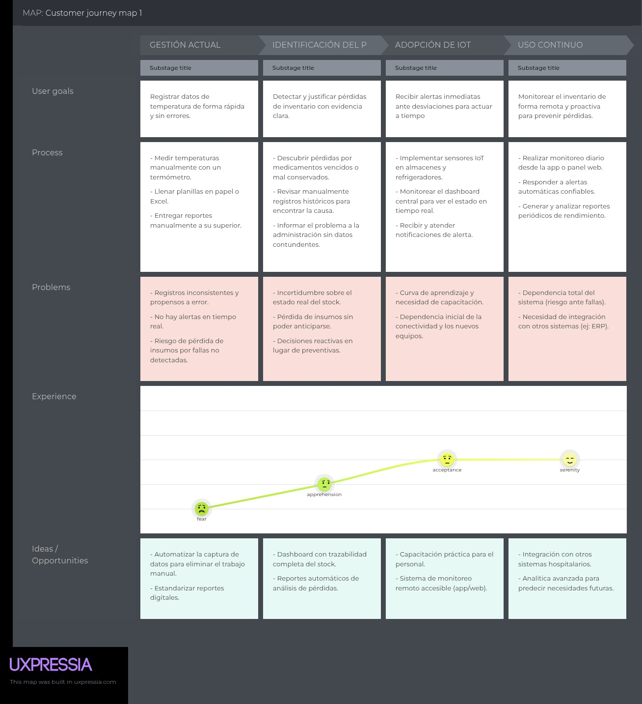

### 2.3.4. Empathy Mapping

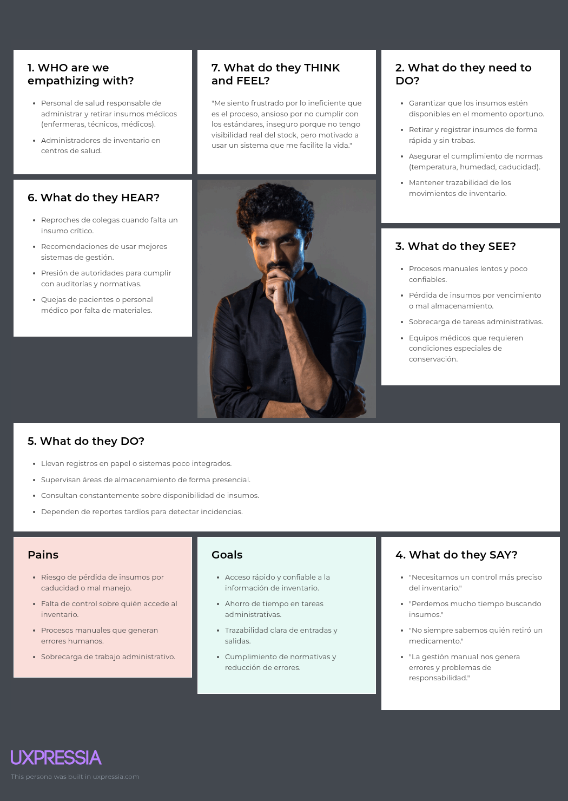

## 2.4. Big Picture EventStorming

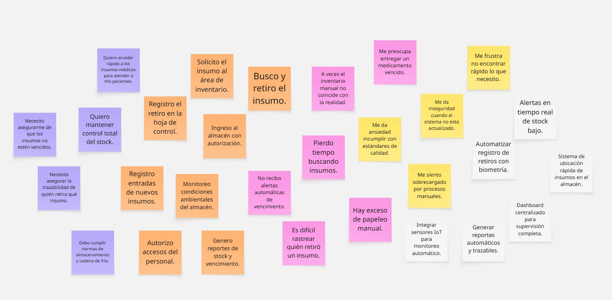

## 2.5. Ubiquitous Language

A continuación, se presentan los términos clave identificados a partir de las entrevistas, el análisis y los requerimientos del sistema:

| **Término**                | **Definición dentro del dominio**                                                                 |
|-----------------------------|---------------------------------------------------------------------------------------------------|
| **Insumo médico**          | Todo medicamento, dispositivo, material o recurso necesario para la atención en salud.             |
| **Inventario médico**       | Conjunto organizado de insumos disponibles, con registro de cantidad, ubicación, estado y fecha.   |
| **Cadena de frío**          | Condiciones de temperatura controlada necesarias para preservar la eficacia de medicamentos.       |
| **Monitoreo en tiempo real**| Supervisión continua de variables (ej. temperatura, humedad, stock) con actualizaciones instantáneas. |
| **Registro manual**         | Métodos tradicionales de anotación en papel o Excel utilizados para controlar insumos.             |
| **Trazabilidad**            | Capacidad de rastrear el ciclo completo de un insumo: ingreso, conservación, uso y salida.         |
| **Desabastecimiento**       | Situación en la que un insumo requerido no está disponible en el inventario.                      |
| **Pérdida por vencimiento** | Descarte de insumos debido a que superaron su fecha de caducidad.                                  |
| **Pérdida por deterioro**   | Insumos descartados por no cumplir con las condiciones de conservación (ej. cadena de frío rota).  |
| **Reporte automático**      | Documento o registro generado automáticamente por el sistema que refleja el estado del inventario. |
| **Alerta preventiva**       | Notificación inmediata ante un riesgo detectado (ej. aumento de temperatura, bajo stock).          |
| **Soporte técnico**         | Acompañamiento especializado durante la adopción y mantenimiento del sistema IoT.                  |
| **Capacitación continua**   | Proceso de formación para que el personal use eficazmente la solución tecnológica.                 |
| **Dashboard**               | Panel web/móvil que centraliza métricas, reportes y alertas para la gestión de inventario.         |
| **Acceso autorizado**       | Control de ingreso físico o digital restringido al personal habilitado para manipular insumos.     |
| **Integración de sistemas** | Conexión entre la solución IoT y otros sistemas de información (HIS, ERP, etc.).                   |

# Capítulo III: Requirements Specification

## 3.1. User Stories

<table>
<colgroup>
<col style="width: 11%" />
<col style="width: 18%" />
<col style="width: 30%" />
<col style="width: 30%" />
<col style="width: 11%" />
</colgroup>
<tbody>
<tr class="odd">
<td>Epic / Story ID</td>
<td>Título</td>
<td>Descripción</td>
<td>Criterios de Aceptación</td>
<td>Relación Epic ID</td>
</tr>

<tr>
  <td colspan="5" style="padding: 15px; ">
    <strong>Epic 1: Autenticación y Gestión de Usuarios</strong>
  </td>
</tr>

<tr>
  <td>E1-HU001</td>
  <td>Registro de institución (hospital/clinica)</td>
  <td>
    <strong>Como</strong> administrador institucional, 
    <strong>Quiero</strong> registrar mi organización, 
    <strong>Para</strong> habilitar espacios y usuarios propios en la plataforma
  </td>
  <td>
    <strong>Escenario 1: Registro institucional exitoso</strong> 
    <strong>Dado</strong> que proporciono datos válidos de la institución, 
    <strong>Cuando</strong> envío el formulario, 
    <strong>Entonces</strong> se crea la cuenta y recibo un correo de confirmación.  
    <strong>Escenario 2: Datos incompletos o inválidos</strong> 
    <strong>Dado</strong> que dejo campos obligatorios vacíos o con formato incorrecto, 
    <strong>Cuando</strong> intento registrar la institución, 
    <strong>Entonces</strong> el sistema muestra mensajes de error específicos.
  </td>
  <td>1</td>
</tr>

<tr>
  <td>E1-HU002</td>
  <td>Registro de usuario</td>
  <td>
    <strong>Como</strong> nuevo usuario, 
    <strong>Quiero</strong> registrarme con mis datos personales y correo electrónico, 
    <strong>Para</strong> acceder a la plataforma
  </td>
  <td>
    <strong>Escenario 1: Registro exitoso</strong> 
    <strong>Dado</strong> que el usuario quiere unirse a la plataforma, 
    <strong>Cuando</strong> completa el formulario con datos válidos, 
    <strong>Entonces</strong> se crea su cuenta y recibe un correo de verificación.  
    <strong>Escenario 2: Correo ya registrado</strong> 
    <strong>Dado</strong> que el correo ya existe en el sistema, 
    <strong>Cuando</strong> intento registrarme, 
    <strong>Entonces</strong> el sistema indica que el correo está en uso.
  </td>
  <td>1</td>
</tr>

<tr>
  <td>E1-HU003</td>
  <td>Inicio de sesión</td>
  <td>
    <strong>Como</strong> usuario registrado, 
    <strong>Quiero</strong> iniciar sesión con mi correo y contraseña, 
    <strong>Para</strong> acceder a mi cuenta de forma segura
  </td>
  <td>
    <strong>Escenario 1: Inicio exitoso</strong> 
    <strong>Dado</strong> que tengo credenciales correctas, 
    <strong>Cuando</strong> las ingreso y presiono "Iniciar sesión", 
    <strong>Entonces</strong> accedo a mi dashboard.  
    <strong>Escenario 2: Inicio fallido</strong> 
    <strong>Dado</strong> que ingreso credenciales incorrectas, 
    <strong>Cuando</strong> intento iniciar sesión, 
    <strong>Entonces</strong> veo el mensaje "usuario o contraseña inválida".
  </td>
  <td>1</td>
</tr>

<tr>
  <td>E1-HU004</td>
  <td>Cerrar sesión</td>
  <td>
    <strong>Como</strong> usuario autenticado, 
    <strong>Quiero</strong> finalizar mi sesión, 
    <strong>Para</strong> proteger el acceso a mis datos
  </td>
  <td>
    <strong>Escenario 1: Cierre exitoso</strong> 
    <strong>Dado</strong> que tengo una sesión activa, 
    <strong>Cuando</strong> selecciono "Cerrar sesión", 
    <strong>Entonces</strong> el sistema finaliza la sesión y redirige al login.  
    <strong>Escenario 2: Sin sesión activa</strong> 
    <strong>Dado</strong> que no tengo sesión, 
    <strong>Cuando</strong> accedo a la URL de cerrar sesión, 
    <strong>Entonces</strong> se muestra la pantalla de inicio de sesión.
  </td>
  <td>1</td>
</tr>

<tr>
  <td>E1-HU005</td>
  <td>Recuperación de contraseña</td>
  <td>
    <strong>Como</strong> usuario registrado, 
    <strong>Quiero</strong> recuperar mi contraseña mediante mi correo, 
    <strong>Para</strong> restablecer el acceso en caso de olvido
  </td>
  <td>
    <strong>Escenario 1: Solicitud de recuperación</strong> 
    <strong>Dado</strong> que olvidé mi contraseña, 
    <strong>Cuando</strong> ingreso mi correo en "Recuperar contraseña", 
    <strong>Entonces</strong> recibo un enlace de restablecimiento.  
    <strong>Escenario 2: Correo inexistente</strong> 
    <strong>Dado</strong> que ingreso un correo no registrado, 
    <strong>Cuando</strong> solicito recuperación, 
    <strong>Entonces</strong> el sistema informa que no existe una cuenta asociada.
  </td>
  <td>1</td>
</tr>

<tr>
  <td>E1-HU006</td>
  <td>Cambio de contraseña</td>
  <td>
    <strong>Como</strong> usuario autenticado, 
    <strong>Quiero</strong> cambiar mi contraseña desde mi perfil, 
    <strong>Para</strong> mantener mi cuenta segura
  </td>
  <td>
    <strong>Escenario 1: Cambio exitoso</strong> 
    <strong>Dado</strong> que accedo a mi perfil, 
    <strong>Cuando</strong> introduzco mi contraseña actual y la nueva válida, 
    <strong>Entonces</strong> el sistema confirma el cambio.  
    <strong>Escenario 2: Error de validación</strong> 
    <strong>Dado</strong> que ingreso la contraseña actual incorrecta, 
    <strong>Cuando</strong> intento guardar, 
    <strong>Entonces</strong> el sistema muestra un mensaje de error.
  </td>
  <td>1</td>
</tr>

<tr>
  <td>E1-HU007</td>
  <td>Gestión de perfil de usuario</td>
  <td>
    <strong>Como</strong> usuario autenticado, 
    <strong>Quiero</strong> ver y editar mi información de perfil, 
    <strong>Para</strong> mantener mis datos actualizados
  </td>
  <td>
    <strong>Escenario 1: Visualización de perfil</strong> 
    <strong>Dado</strong> que he iniciado sesión, 
    <strong>Cuando</strong> accedo a "Mi perfil", 
    <strong>Entonces</strong> veo mi información registrada.  
    <strong>Escenario 2: Edición de perfil</strong> 
    <strong>Dado</strong> que deseo actualizar mis datos, 
    <strong>Cuando</strong> guardo los cambios, 
    <strong>Entonces</strong> la nueva información se muestra correctamente.
  </td>
  <td>1</td>
</tr>

<tr>
  <td>E1-HU008</td>
  <td>Roles y permisos (RBAC)</td>
  <td>
    <strong>Como</strong> administrador institucional, 
    <strong>Quiero</strong> asignar roles (farmacia, clínica, admin, auditor), 
    <strong>Para</strong> controlar permisos de acceso
  </td>
  <td>
    <strong>Escenario 1: Asignación exitosa</strong> 
    <strong>Dado</strong> que el usuario está registrado, 
    <strong>Cuando</strong> le asigno un rol, 
    <strong>Entonces</strong> obtiene los permisos correspondientes.  
    <strong>Escenario 2: Rol inexistente</strong> 
    <strong>Dado</strong> que intento asignar un rol no definido, 
    <strong>Cuando</strong> confirmo la acción, 
    <strong>Entonces</strong> el sistema muestra "rol inválido".
  </td>
  <td>1</td>
</tr>

<tr>
  <td>E1-HU009</td>
  <td>Políticas de sesión (expiración e inactividad)</td>
  <td>
    <strong>Como</strong> responsable TI, 
    <strong>Quiero</strong> configurar expiración de sesión por inactividad, 
    <strong>Para</strong> reducir riesgos de acceso no autorizado
  </td>
  <td>
    <strong>Escenario 1: Sesión expirada</strong> 
    <strong>Dado</strong> que el usuario estuvo inactivo por N minutos, 
    <strong>Cuando</strong> intenta acceder a una vista protegida, 
    <strong>Entonces</strong> se redirige al inicio de sesión con mensaje de expiración.  
    <strong>Escenario 2: Tiempo configurable</strong> 
    <strong>Dado</strong> que TI actualiza el umbral de inactividad, 
    <strong>Cuando</strong> guarda la configuración, 
    <strong>Entonces</strong> el nuevo tiempo aplica para sesiones futuras.
  </td>
  <td>1</td>
</tr>

<tr>
  <td>E1-HU010</td>
  <td>Segundo factor de autenticación (2FA OTP)</td>
  <td>
    <strong>Como</strong> usuario con permisos críticos, 
    <strong>Quiero</strong> habilitar 2FA mediante OTP, 
    <strong>Para</strong> reforzar la seguridad de acceso
  </td>
  <td>
    <strong>Escenario 1: OTP válido</strong> 
    <strong>Dado</strong> que el 2FA está activado, 
    <strong>Cuando</strong> ingreso el OTP correcto, 
    <strong>Entonces</strong> el sistema permite el acceso.  
    <strong>Escenario 2: OTP inválido o múltiples fallos</strong> 
    <strong>Dado</strong> que ingreso un OTP incorrecto repetidas veces, 
    <strong>Cuando</strong> excedo el límite, 
    <strong>Entonces</strong> la cuenta se bloquea temporalmente y se notifica al usuario.
  </td>
  <td>1</td>
</tr>

</tbody>
</table>

<table>
<colgroup>
<col style="width: 11%" />
<col style="width: 18%" />
<col style="width: 30%" />
<col style="width: 30%" />
<col style="width: 11%" />
</colgroup>
<tbody>
<tr class="odd">
<td>Epic / Story ID</td>
<td>Título</td>
<td>Descripción</td>
<td>Criterios de Aceptación</td>
<td>Relación Epic ID</td>
</tr>

<tr>
  <td colspan="5" style="padding: 15px; ">
    <strong>Epic 2: Dispositivos IoT (provisión y salud)</strong>
  </td>
</tr>

<tr>
  <td>E2-HU011</td>
  <td>Alta / provisión de dispositivo IoT</td>
  <td>
    <strong>Como</strong> TI, 
    <strong>Quiero</strong> registrar un dispositivo (ID, clave, tipo), 
    <strong>Para</strong> vincularlo y comenzar a operar
  </td>
  <td>
    <strong>Escenario 1: Provisión exitosa</strong> 
    <strong>Dado</strong> que el ID es único y las credenciales son válidas, 
    <strong>Cuando</strong> completo el alta, 
    <strong>Entonces</strong> el dispositivo queda listo para asignación.  
    <strong>Escenario 2: ID duplicado</strong> 
    <strong>Dado</strong> que el ID ya existe, 
    <strong>Cuando</strong> intento registrar el dispositivo, 
    <strong>Entonces</strong> el sistema rechaza la operación con mensaje claro.
  </td>
  <td>2</td>
</tr>

<tr>
  <td>E2-HU012</td>
  <td>Asignar dispositivo a ubicación</td>
  <td>
    <strong>Como</strong> farmacia, 
    <strong>Quiero</strong> asociar cada dispositivo a una cámara/área, 
    <strong>Para</strong> contextualizar correctamente las lecturas
  </td>
  <td>
    <strong>Escenario 1: Asignación visible</strong> 
    <strong>Dado</strong> que selecciono un dispositivo y una ubicación, 
    <strong>Cuando</strong> confirmo la asignación, 
    <strong>Entonces</strong> el panel muestra el dispositivo bajo esa área.  
    <strong>Escenario 2: Reasignación bloqueada por alerta</strong> 
    <strong>Dado</strong> que el dispositivo tiene alertas abiertas, 
    <strong>Cuando</strong> intento reasignarlo, 
    <strong>Entonces</strong> el sistema impide la acción e indica cerrar alertas primero.
  </td>
  <td>2</td>
</tr>

<tr>
  <td>E2-HU013</td>
  <td>Monitoreo de salud del dispositivo</td>
  <td>
    <strong>Como</strong> TI, 
    <strong>Quiero</strong> ver señal, último ping y estado del dispositivo, 
    <strong>Para</strong> anticipar fallas y mantener disponibilidad
  </td>
  <td>
    <strong>Escenario 1: Estado en línea/mudo</strong> 
    <strong>Dado</strong> que el dispositivo reporta heartbeats, 
    <strong>Cuando</strong> el último ping está dentro del umbral, 
    <strong>Entonces</strong> se muestra "en línea"; de lo contrario "mudo".  
    <strong>Escenario 2: Alerta por inactividad</strong> 
    <strong>Dado</strong> que no hay ping por más de N minutos, 
    <strong>Cuando</strong> se supera el umbral, 
    <strong>Entonces</strong> se genera una alerta de dispositivo inactivo.
  </td>
  <td>2</td>
</tr>

<tr>
  <td>E2-HU014</td>
  <td>Actualización OTA de firmware</td>
  <td>
    <strong>Como</strong> TI, 
    <strong>Quiero</strong> actualizar firmware de forma remota (OTA), 
    <strong>Para</strong> corregir fallos y aplicar mejoras
  </td>
  <td>
    <strong>Escenario 1: OTA exitosa</strong> 
    <strong>Dado</strong> que selecciono una versión disponible, 
    <strong>Cuando</strong> ejecuto la actualización, 
    <strong>Entonces</strong> el dispositivo reinicia y reporta la nueva versión.  
    <strong>Escenario 2: Fallo de checksum/rollback</strong> 
    <strong>Dado</strong> que la imagen no pasa la verificación, 
    <strong>Cuando</strong> el dispositivo detecta el fallo, 
    <strong>Entonces</strong> revierte a la versión anterior y notifica el error.
  </td>
  <td>2</td>
</tr>

<tr>
  <td>E2-HU015</td>
  <td>Buffer local (store-and-forward)</td>
  <td>
    <strong>Como</strong> TI, 
    <strong>Quiero</strong> que el nodo almacene lecturas cuando no hay red, 
    <strong>Para</strong> evitar pérdida de datos y reenviarlos al reconectar
  </td>
  <td>
    <strong>Escenario 1: Reenvío al reconectar</strong> 
    <strong>Dado</strong> que hubo un corte de conectividad, 
    <strong>Cuando</strong> el enlace se restablece, 
    <strong>Entonces</strong> el nodo reenvía lecturas pendientes en orden.  
    <strong>Escenario 2: Marcas de tiempo preservadas</strong> 
    <strong>Dado</strong> que se almacenaron lecturas en buffer, 
    <strong>Cuando</strong> se procesan en el backend, 
    <strong>Entonces</strong> conservan su timestamp original.
  </td>
  <td>2</td>
</tr>

</tbody>
</table>

<table>
<colgroup>
<col style="width: 11%" />
<col style="width: 18%" />
<col style="width: 30%" />
<col style="width: 30%" />
<col style="width: 11%" />
</colgroup>
<tbody>
<tr class="odd">
<td>Epic / Story ID</td>
<td>Título</td>
<td>Descripción</td>
<td>Criterios de Aceptación</td>
<td>Relación Epic ID</td>
</tr>

<tr>
  <td colspan="5" style="padding: 15px; ">
    <strong>Epic 3: Monitoreo y Alertas</strong>
  </td>
</tr>

<tr>
  <td>E3-HU016</td>
  <td>Configurar umbrales por ubicación/ítem</td>
  <td>
    <strong>Como</strong> farmacia, 
    <strong>Quiero</strong> definir rangos de T°/HR por cámara e ítem, 
    <strong>Para</strong> generar alertas precisas según contexto
  </td>
  <td>
    <strong>Escenario 1: Guardado de umbrales</strong> 
    <strong>Dado</strong> que ingreso límites válidos, 
    <strong>Cuando</strong> guardo la configuración, 
    <strong>Entonces</strong> el sistema aplica los nuevos umbrales.  
    <strong>Escenario 2: Historial de cambios</strong> 
    <strong>Dado</strong> que modifico un umbral, 
    <strong>Cuando</strong> se guarda, 
    <strong>Entonces</strong> se registra quién y cuándo hizo el cambio.
  </td>
  <td>3</td>
</tr>

<tr>
  <td>E3-HU017</td>
  <td>Alertas por tiempo fuera de rango</td>
  <td>
    <strong>Como</strong> farmacia, 
    <strong>Quiero</strong> generar alertas si T°/HR está fuera de rango por más de N minutos, 
    <strong>Para</strong> evitar falsos positivos y reaccionar a tiempo
  </td>
  <td>
    <strong>Escenario 1: Ventana de tolerancia</strong> 
    <strong>Dado</strong> que la T° sale de rango, 
    <strong>Cuando</strong> el evento supera N minutos, 
    <strong>Entonces</strong> se crea una alerta.  
    <strong>Escenario 2: Vuelve a rango antes de N</strong> 
    <strong>Dado</strong> que la T° regresó al rango, 
    <strong>Cuando</strong> ocurre antes del umbral, 
    <strong>Entonces</strong> no se genera alerta.
  </td>
  <td>3</td>
</tr>

<tr>
  <td>E3-HU018</td>
  <td>Preferencias de notificación (web/email/SMS/WhatsApp)</td>
  <td>
    <strong>Como</strong> usuario, 
    <strong>Quiero</strong> elegir canales y ventanas horarias de notificación, 
    <strong>Para</strong> recibir alertas oportunas sin ruido
  </td>
  <td>
    <strong>Escenario 1: Envío por canal elegido</strong> 
    <strong>Dado</strong> que seleccioné email y WhatsApp, 
    <strong>Cuando</strong> se emite una alerta, 
    <strong>Entonces</strong> recibo notificación por esos canales.  
    <strong>Escenario 2: Modo silencio</strong> 
    <strong>Dado</strong> que configuré horario silencioso, 
    <strong>Cuando</strong> se genera una alerta en ese periodo, 
    <strong>Entonces</strong> no se envía notificación (salvo críticas si así se definió).
  </td>
  <td>3</td>
</tr>

<tr>
  <td>E3-HU019</td>
  <td>Acknowledgement y cierre con evidencia</td>
  <td>
    <strong>Como</strong> jefe de farmacia, 
    <strong>Quiero</strong> exigir ACK y cierre con foto/nota, 
    <strong>Para</strong> garantizar trazabilidad en auditorías
  </td>
  <td>
    <strong>Escenario 1: Cierre con evidencia</strong> 
    <strong>Dado</strong> que existe una alerta activa, 
    <strong>Cuando</strong> intento cerrarla, 
    <strong>Entonces</strong> el sistema requiere adjuntar evidencia y comentario.  
    <strong>Escenario 2: Auditoría de cierre</strong> 
    <strong>Dado</strong> que la alerta fue cerrada, 
    <strong>Cuando</strong> consulto el detalle, 
    <strong>Entonces</strong> veo quién cerró, cuándo y la evidencia asociada.
  </td>
  <td>3</td>
</tr>

<tr>
  <td>E3-HU020</td>
  <td>Escalamiento por SLA</td>
  <td>
    <strong>Como</strong> administrador, 
    <strong>Quiero</strong> escalar alertas no atendidas en X minutos, 
    <strong>Para</strong> asegurar tiempos de respuesta bajos
  </td>
  <td>
    <strong>Escenario 1: Escalamiento activo</strong> 
    <strong>Dado</strong> que una alerta sigue sin ACK, 
    <strong>Cuando</strong> se cumple el SLA configurado, 
    <strong>Entonces</strong> se notifica al siguiente rol en la cadena.  
    <strong>Escenario 2: Evitar duplicados</strong> 
    <strong>Dado</strong> que la alerta ya fue aceptada, 
    <strong>Cuando</strong> llega el tiempo de escalamiento, 
    <strong>Entonces</strong> el sistema no envía notificación duplicada.
  </td>
  <td>3</td>
</tr>

<tr>
  <td>E3-HU021</td>
  <td>Dashboard principal (KPIs y mapa de riesgo)</td>
  <td>
    <strong>Como</strong> usuario, 
    <strong>Quiero</strong> visualizar un panel con estado por áreas, KPIs y últimas alertas, 
    <strong>Para</strong> priorizar acciones rápidamente
  </td>
  <td>
    <strong>Escenario 1: Semáforos por área</strong> 
    <strong>Dado</strong> que existen umbrales definidos, 
    <strong>Cuando</strong> accedo al panel, 
    <strong>Entonces</strong> veo tarjetas en verde/amarillo/rojo según cumplimiento.  
    <strong>Escenario 2: Sin datos</strong> 
    <strong>Dado</strong> que aún no hay lecturas, 
    <strong>Cuando</strong> visualizo el panel, 
    <strong>Entonces</strong> se muestra estado vacío y recomendaciones de configuración.
  </td>
  <td>3</td>
</tr>

</tbody>
</table>

<table>
<colgroup>
<col style="width: 11%" />
<col style="width: 18%" />
<col style="width: 30%" />
<col style="width: 30%" />
<col style="width: 11%" />
</colgroup>
<tbody>
<tr class="odd">
<td>Epic / Story ID</td>
<td>Título</td>
<td>Descripción</td>
<td>Criterios de Aceptación</td>
<td>Relación Epic ID</td>
</tr>

<tr>
  <td colspan="5" style="padding: 15px; ">
    <strong>Epic 4: Inventario, Lotes y FEFO</strong>
  </td>
</tr>

<tr>
  <td>E4-HU022</td>
  <td>Registro de ítems, lotes y vencimientos</td>
  <td>
    <strong>Como</strong> farmacia, 
    <strong>Quiero</strong> registrar ítems, lotes y fechas de vencimiento, 
    <strong>Para</strong> gestionar FEFO correctamente
  </td>
  <td>
    <strong>Escenario 1: Alta y edición</strong> 
    <strong>Dado</strong> que ingreso datos válidos, 
    <strong>Cuando</strong> creo o edito un ítem/lote, 
    <strong>Entonces</strong> se guarda con validaciones de formato y duplicidad.  
    <strong>Escenario 2: Bloqueo por movimientos</strong> 
    <strong>Dado</strong> que un lote tiene movimientos asociados, 
    <strong>Cuando</strong> intento eliminarlo, 
    <strong>Entonces</strong> el sistema impide la eliminación y sugiere un ajuste.
  </td>
  <td>4</td>
</tr>

<tr>
  <td>E4-HU023</td>
  <td>Alertas de vencimientos (30/7/1 días)</td>
  <td>
    <strong>Como</strong> farmacia, 
    <strong>Quiero</strong> recibir alertas de próximos a vencer, 
    <strong>Para</strong> rotar stock a tiempo y reducir mermas
  </td>
  <td>
    <strong>Escenario 1: Listado y avisos</strong> 
    <strong>Dado</strong> que hay lotes por vencer en 30/7/1 días, 
    <strong>Cuando</strong> consulto "Próximos a vencer", 
    <strong>Entonces</strong> veo el listado y se envían notificaciones a responsables.  
    <strong>Escenario 2: Sin próximos a vencer</strong> 
    <strong>Dado</strong> que no hay lotes dentro del rango, 
    <strong>Cuando</strong> abro la vista, 
    <strong>Entonces</strong> el sistema muestra "sin ítems próximos a vencer".
  </td>
  <td>4</td>
</tr>

<tr>
  <td>E4-HU024</td>
  <td>Mínimos/máximos y punto de reorden</td>
  <td>
    <strong>Como</strong> logística, 
    <strong>Quiero</strong> configurar min/max y punto de reorden por ítem/ubicación, 
    <strong>Para</strong> activar reposición oportuna
  </td>
  <td>
    <strong>Escenario 1: Alerta por mínimo</strong> 
    <strong>Dado</strong> que el stock cae al mínimo, 
    <strong>Cuando</strong> se alcanza el umbral, 
    <strong>Entonces</strong> se genera una alerta de reposición.  
    <strong>Escenario 2: Sugerencia de cantidad</strong> 
    <strong>Dado</strong> el histórico de consumo, 
    <strong>Cuando</strong> se crea la solicitud, 
    <strong>Entonces</strong> el sistema sugiere una cantidad de compra.
  </td>
  <td>4</td>
</tr>

<tr>
  <td>E4-HU025</td>
  <td>Sugerencia FEFO en salida</td>
  <td>
    <strong>Como</strong> enfermería/quirófano, 
    <strong>Quiero</strong> que el sistema sugiera el lote más próximo a vencer, 
    <strong>Para</strong> cumplir FEFO al retirar insumos
  </td>
  <td>
    <strong>Escenario 1: Orden FEFO</strong> 
    <strong>Dado</strong> que hay varios lotes disponibles, 
    <strong>Cuando</strong> selecciono un ítem para salida, 
    <strong>Entonces</strong> se listan por fecha de vencimiento ascendente.  
    <strong>Escenario 2: Advertencia por no FEFO</strong> 
    <strong>Dado</strong> que elijo un lote que no es el más próximo a vencer, 
    <strong>Cuando</strong> intento confirmar, 
    <strong>Entonces</strong> el sistema muestra advertencia y permite justificar.
  </td>
  <td>4</td>
</tr>

<tr>
  <td>E4-HU026</td>
  <td>Recepción con evidencia de cadena de frío</td>
  <td>
    <strong>Como</strong> logística, 
    <strong>Quiero</strong> registrar recepción con fotos y T° de transporte, 
    <strong>Para</strong> asegurar condiciones de cadena de frío
  </td>
  <td>
    <strong>Escenario 1: Recepción con evidencia</strong> 
    <strong>Dado</strong> que arriban insumos de frío, 
    <strong>Cuando</strong> registro la recepción, 
    <strong>Entonces</strong> adjunto fotos y T° y el sistema valida la obligatoriedad.  
    <strong>Escenario 2: Falta de evidencia</strong> 
    <strong>Dado</strong> que no adjunto evidencia requerida, 
    <strong>Cuando</strong> intento finalizar, 
    <strong>Entonces</strong> el sistema rechaza el registro e indica los faltantes.
  </td>
  <td>4</td>
</tr>

<tr>
  <td>E4-HU027</td>
  <td>Conteo cíclico y ajuste de stock</td>
  <td>
    <strong>Como</strong> farmacia, 
    <strong>Quiero</strong> realizar conteos cíclicos y ajustes auditables, 
    <strong>Para</strong> mantener precisión del inventario
  </td>
  <td>
    <strong>Escenario 1: Diferencias justificadas</strong> 
    <strong>Dado</strong> que el conteo difiere del sistema, 
    <strong>Cuando</strong> registro un ajuste, 
    <strong>Entonces</strong> debo ingresar motivo y responsable.  
    <strong>Escenario 2: Bitácora de ajustes</strong> 
    <strong>Dado</strong> que se han realizado ajustes, 
    <strong>Cuando</strong> consulto la bitácora, 
    <strong>Entonces</strong> veo usuario, fecha y detalle de cada ajuste.
  </td>
  <td>4</td>
</tr>

</tbody>
</table>

<table>
<colgroup>
<col style="width: 11%" />
<col style="width: 18%" />
<col style="width: 30%" />
<col style="width: 30%" />
<col style="width: 11%" />
</colgroup>
<tbody>
<tr class="odd">
<td>Epic / Story ID</td>
<td>Título</td>
<td>Descripción</td>
<td>Criterios de Aceptación</td>
<td>Relación Epic ID</td>
</tr>

<tr>
  <td colspan="5" style="padding: 15px; ">
    <strong>Epic 5: Reportes, Integración y Auditoría</strong>
  </td>
</tr>

<tr>
  <td>E5-HU028</td>
  <td>Reporte semanal de excursiones y mermas</td>
  <td>
    <strong>Como</strong> calidad, 
    <strong>Quiero</strong> un reporte semanal con % fuera de rango y mermas en S/., 
    <strong>Para</strong> auditorías y mejora continua
  </td>
  <td>
    <strong>Escenario 1: Filtros y exportación</strong> 
    <strong>Dado</strong> que existen datos registrados, 
    <strong>Cuando</strong> aplico filtros por área/periodo, 
    <strong>Entonces</strong> obtengo el reporte y puedo exportar a CSV/PDF.  
    <strong>Escenario 2: Sin datos en el rango</strong> 
    <strong>Dado</strong> que no hay eventos en el periodo, 
    <strong>Cuando</strong> genero el reporte, 
    <strong>Entonces</strong> se muestra un mensaje indicando ausencia de datos.
  </td>
  <td>5</td>
</tr>

<tr>
  <td>E5-HU029</td>
  <td>Import/Export de maestros y movimientos</td>
  <td>
    <strong>Como</strong> integración/ERP, 
    <strong>Quiero</strong> importar catálogo y exportar movimientos, 
    <strong>Para</strong> conciliar datos con sistemas externos
  </td>
  <td>
    <strong>Escenario 1: Importación válida</strong> 
    <strong>Dado</strong> que cargo un archivo con formato correcto, 
    <strong>Cuando</strong> ejecuto la importación, 
    <strong>Entonces</strong> el sistema crea/actualiza registros y muestra un resumen.  
    <strong>Escenario 2: Errores de formato</strong> 
    <strong>Dado</strong> que el archivo tiene filas inválidas, 
    <strong>Cuando</strong> intento importarlo, 
    <strong>Entonces</strong> se genera un reporte de errores descargable.
  </td>
  <td>5</td>
</tr>

<tr>
  <td>E5-HU030</td>
  <td>Bitácora de auditoría completa</td>
  <td>
    <strong>Como</strong> auditor, 
    <strong>Quiero</strong> ver quién cambió umbrales, cerró alertas y editó lotes, 
    <strong>Para</strong> garantizar trazabilidad y cumplimiento
  </td>
  <td>
    <strong>Escenario 1: Registro detallado</strong> 
    <strong>Dado</strong> que se realizan acciones en el sistema, 
    <strong>Cuando</strong> consulto la auditoría, 
    <strong>Entonces</strong> veo usuario, acción, fecha/hora e IP.  
    <strong>Escenario 2: Exportación de auditoría</strong> 
    <strong>Dado</strong> que necesito evidencias, 
    <strong>Cuando</strong> exporto la bitácora, 
    <strong>Entonces</strong> obtengo un archivo para inspección.
  </td>
  <td>5</td>
</tr>

<tr>
  <td>E5-HU031</td>
  <td>Gestión de calibración de sensores</td>
  <td>
    <strong>Como</strong> ingeniería clínica, 
    <strong>Quiero</strong> registrar certificados y alertas de vencimiento de calibración, 
    <strong>Para</strong> asegurar precisión de medición
  </td>
  <td>
    <strong>Escenario 1: Alerta de calibración próxima a vencer</strong> 
    <strong>Dado</strong> que un sensor está por vencer su calibración, 
    <strong>Cuando</strong> faltan X días, 
    <strong>Entonces</strong> se genera una alerta preventiva.  
    <strong>Escenario 2: Bloqueo configurable</strong> 
    <strong>Dado</strong> que el certificado venció, 
    <strong>Cuando</strong> el bloqueo está habilitado, 
    <strong>Entonces</strong> el sistema impide usar datos de ese sensor hasta regularizar.
  </td>
  <td>5</td>
</tr>

<tr>
  <td>E5-HU032</td>
  <td>Reporte de cumplimiento normativo (GDP/guías)</td>
  <td>
    <strong>Como</strong> calidad, 
    <strong>Quiero</strong> generar un informe con evidencias de cadena de frío y acciones correctivas, 
    <strong>Para</strong> presentar en inspecciones regulatorias
  </td>
  <td>
    <strong>Escenario 1: Informe completo</strong> 
    <strong>Dado</strong> que existen excursiones, cierres con evidencia y calibraciones vigentes, 
    <strong>Cuando</strong> genero el informe por periodo/área, 
    <strong>Entonces</strong> se compilan hallazgos y acciones con firma digital.  
    <strong>Escenario 2: Datos insuficientes</strong> 
    <strong>Dado</strong> que faltan evidencias o calibraciones, 
    <strong>Cuando</strong> intento generar el informe, 
    <strong>Entonces</strong> el sistema indica los requisitos faltantes.
  </td>
  <td>5</td>
</tr>

</tbody>
</table>

## 3.2. Impact Mapping 

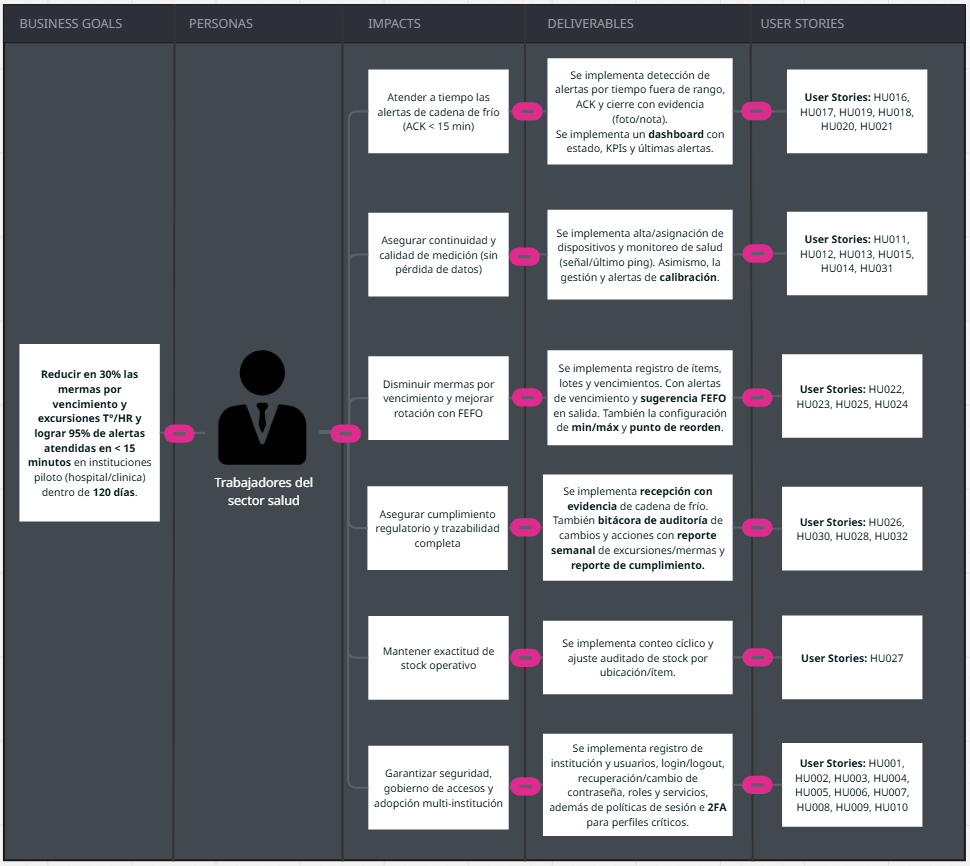

## 3.3. Product Backlog
| Orden | User Story / Technical Story Id | Título                                                   | Descripción                                                                                                                                                       | Story Points |
| ----- | ------------------------------- | -------------------------------------------------------- | ----------------------------------------------------------------------------------------------------------------------------------------------------------------- | ------------ |
| 1     | HU001                           | Registro de institución (hospital/clinica)               | Como administrador institucional, quiero registrar mi organización para habilitar espacios y usuarios propios en la plataforma.                                   | 5            |
| 2     | HU002                           | Registro de usuario                                      | Como nuevo usuario, quiero registrarme con mis datos personales y correo para acceder a la plataforma.                                                             | 5            |
| 3     | HU003                           | Inicio de sesión                                         | Como usuario registrado, quiero iniciar sesión con mi correo y contraseña para acceder de forma segura.                                                            | 3            |
| 4     | HU004                           | Cerrar sesión                                            | Como usuario autenticado, quiero poder cerrar sesión para proteger el acceso a mis datos.                                                                          | 1            |
| 5     | HU007                           | Gestión de perfil de usuario                             | Como usuario autenticado, quiero ver y editar mi información de perfil para mantener mis datos actualizados.                                                      | 2            |
| 6     | HU005                           | Recuperación de contraseña                               | Como usuario registrado, quiero recuperar mi contraseña vía correo para restablecer el acceso a mi cuenta.                                                         | 2            |
| 7     | HU006                           | Cambio de contraseña                                     | Como usuario autenticado, quiero cambiar mi contraseña desde mi perfil para mantener mi cuenta segura.                                                             | 1            |
| 8     | HU008                           | Roles y permisos (RBAC)                                  | Como administrador institucional, quiero asignar roles (farmacia, clínica, admin, auditor) para controlar permisos de acceso.                                     | 5            |
| 9     | HU009                           | Políticas de sesión (expiración e inactividad)           | Como responsable TI, quiero configurar la expiración por inactividad para reducir riesgos de acceso no autorizado.                                                 | 3            |
| 10    | HU010                           | Segundo factor de autenticación (2FA OTP)                | Como usuario con permisos críticos, quiero habilitar 2FA para reforzar la seguridad de acceso.                                                                     | 5            |
| 11    | HU011                           | Alta / provisión de dispositivo IoT                      | Como TI, quiero registrar un dispositivo (ID, clave, tipo) para vincularlo y comenzar a operar.                                                                    | 5            |
| 12    | HU012                           | Asignar dispositivo a ubicación                          | Como farmacia, quiero asociar cada dispositivo a una cámara/área para contextualizar correctamente las lecturas.                                                   | 3            |
| 13    | HU013                           | Monitoreo de salud del dispositivo                       | Como TI, quiero ver señal, último ping y estado del dispositivo para anticipar fallas y mantener disponibilidad.                                                   | 5            |
| 14    | HU015                           | Buffer local (store-and-forward)                         | Como TI, quiero que el nodo almacene lecturas cuando no hay red para evitar pérdida de datos y reenviarlas al reconectar.                                         | 8            |
| 15    | HU014                           | Actualización OTA de firmware                            | Como TI, quiero actualizar firmware de forma remota (OTA) para corregir fallos y aplicar mejoras.                                                                  | 8            |
| 16    | HU016                           | Configurar umbrales por ubicación/ítem                   | Como farmacia, quiero definir rangos de T°/HR por cámara e ítem para generar alertas precisas según contexto.                                                      | 3            |
| 17    | HU017                           | Alertas por tiempo fuera de rango                        | Como farmacia, quiero alertas si T°/HR está fuera de rango por más de N minutos para evitar falsos positivos y reaccionar a tiempo.                               | 5            |
| 18    | HU018                           | Preferencias de notificación (web/email/SMS/WhatsApp)    | Como usuario, quiero elegir canales y ventanas horarias de notificación para recibir alertas oportunas sin ruido.                                                  | 3            |
| 19    | HU020                           | Escalamiento por SLA                                     | Como administrador, quiero escalar alertas no atendidas en X minutos para asegurar tiempos de respuesta bajos.                                                     | 5            |
| 20    | HU019                           | Acknowledgement y cierre con evidencia                    | Como jefe de farmacia, quiero exigir ACK y cierre con foto/nota para garantizar trazabilidad en auditorías.                                                        | 5            |
| 21    | HU021                           | Dashboard principal (KPIs y mapa de riesgo)              | Como usuario, quiero visualizar un panel con estado por áreas, KPIs y últimas alertas para priorizar acciones rápidamente.                                         | 5            |
| 22    | HU022                           | Registro de ítems, lotes y vencimientos                  | Como farmacia, quiero registrar ítems, lotes y fechas de vencimiento para gestionar FEFO correctamente.                                                            | 5            |
| 23    | HU024                           | Mínimos/máximos y punto de reorden                       | Como logística, quiero configurar min/max y punto de reorden por ítem/ubicación para activar reposición oportuna.                                                  | 5            |
| 24    | HU023                           | Alertas de vencimientos (30/7/1 días)                    | Como farmacia, quiero recibir alertas de próximos a vencer para rotar stock a tiempo y reducir mermas.                                                             | 3            |
| 25    | HU026                           | Recepción con evidencia de cadena de frío                | Como logística, quiero registrar recepción con fotos y T° de transporte para asegurar condiciones de cadena de frío.                                               | 5            |
| 26    | HU025                           | Sugerencia FEFO en salida                                | Como enfermería/quirófano, quiero que el sistema sugiera el lote más próximo a vencer para cumplir FEFO al retirar insumos.                                        | 5            |
| 27    | HU027                           | Conteo cíclico y ajuste de stock                         | Como farmacia, quiero realizar conteos cíclicos y ajustes auditables para mantener precisión del inventario.                                                        | 5            |
| 28    | HU030                           | Bitácora de auditoría completa                           | Como auditor, quiero ver quién cambió umbrales, cerró alertas y editó lotes para garantizar trazabilidad y cumplimiento.                                           | 5            |
| 29    | HU029                           | Import/Export de maestros y movimientos                  | Como integración/ERP, quiero importar catálogo y exportar movimientos para conciliar datos con sistemas externos.                                                  | 5            |
| 30    | HU028                           | Reporte semanal de excursiones y mermas                  | Como calidad, quiero un reporte semanal con % fuera de rango y mermas en S/. para auditorías y mejora continua.                                                    | 3            |
| 31    | HU031                           | Gestión de calibración de sensores                       | Como ingeniería clínica, quiero registrar certificados y alertas de vencimiento de calibración para asegurar precisión de medición.                                | 5            |
| 32    | HU032                           | Reporte de cumplimiento normativo (GDP/guías)            | Como calidad, quiero generar un informe con evidencias de cadena de frío y acciones correctivas para presentar en inspecciones regulatorias.                       | 8            |

  # Capítulo IV: Solution Software Design

  ## 4.1. Strategic-Level Domain-Driven Design

  ### 4.1.1. Design-Level EventStorming
  #### 4.1.1.1. Candidate Context Discovery

  Aplicamos **start-with-value** (core orientado a cadena de frío y stock), **look-for-pivotal-events** y **start-with-simple** (timeline por *swimlanes* institucional, dispositivos, inventario, alertas).

  | Contexto candidato | Descripción (alcance del dominio) | Historias/Epics que lo sustentan |
  | --- | --- | --- |
  | **Identity & Access (IAM) + Preferencias** | Registro/login/logout, recuperación y cambio de contraseña, gestión de perfil y preferencias de UI (tema/idioma) y canales base. Emite identidad y *claims* al resto de la plataforma. | **HU002–HU007, HU009–HU010, HU029** (Épica 1) |
  | **Gobierno Institucional (Tenancy & Roles)** | Multitenancy: alta de instituciones, membresías, asignación de roles/permisos y *quotas* básicas. | **HU001, HU008** (Épica 1) |
  | **Gestión de Dispositivos IoT & Activos** | Provisión/alta de hardware, asignación a ubicaciones, salud de dispositivo, OTA segura y *store-and-forward*. Gestión de calibración. | **HU011–HU015, HU031** (Épica 2) |
  | **Telemetría & Monitoreo** | Ingesta de lecturas, configuración de umbrales por ubicación/ítem, detección de excursiones, ACK/cierre con evidencia, SLA/escalamiento y *dashboard* de riesgo. | **HU016–HU017, HU019–HU021** (Épica 3) |
  | **Notificaciones & Workflows** | Entrega multicanal (in-app/email/SMS/WhatsApp), ventanas horarias, deduplicación y orquestación de escalados. | **HU018, HU020** (Épica 3) |
  | **Inventario & Stock (FEFO y Cadena de Suministro)** | Catálogo de ítems, lotes y vencimientos; mínimos/máximos y punto de reorden; recepción con evidencia de cadena de frío; sugerencia FEFO; conteo cíclico y ajustes. | **HU022–HU027** (Épica 4) |
  | **Integraciones & Datos Maestros** | Import/Export de maestros y movimientos hacia/desde ERP/HCE. | **HU029** (Épica 5) |
  | **Reportería & Cumplimiento** | Reportes semanales de excursiones/mermas y reportes de cumplimiento normativo (GDP/guías). | **HU028, HU032** (Épica 5) |
  | **Auditoría & Analytics** | Bitácora inmutable por estudio/paciente/usuario y KPIs/series temporales para *compliance* y mejora continua. | **HU030** (Épica 5) |

  ---

  #### 4.1.1.2. Domain Message Flows Modeling

  **Comandos y eventos del dominio**

  | Comando | Evento(s) resultante(s) | Productor | Consumidor(es) |
  | --- | --- | --- | --- |
  | `RegisterUser` | `UserRegistered` | IAM | Gobierno, Auditoría |
  | `LoginUser` | `LoginSucceeded` · `LoginFailed` | IAM | Auditoría |
  | `RequestPasswordReset` | `PasswordResetRequested` | IAM | Auditoría |
  | `ChangePassword` | `PasswordChanged` | IAM | Auditoría |
  | `CreateInstitution` | `InstitutionCreated` | Gobierno | Auditoría |
  | `AddMember` | `InstitutionUserAdded` | Gobierno | IAM, Auditoría |
  | `AssignRole` | `RoleAssigned` | Gobierno | IAM, Auditoría |
  | `ProvisionDevice` | `DeviceProvisioned` | Dispositivos | Telemetría, Auditoría |
  | `AssignDeviceToLocation` | `DeviceAssignedToLocation` | Dispositivos | Telemetría, Inventario, Auditoría |
  | `UpdateFirmwareOta` | `FirmwareUpdated` · `FirmwareUpdateFailed` | Dispositivos | Auditoría |
  | `IngestTelemetry` | `TelemetryIngested` | Telemetría | Telemetría, Auditoría |
  | `SetThresholds` | `ThresholdsConfigured` | Telemetría | Auditoría |
  | *(policy)* | `ThresholdBreached` → `AlertRaised` | Telemetría | Notificaciones, Auditoría |
  | `AcknowledgeAlert` | `AlertAcknowledged` | Telemetría | Notificaciones, Auditoría |
  | `CloseAlertWithEvidence` | `AlertClosedWithEvidence` | Telemetría | Auditoría, Reportería |
  | *(policy SLA)* | `SlaEscalationRaised` | Notificaciones | Auditoría |
  | `SetNotificationPreferences` | `UserPreferencesUpdated` | IAM/Notificaciones | Auditoría |
  | `RegisterItemLot` | `ItemLotRegistered` | Inventario | Auditoría |
  | `ConfigureMinMaxReorder` | `ReorderSettingsUpdated` | Inventario | Auditoría |
  | *(policy)* | `StockLevelChanged` → `ReorderPointReached` | Inventario | Notificaciones, Integraciones, Auditoría |
  | *(policy)* | `LotExpiringSoon` → `ExpiryAlertRaised` | Inventario | Notificaciones, Auditoría |
  | `SuggestFefoPick` | `FefoSuggestionGenerated` | Inventario | Telemetría, Auditoría |
  | `ReceiveGoodsWithEvidence` | `GoodReceivedWithColdChainEvidence` | Inventario | Auditoría, Reportería |
  | `CycleCountAdjust` | `StockAdjustedAfterCycleCount` | Inventario | Auditoría, Integraciones |
  | `ScheduleCalibration` | `CalibrationScheduled` | Dispositivos | Auditoría |
  | *(policy)* | `CalibrationDue` → `CalibrationExpired` | Dispositivos | Notificaciones, Auditoría |
  | `GenerateWeeklyExcursionReport` | `WeeklyExcursionReportGenerated` | Reportería | Auditoría |
  | `GenerateComplianceReport` | `ComplianceReportGenerated` | Reportería | Auditoría, Gobierno |
  | `ImportMasterData` / `ExportMovements` | `ImportCompleted` / `ExportCompleted` | Integraciones | Auditoría |

  **Flujos end-to-end (Domain Storytelling)**

  1. **Cadena de frío y alertas** *(HU011–HU017, HU018–HU021, HU030)*  
    *TI* da de alta un sensor (`DeviceProvisioned`) y lo asigna a *Cámara 3* (`DeviceAssignedToLocation`). Se ingesta telemetría (`TelemetryIngested`), se detecta excursión (`ThresholdBreached`) y se levanta alerta (`AlertRaised`). Farmacia hace *ACK* (`AlertAcknowledged`), interviene y sube evidencia (`AlertClosedWithEvidence`). Si no hay *ACK*, se dispara `SlaEscalationRaised`. Todo queda auditado.

  2. **FEFO y vencimientos** *(HU022–HU027, HU024, HU025)*  
    Inventario registra lotes con fecha (`ItemLotRegistered`). El sistema genera `ExpiryAlertRaised` ante proximidad (30/7/1 días). En dispensación, se emite `FefoSuggestionGenerated`. Durante conteo cíclico, `StockAdjustedAfterCycleCount` corrige desvíos.

  3. **Recepción en frío con evidencia** *(HU026, HU030, HU028)*  
    Logística recibe mercancía y captura fotos + T° transporte (`GoodReceivedWithColdChainEvidence`). Se agregan a reportes (`WeeklyExcursionReportGenerated`) y quedan trazas en Auditoría.

  #### 4.1.1.3. Bounded Context Canvases

  A continuación, los *Bounded Contexts* priorizados con su *canvas* resumido. El diseño siguió los pasos de: **Context Overview → Business Rules & Ubiquitous Language → Capabilities → Dependencies → Design Critique**.

  | Contexto | Propósito | Responsabilidades principales | Entidades / Aggregates | Eventos emitidos | Interfaces (APIs/Topics) | Relaciones |
  | --- | --- | --- | --- | --- | --- | --- |
  | **Identity & Access (IAM) + Preferencias** | Autenticar/autorizar y gestionar perfil & preferencias de UI/canales. | Registro/login/logout; recuperación/cambio de contraseña; edición de perfil; tema/idioma; base de preferencias de notificación. | `User`, `Credential`, `Session`, `UserPreferences` | `UserRegistered`, `LoginSucceeded/LoginFailed`, `PasswordResetRequested`, `PasswordChanged`, `UserPreferencesUpdated` | REST `/auth`, `/users`; OIDC/JWT; topic `iam.*` | **Upstream** de todos (Conformist). *Shared Kernel* (ids) con Gobierno. **HU002–HU007, HU009–HU010, HU029** |
  | **Gobierno Institucional (Tenancy & Roles)** | Multitenancy y control de acceso organizacional. | Alta de institución; altas/bajas de miembros; asignación de roles/permisos. | `Institution`, `Membership`, `Role` | `InstitutionCreated`, `InstitutionUserAdded/Removed`, `RoleAssigned` | REST `/institutions`, `/roles`; topic `gov.*` | **Customer/Supplier** con IAM/Telemetría/Inventario. **HU001, HU008** |
  | **Gestión de Dispositivos IoT & Activos** | Ciclo de vida del hardware. | Provisión; asignación a ubicación; salud (ping/señal/batería); OTA; *store-and-forward*; planificación y vencimiento de calibración. | `Device`, `LocationBinding`, `Firmware`, `Calibration` | `DeviceProvisioned`, `DeviceAssignedToLocation`, `FirmwareUpdated`, `CalibrationScheduled`, `CalibrationExpired` | REST `/devices`; MQTT/HTTP ingest; topic `devices.*` | **Supplier** de Telemetría; **Downstream** de Gobierno. **HU011–HU015, HU031** |
  | **Telemetría & Monitoreo** | Orquestar el ciclo *medición → detección → gestión de incidentes*. | Ingesta & validación de lecturas; configuración de umbrales; detección de excursiones; creación/ACK/cierre de alertas con evidencia; SLA/escalado; *dashboard* de riesgo/KPIs. | `TelemetryPoint`, `ThresholdProfile`, `Alert`, `Incident`, `SlaPolicy` | `TelemetryIngested`, `ThresholdsConfigured`, `ThresholdBreached`, `AlertRaised`, `AlertAcknowledged`, `AlertClosedWithEvidence`, `SlaEscalationRaised` | REST `/monitoring`, `/alerts`; topics `telemetry.*`, `alerts.*` | **Downstream** de Dispositivos; **Upstream** de Notificaciones & Auditoría. **HU016–HU017, HU019–HU021** |
  | **Notificaciones & Workflows** | Entrega confiable y coordinada de avisos. | Suscripción a eventos; preferencias por canal/ventanas; deduplicación; priorización; escalamiento SLA; *failover* de entrega. | `Notification`, `Subscription`, `DeliveryAttempt`, `Escalation` | `NotificationSent`, `NotificationFailed`, `SlaEscalationRaised` | REST `/notify`; SMTP/SMS/Push/Webhooks; topic `notify.*` | **Downstream** de Telemetría/Inventario/Reportería; **Feeds** a Auditoría. **HU018, HU020** |
  | **Inventario & Stock (FEFO)** | Disponibilidad, conservación y exactitud de stock. | Catálogo de ítems; lotes/vencimientos; mínimos/máximos y puntos de reorden; sugerencia FEFO; recepción con evidencia; conteo cíclico y ajustes. | `Item`, `Lot`, `Expiry`, `StockLevel`, `ReorderPolicy`, `Receipt`, `CycleCount` | `ItemLotRegistered`, `ReorderSettingsUpdated`, `ExpiryAlertRaised`, `ReorderPointReached`, `FefoSuggestionGenerated`, `GoodReceivedWithColdChainEvidence`, `StockAdjustedAfterCycleCount` | REST `/inventory`; topic `inventory.*` | **Peer** de Telemetría (vínculo a umbrales por ítem); **Upstream** de Reportería. **HU022–HU027** |
  | **Integraciones & Datos Maestros** | Sincronía con ERP/HCE y sistemas externos. | Importar maestros; exportar movimientos/ajustes; conciliación periódica; *idempotencia*. | `ImportJob`, `ExportJob`, `Mapping` | `ImportCompleted`, `ExportCompleted` | REST `/integrations`; SFTP/HTTPS; topic `etl.*` | **Anti-Corruption Layer** con externos; **Downstream** de Inventario. **HU029** |
  | **Reportería & Cumplimiento** | Evidencias y métricas para calidad/regulatorio. | Reporte semanal de excursiones/mermas; reportes de cumplimiento GDP/guías con evidencias y acciones correctivas. | `Report`, `ComplianceArtifact` | `WeeklyExcursionReportGenerated`, `ComplianceReportGenerated` | REST `/reports`; topic `reports.*` | **Downstream** de Telemetría/Inventario/Auditoría. **HU028, HU032** |
  | **Auditoría & Analytics** | *Ledger* de eventos y KPIs. | Registrar cada cambio de estado (quién, cuándo, qué); consultas por estudio/ubicación/usuario; *timeseries* y agregaciones. | `AuditEntry`, `KpiSeries` | `AuditRecorded`, `UsageStatsComputed` | REST `/audit`, `/analytics`; topic `audit.*` | **Downstream** de todos; *Published Language* compartido. **HU030** |

  ---

  ### 4.1.2. Context Mapping
  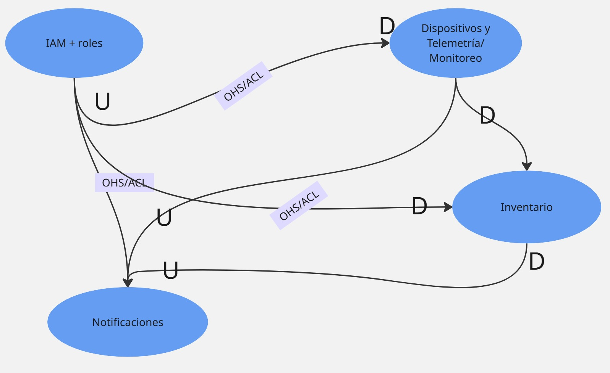</img>

  ### 4.1.3. Software Architecture
  #### 4.1.3.1. Software Architecture System Landscape Diagram
  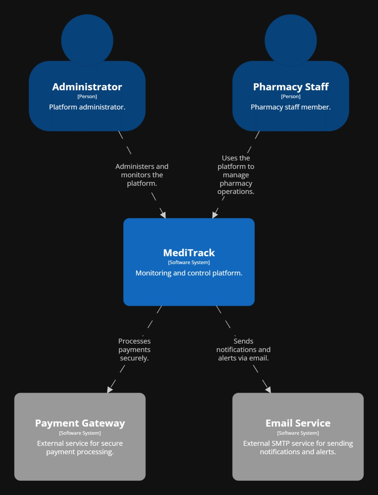</img>

  #### 4.1.3.2. Software Architecture Context Level Diagrams
  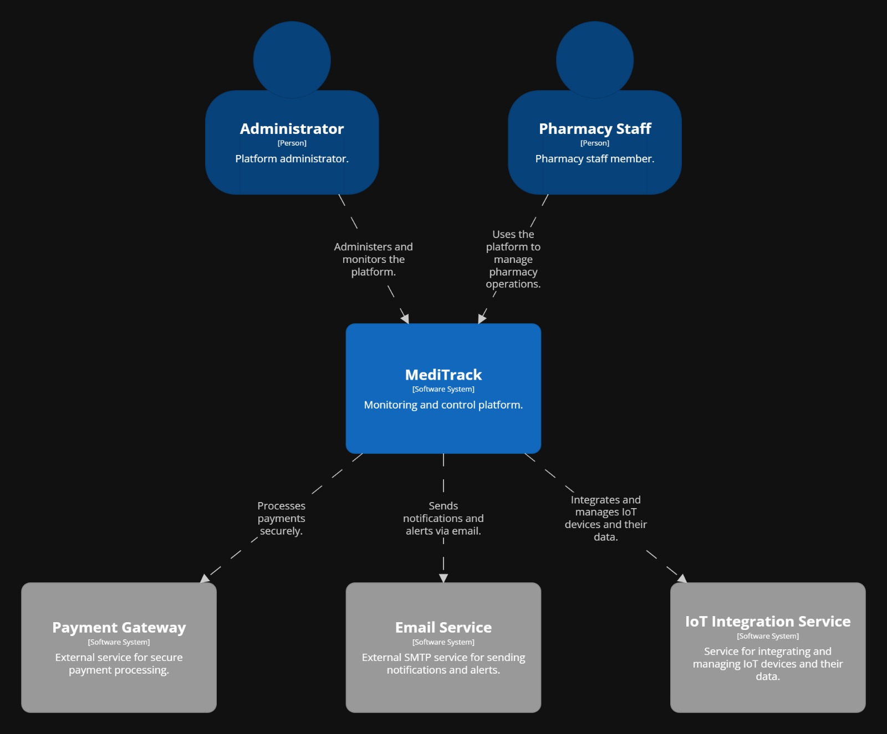</img>

  #### 4.1.3.3. Software Architecture Container Level Diagrams
  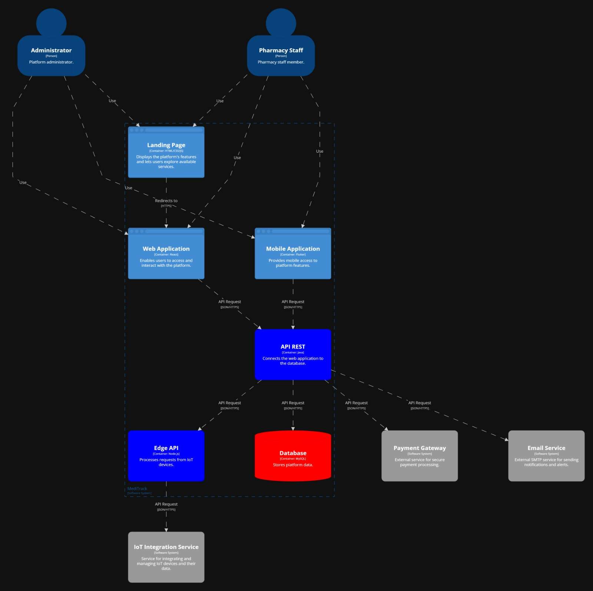</img>

  #### 4.1.3.4. Software Architecture Deployment Diagrams
  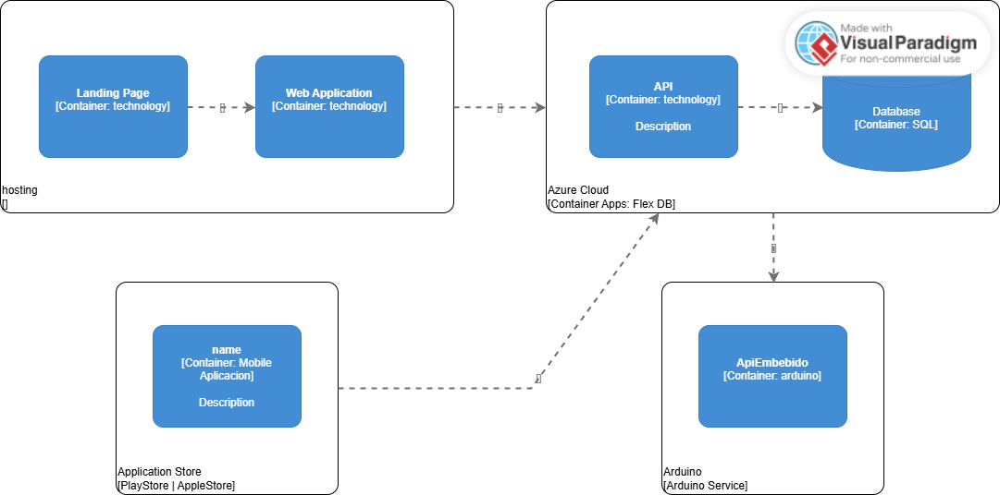</img>

  ## 4.2. Tactical-Level Domain-Driven Design

  ### 4.2.1. Bounded Context: IAM + roles <Bounded Context Name>

  #### 4.2.1.1. Domain Layer
  ### Entity
  | Nombre  | Categoría | Propósito |
  |---------|-----------|-----------|
  | Usuario | Aggregate | Representa a un usuario dentro del sistema con un rol específico. |

  ### Atributos – Usuario
  | Nombre   | Tipo de dato | Visibilidad | Descripción |
  |----------|--------------|-------------|-------------|
  | Id       | Int          | Public      | Identificador único del usuario. |
  | Email    | String       | Public      | Correo electrónico del usuario. |
  | Password | String       | Private     | Contraseña encriptada. |
  | Rol      | Enum         | Public      | Puede ser "Administrador" o "Personal Médico". |
  | Estado   | Boolean      | Public      | Indica si la cuenta está activa o no. |

  ---

  #### 4.2.1.2. Interface Layer

  | **Componente**     | **Descripción**                                                  | **Endpoints/Interfaces**                                                                                                                                                                          |
  |--------------------|------------------------------------------------------------------|---------------------------------------------------------------------------------------------------------------------------------------------------------------------------------------------------|
  | **REST APIs**      | Define los puntos de acceso para interactuar con el sistema de gestión de usuarios. | - `POST /auth/register`: Registro de nuevo usuario.   - `POST /auth/login`: Ingreso de usuario.   - `POST /auth/logout`: Cerrar sesión.   - `PUT /users/{id}/password`: Cambio de contraseña.   - `GET /users/{id}`: Obtener información del usuario.   - `GET /users`: Listado de usuarios. |
  | **Notificación**   | Enviar notificaciones al usuario.                                | - `POST /users/{id}/notify`: Enviar notificaciones al usuario (ej. de cambio de contraseña, activación de cuenta, etc.).                                                                         |
  | **Autenticación**  | Usar JWT para la autenticación y autorización del usuario.       | - Usar **JWT (JSON Web Token)** en todas las interacciones API para garantizar la autenticación y autorización del usuario.                                                                     |

  #### 4.2.1.3. Application Layer

  | **Componente**                     | **Descripción**                                           | **Funcionalidad**                                                                                                                                                                                                                                          |
  |------------------------------------|-----------------------------------------------------------|------------------------------------------------------------------------------------------------------------------------------------------------------------------------------------------------------------------------------------------------------------|
  | **Servicio de Registro de Usuario** | Gestionar el registro de nuevos usuarios.                 | - Validar los datos de entrada (correo electrónico y contraseña).   - Crear el objeto `Usuario` en el **Domain Layer**.   - Enviar correo de bienvenida.   - Emitir el evento `UserRegistered`.                                                   |
  | **Servicio de Autenticación**      | Gestionar el inicio de sesión de los usuarios.            | - Verificar las credenciales del usuario (`Email`, `Password`).   - Generar un token JWT para el usuario autenticado.   - Emitir los eventos `LoginSucceeded` o `LoginFailed`.                                                                    |
  | **Servicio de Gestión de Roles**   | Asignar roles a los usuarios.                             | - Asignar o cambiar el rol de un usuario entre "Administrador" o "Personal Médico".   - Emitir el evento `RoleAssigned`.                                                                                                                                 |
  | **Servicio de Actualización de Contraseña** | Permitir el cambio de contraseña de los usuarios.      | - Validar la contraseña actual del usuario.   - Encriptar la nueva contraseña.   - Emitir el evento `PasswordChanged`.                                                                                                                                |
  | **Reglas de Negocio**              | Validación y reglas para la gestión de usuarios.          | - **Contraseña**: Longitud mínima, complejidad de caracteres.   - **Email**: Validación de unicidad y formato correcto.                                                                                                                                    |

  ---

  #### 4.2.1.4. Infrastructure Layer

  #### Repository Interface
  **Nombre:** `UserRepository`  
  **Categoría:** Repository  
  **Propósito:** Gestionar las operaciones de persistencia y consulta para la entidad `Usuario`.

  ##### Métodos
  | **Nombre**               | **Tipo de retorno**              | **Visibilidad** | **Descripción**                                                                                           |
  |--------------------------|----------------------------------|-----------------|-----------------------------------------------------------------------------------------------------------|
  | `FindByIdAsync`          | `Task<Usuario?>`                 | Public          | Recupera un usuario a partir de su `Id`.                                                                  |
  | `FindByEmailAsync`       | `Task<Usuario?>`                 | Public          | Recupera un usuario basado en su correo electrónico.                                                     |
  | `CreateAsync`            | `Task<Usuario>`                  | Public          | Crea un nuevo usuario en la base de datos.                                                                |
  | `UpdateAsync`            | `Task<Usuario>`                  | Public          | Actualiza los datos de un usuario existente (ej. rol, estado).                                           |
  | `DeleteAsync`            | `Task<bool>`                     | Public          | Elimina un usuario de la base de datos.                                                                   |

  ---

  #### Repository Interface
  **Nombre:** `RoleRepository`  
  **Categoría:** Repository  
  **Propósito:** Gestionar la persistencia y consulta de roles de usuario.

  ##### Métodos
  | **Nombre**               | **Tipo de retorno**              | **Visibilidad** | **Descripción**                                                                                           |
  |--------------------------|----------------------------------|-----------------|-----------------------------------------------------------------------------------------------------------|
  | `FindAllAsync`           | `Task<IEnumerable<Role>>`        | Public          | Recupera todos los roles disponibles en el sistema.                                                       |
  | `FindByIdAsync`          | `Task<Role?>`                    | Public          | Recupera un rol basado en su `Id`.                                                                         |
  | `FindByNameAsync`        | `Task<Role?>`                    | Public          | Recupera un rol basado en su nombre.                                                                       |
  | `CreateAsync`            | `Task<Role>`                     | Public          | Crea un nuevo rol en la base de datos.                                                                     |
  | `UpdateAsync`            | `Task<Role>`                     | Public          | Actualiza un rol existente (por ejemplo, cambios en permisos).                                             |
  | `DeleteAsync`            | `Task<bool>`                     | Public          | Elimina un rol de la base de datos.                                                                        |

  ---

  #### Repository Interface
  **Nombre:** `UserCredentialRepository`  
  **Categoría:** Repository  
  **Propósito:** Gestionar la persistencia y recuperación de credenciales de usuario.

  ##### Métodos
  | **Nombre**               | **Tipo de retorno**              | **Visibilidad** | **Descripción**                                                                                           |
  |--------------------------|----------------------------------|-----------------|-----------------------------------------------------------------------------------------------------------|
  | `FindByUserIdAsync`      | `Task<UserCredential?>`          | Public          | Recupera las credenciales asociadas a un `Usuario` por su `Id`.                                           |
  | `CreateAsync`            | `Task<UserCredential>`           | Public          | Crea nuevas credenciales de usuario (ej. contraseña encriptada).                                          |
  | `UpdateAsync`            | `Task<UserCredential>`           | Public          | Actualiza las credenciales de un usuario (por ejemplo, cambiar la contraseña).                            |

  ---

  #### Repository Interface
  **Nombre:** `RoleAssignmentRepository`  
  **Categoría:** Repository  
  **Propósito:** Gestionar la asignación de roles a los usuarios.

  ##### Métodos
  | **Nombre**               | **Tipo de retorno**              | **Visibilidad** | **Descripción**                                                                                           |
  |--------------------------|----------------------------------|-----------------|-----------------------------------------------------------------------------------------------------------|
  | `AssignRoleToUserAsync`  | `Task<bool>`                     | Public          | Asigna un rol a un usuario.                                                                               |
  | `FindByUserIdAsync`      | `Task<IEnumerable<Role>>`        | Public          | Recupera los roles asignados a un usuario basado en su `Id`.                                              |
  | `RemoveRoleFromUserAsync`| `Task<bool>`                     | Public          | Elimina la asignación de un rol a un usuario.                                                             |

  ---

  ##### ● Repository Interface
  **Nombre:** `UserPreferencesRepository`  
  **Categoría:** Repository  
  **Propósito:** Gestionar las preferencias de usuario (ej. idioma, tema).

  ##### Métodos
  | **Nombre**               | **Tipo de retorno**              | **Visibilidad** | **Descripción**                                                                                           |
  |--------------------------|----------------------------------|-----------------|-----------------------------------------------------------------------------------------------------------|
  | `FindByUserIdAsync`      | `Task<UserPreferences?>`         | Public          | Recupera las preferencias del usuario.                                                                    |
  | `UpdatePreferencesAsync` | `Task<UserPreferences>`          | Public          | Actualiza las preferencias del usuario (como idioma y tema de la interfaz).                              |
  | `ResetPreferencesAsync`  | `Task<bool>`                      | Public          | Restablece las preferencias del usuario a los valores predeterminados.                                     |

  ---

  #### **Tecnologías/Implementación**

  - **ORM/DB**: Se utiliza **Entity Framework** (para C#) o **Hibernate** (para Java) para interactuar con la base de datos.
  - **Base de Datos**: Relacional (MySQL, PostgreSQL, etc.), con tablas para `Users`, `Roles`, `UserCredentials`, `UserPreferences`.
  - **Autenticación**: **JWT (JSON Web Tokens)** para la autenticación de usuarios, que es gestionado en el **Application Layer** y persistido por el `UserCredentialRepository`.
  - **Encriptación**: Uso de librerías de encriptación como **bcrypt** o **PBKDF2** para almacenar contraseñas de forma segura.

  ---

  Este es el **Infrastructure Layer** detallado con repositorios y métodos para el **Bounded Context: IAM + Roles** en formato Markdown. Si necesitas algún ajuste o más detalles, no dudes en indicármelo.
            

  #### 4.2.1.5. Bounded Context Software Architecture Component Level Diagrams

  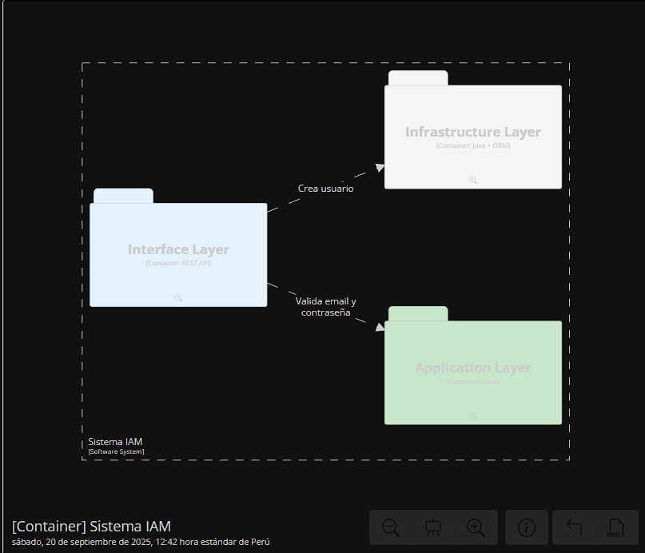</img>
  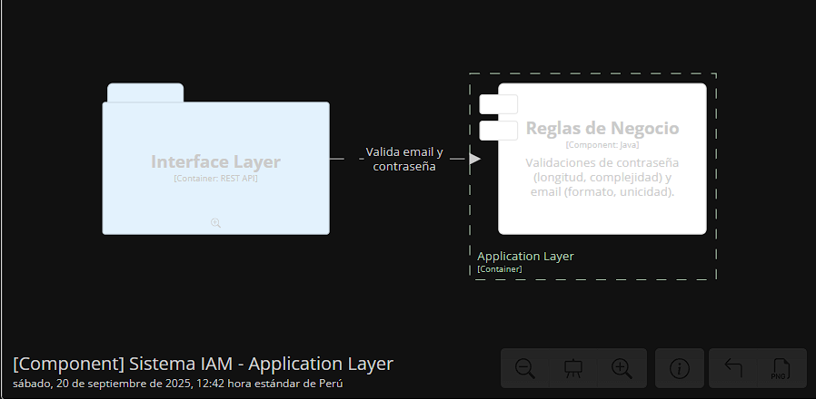</img>
  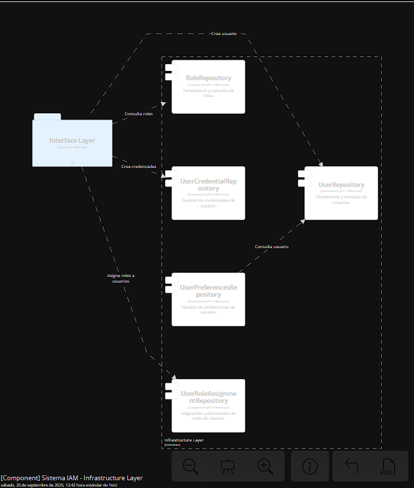</img>
  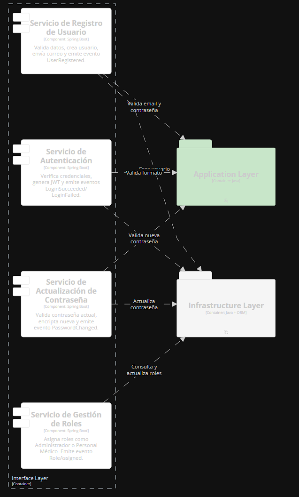</img>

  #### 4.2.1.6. Bounded Context Software Architecture Code Level Diagrams
  ##### 4.2.1.6.1. Bounded Context Domain Layer Class Diagrams
  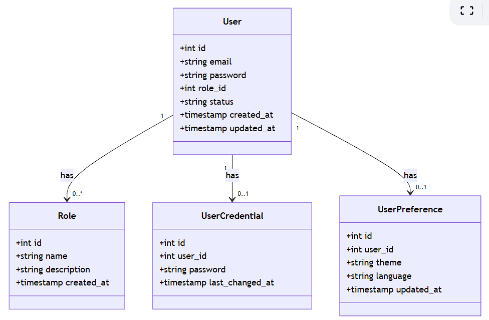</img>

  ##### 4.2.1.6.2. Bounded Context Database Design Diagram
  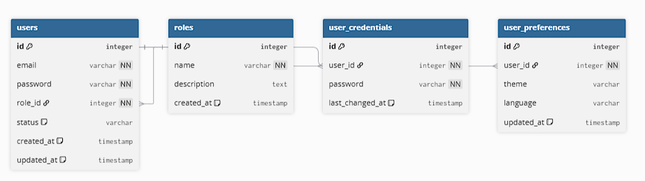</img>
Dispositivos_Component.png

### 4.2.2. Bounded Context: Dispositivos y Telemetria/Monitoreo <Bounded Context Name>

#### 4.2.2.1. Domain Layer
### Entity
| Nombre      | Categoría | Propósito |
|-------------|-----------|-----------|
| Dispositivo | Aggregate | Representa un dispositivo registrado en el sistema para monitoreo. |
| Telemetría  | Entity    | Registra una lectura de telemetría de un dispositivo en un momento dado. |

### Atributos – Dispositivo
| Nombre        | Tipo de dato | Visibilidad | Descripción |
|---------------|--------------|-------------|-------------|
| Id            | Int          | Public      | Identificador único del dispositivo. |
| Tipo          | String       | Public      | Tipo de dispositivo (sensor, monitor, etc.). |
| Estado        | String       | Public      | Estado operativo del dispositivo. |
| Configuración | String       | Private     | Parámetros de configuración del dispositivo. |

### Atributos – Telemetría
| Nombre    | Tipo de dato | Visibilidad | Descripción |
|-----------|--------------|-------------|-------------|
| Id        | Int          | Public      | Identificador de la lectura. |
| Timestamp | DateTime     | Public      | Momento en que se generó la lectura. |
| Métrica   | Float        | Public      | Valor de la métrica registrada. |
| Unidad    | String       | Public      | Unidad de medida de la métrica. |

---
#### 4.2.2.2. Interface Layer

### REST APIs

- **Componente:** REST APIs  
- **Descripción:** Define los puntos de acceso para interactuar con los dispositivos y las lecturas de telemetría.  
- **Endpoints/Interfaces:**
  - `POST /devices`: Crear nuevo dispositivo.
  - `GET /devices/{id}`: Obtener información del dispositivo.
  - `PUT /devices/{id}`: Actualizar información de un dispositivo.
  - `POST /telemetries`: Registrar nueva lectura de telemetría.
  - `GET /telemetries/{deviceId}`: Obtener lecturas de telemetría para un dispositivo.

### Notificaciones

- **Componente:** Notificaciones  
- **Descripción:** Enviar notificaciones sobre alertas de dispositivos (por ejemplo, estado fuera de rango).  
- **Endpoints/Interfaces:**
  - `POST /devices/{id}/notify`: Enviar notificación si el dispositivo tiene un fallo crítico.

#### 4.2.2.3. Application Layer

### Command Services

#### Servicio de Gestión de Dispositivos

| Método                  | Parámetros                                     | Retorno         | Descripción                                                                 |
|-------------------------|------------------------------------------------|------------------|------------------------------------------------------------------------------|
| `CreateDeviceAsync`     | tipo: string, configuración: string            | Device           | Crea un nuevo dispositivo y emite `DeviceProvisioned`                       |
| `UpdateDeviceAsync`     | id: int, estado: string, configuración: string | Device           | Actualiza dispositivo y emite `DeviceStatusUpdated`                         |
| `DeleteDeviceAsync`     | id: int                                        | bool             | Elimina dispositivo del sistema                                             |

#### Servicio de Telemetría

| Método                    | Parámetros                                                  | Retorno     | Descripción                                                                 |
|---------------------------|-------------------------------------------------------------|-------------|------------------------------------------------------------------------------|
| `RegisterTelemetryAsync` | deviceId: int, timestamp: DateTime, métrica: float, unidad: string | Telemetry   | Registra lectura y emite `TelemetryIngested`                                |

### Query Services

#### Servicio de Consulta de Dispositivos

| Método              | Parámetros | Retorno         | Descripción                                      |
|---------------------|------------|------------------|--------------------------------------------------|
| `GetDeviceByIdAsync`| id: int    | Device?          | Obtiene un dispositivo por su identificador      |
| `GetAllDevicesAsync`| —          | List<Device>     | Lista todos los dispositivos registrados         |

#### Servicio de Consulta de Telemetría

| Método                     | Parámetros  | Retorno                  | Descripción                                                  |
|----------------------------|-------------|---------------------------|--------------------------------------------------------------|
| `GetTelemetryByDeviceIdAsync` | deviceId: int | List<Telemetry>           | Obtiene todas las lecturas de telemetría de un dispositivo   |
| `GetLatestTelemetryAsync` | deviceId: int | Telemetry?                | Obtiene la última lectura registrada para un dispositivo     |

#### 4.2.2.4. Infrastructure Layer

### Repositorio – Dispositivos

| Método           | Parámetros                      | Retorno         | Descripción                                      |
|------------------|----------------------------------|------------------|--------------------------------------------------|
| `FindByIdAsync`  | id: int                          | Device?          | Busca dispositivo por ID                         |
| `CreateAsync`    | device: Device                   | Device           | Persiste nuevo dispositivo                       |
| `UpdateAsync`    | device: Device                   | Device           | Actualiza dispositivo existente                  |
| `DeleteAsync`    | id: int                          | bool             | Elimina dispositivo                              |
| `FindAllAsync`   | —                                | List<Device>     | Lista todos los dispositivos                     |

### Repositorio – Telemetría

| Método                     | Parámetros                      | Retorno                  | Descripción                                                  |
|----------------------------|----------------------------------|---------------------------|--------------------------------------------------------------|
| `FindByDeviceIdAsync`      | deviceId: int                   | List<Telemetry>           | Obtiene lecturas por dispositivo                            |
| `CreateAsync`              | telemetry: Telemetry            | Telemetry                 | Persiste nueva lectura de telemetría                         |
| `FindLatestByDeviceIdAsync`| deviceId: int                   | Telemetry?                | Obtiene la última lectura registrada                         |

---

### DeviceController

| Método         | HTTP   | Ruta                   | Parámetros de entrada                  | Retorno         | Descripción                                      |
|----------------|--------|------------------------|----------------------------------------|------------------|--------------------------------------------------|
| `CreateDevice` | POST   | `/devices`             | tipo, configuración                    | Device           | Crea nuevo dispositivo                           |
| `GetDevice`    | GET    | `/devices/{id}`        | id                                     | Device?          | Consulta dispositivo por ID                      |
| `UpdateDevice` | PUT    | `/devices/{id}`        | estado, configuración                  | Device           | Actualiza dispositivo                            |
| `DeleteDevice` | DELETE | `/devices/{id}`        | id                                     | bool             | Elimina dispositivo                              |
| `NotifyDevice` | POST   | `/devices/{id}/notify` | id                                     | void             | Envía alerta si hay fallo crítico                |

### TelemetryController

| Método                   | HTTP | Ruta                            | Parámetros de entrada                             | Retorno         | Descripción                                                  |
|--------------------------|------|----------------------------------|---------------------------------------------------|------------------|--------------------------------------------------------------|
| `CreateTelemetry`        | POST | `/telemetries`                  | deviceId, timestamp, métrica, unidad              | Telemetry        | Registra nueva lectura de telemetría                         |
| `GetTelemetryByDeviceId` | GET  | `/telemetries/{deviceId}`       | deviceId                                          | List<Telemetry>  | Obtiene lecturas de telemetría por dispositivo               |
| `GetLatestTelemetry`     | GET  | `/telemetries/{deviceId}/latest`| deviceId                                          | Telemetry?       | Obtiene la última lectura registrada para un dispositivo     |

#### 4.2.2.5. Bounded Context Software Architecture Component Level Diagrams
  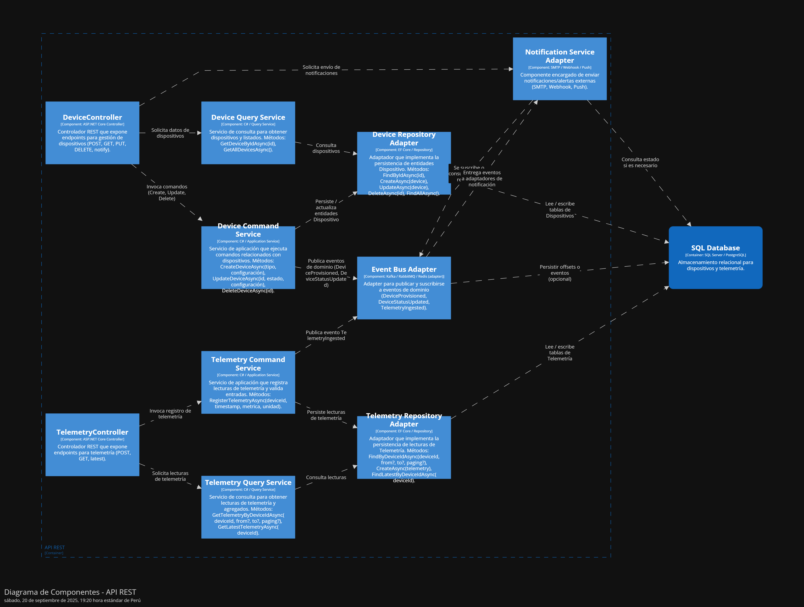</img>

#### 4.2.2.6. Bounded Context Software Architecture Code Level Diagrams
##### 4.2.2.6.1. Bounded Context Domain Layer Class Diagrams
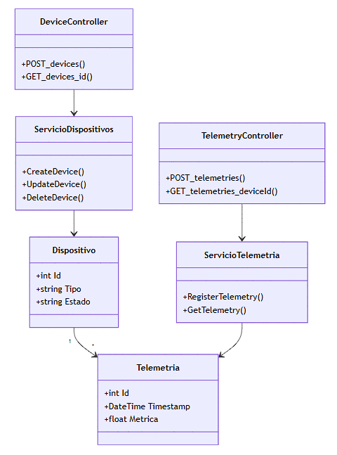</img>

##### 4.2.2.6.2. Bounded Context Database Design Diagram
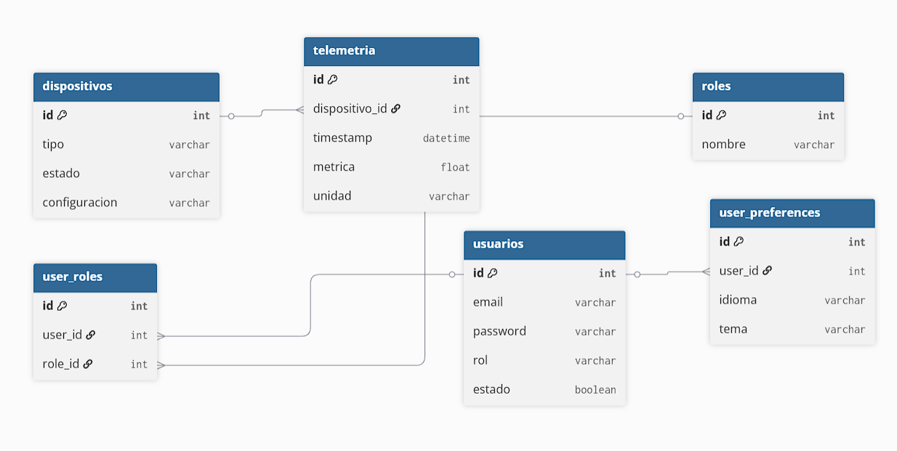</img>
Notifications_Component.png

### 4.2.3. Bounded Context: Notificaciones <Bounded Context Name>

#### 4.2.3.1. Domain Layer
### Entity
| Nombre       | Categoría | Propósito |
|--------------|-----------|-----------|
| Notificación | Aggregate | Representa un mensaje enviado a un usuario por un canal específico. |
| Plantilla    | Entity    | Define el contenido base de una notificación (con variables dinámicas). |

### Atributos – Notificación
| Nombre       | Tipo de dato | Visibilidad | Descripción |
|--------------|--------------|-------------|-------------|
| Id           | Int          | Public      | Identificador único de la notificación. |
| Destinatario | String       | Public      | Usuario o rol que recibirá la notificación. |
| Canal        | String       | Public      | Medio de envío (Email, SMS, Push, InApp). |
| Mensaje      | String       | Public      | Contenido de la notificación. |
| Estado       | String       | Public      | Estado de la notificación (Enviada, Fallida, Leída). |

### Atributos – Plantilla
| Nombre    | Tipo de dato | Visibilidad | Descripción |
|-----------|--------------|-------------|-------------|
| Id        | Int          | Public      | Identificador de la plantilla. |
| Tipo      | String       | Public      | Tipo de notificación (Alerta, Recordatorio, Info). |
| Contenido | String       | Public      | Texto base con variables dinámicas. |

---
#### 4.2.3.2. Interface Layer

### REST APIs

| **Componente**    | **Descripción**                                                  | **Endpoints/Interfaces**                                                                                                                                                                          |
|-------------------|------------------------------------------------------------------|---------------------------------------------------------------------------------------------------------------------------------------------------------------------------------------------------|
| **REST APIs**     | Define los puntos de acceso para interactuar con las notificaciones. | - `POST /notifications`: Crear una nueva notificación.  - `GET /notifications/{id}`: Obtener información de una notificación.  - `POST /templates`: Crear una nueva plantilla.  - `GET /templates/{id}`: Obtener información de una plantilla. |
| **Notificaciones**| Enviar notificaciones a los usuarios.                             | - `POST /notifications/{id}/send`: Enviar una notificación por el canal especificado.                                                                                                           |
| **Plantillas**    | Gestionar las plantillas de notificación.                        | - `POST /templates`: Crear una nueva plantilla de notificación.  - `GET /templates/{id}`: Obtener una plantilla existente.                                                                   |

---

#### 4.2.3.3. Application Layer

### Servicios

| **Componente**               | **Descripción**                                           | **Funcionalidad**                                                                                                                                                                      |
|------------------------------|-----------------------------------------------------------|-----------------------------------------------------------------------------------------------------------------------------------------------------------------------------------------|
| **Servicio de Gestión de Notificaciones** | Gestionar la creación y envío de notificaciones.               | - Crear una notificación con destino, canal y contenido.  - Enviar notificaciones por el canal correspondiente (Email, SMS, Push, etc.).  - Emitir eventos como `NotificationSent`, `NotificationFailed`. |
| **Servicio de Plantillas**    | Gestionar las plantillas de notificación.                    | - Crear y actualizar plantillas con contenido dinámico.  - Asociar variables a las plantillas.  - Emitir eventos como `TemplateCreated`, `TemplateUpdated`. |

### Funciones del Servicio

1. **Crear Notificación:**
    - Validar los parámetros de entrada (destinatario, canal, mensaje).
    - Crear la instancia de notificación en el Domain Layer.
    - Emitir evento `NotificationCreated`.
    
2. **Enviar Notificación:**
    - Enviar la notificación por el canal especificado.
    - Emitir evento `NotificationSent`.
    
3. **Crear Plantilla:**
    - Validar los parámetros de entrada (tipo, contenido).
    - Crear la instancia de plantilla en el Domain Layer.
    - Emitir evento `TemplateCreated`.

4. **Actualizar Plantilla:**
    - Validar los parámetros de entrada.
    - Actualizar la plantilla existente en el Domain Layer.
    - Emitir evento `TemplateUpdated`.

---
#### 4.2.3.4. Infrastructure Layer

#### Repositorio – Notificaciones

**Nombre:** `NotificationRepository`  
**Categoría:** Repository  
**Propósito:** Gestionar las operaciones de persistencia y consulta para las notificaciones.

#### Métodos del Repositorio

| **Nombre**               | **Tipo de retorno**              | **Visibilidad** | **Descripción**                                                                                           |
|--------------------------|----------------------------------|-----------------|-----------------------------------------------------------------------------------------------------------|
| `FindByIdAsync`          | `Task<Notification?>`            | Public          | Recupera una notificación por su `Id`.                                                                     |
| `CreateAsync`            | `Task<Notification>`             | Public          | Crea una nueva notificación en la base de datos.                                                            |
| `UpdateAsync`            | `Task<Notification>`             | Public          | Actualiza la información de una notificación existente.                                                    |
| `DeleteAsync`            | `Task<bool>`                     | Public          | Elimina una notificación de la base de datos.                                                              |
| `FindAllAsync`           | `Task<List<Notification>>`      | Public          | Lista todas las notificaciones registradas.                                                                |

#### Repositorio - Plantilla

**Nombre:** `TemplateRepository`  
**Categoría:** Repository  
**Propósito:** Gestionar las operaciones de persistencia y consulta para las plantillas de notificación.

##### Métodos del Repositorio

| **Nombre**               | **Tipo de retorno**              | **Visibilidad** | **Descripción**                                                                                           |
|--------------------------|----------------------------------|-----------------|-----------------------------------------------------------------------------------------------------------|
| `FindByIdAsync`          | `Task<Template?>`                | Public          | Recupera una plantilla por su `Id`.                                                                       |
| `CreateAsync`            | `Task<Template>`                 | Public          | Crea una nueva plantilla en la base de datos.                                                              |
| `UpdateAsync`            | `Task<Template>`                 | Public          | Actualiza una plantilla existente.                                                                        |
| `DeleteAsync`            | `Task<bool>`                     | Public          | Elimina una plantilla de la base de datos.                                                                |
| `FindAllAsync`           | `Task<List<Template>>`          | Public          | Lista todas las plantillas registradas.                                                                  |

#### Controlador – Notificaciones
**Nombre:** `NotificationController`  
**Propósito:** Exponer los endpoints de REST para la gestión de notificaciones.

##### Métodos del Controlador

| **Nombre**               | **Método HTTP**                 | **Descripción**                                                                                           |
|--------------------------|----------------------------------|-----------------------------------------------------------------------------------------------------------|
| `CreateNotification`     | `POST`                          | Crear una nueva notificación.                                                                              |
| `GetNotification`        | `GET`                           | Obtener una notificación por su `Id`.                                                                     |
| `UpdateNotification`     | `PUT`                           | Actualizar una notificación existente.                                                                    |
| `DeleteNotification`     | `DELETE`                        | Eliminar una notificación por su `Id`.                                                                    |
| `SendNotification`       | `POST`                          | Enviar una notificación por el canal especificado.                                                        |

#### Controlador – Plantillas

**Nombre:** `TemplateController`  
**Propósito:** Exponer los endpoints de REST para la gestión de plantillas de notificación.

##### Métodos del Controlador

| **Nombre**               | **Método HTTP**                 | **Descripción**                                                                                           |
|--------------------------|----------------------------------|-----------------------------------------------------------------------------------------------------------|
| `CreateTemplate`         | `POST`                          | Crear una nueva plantilla.                                                                                |
| `GetTemplate`            | `GET`                           | Obtener una plantilla por su `Id`.                                                                       |
| `UpdateTemplate`         | `PUT`                           | Actualizar una plantilla existente.                                                                      |
| `DeleteTemplate`         | `DELETE`                        | Eliminar una plantilla por su `Id`.                                                                      |

#### 4.2.3.5. Bounded Context Software Architecture Component Level Diagrams
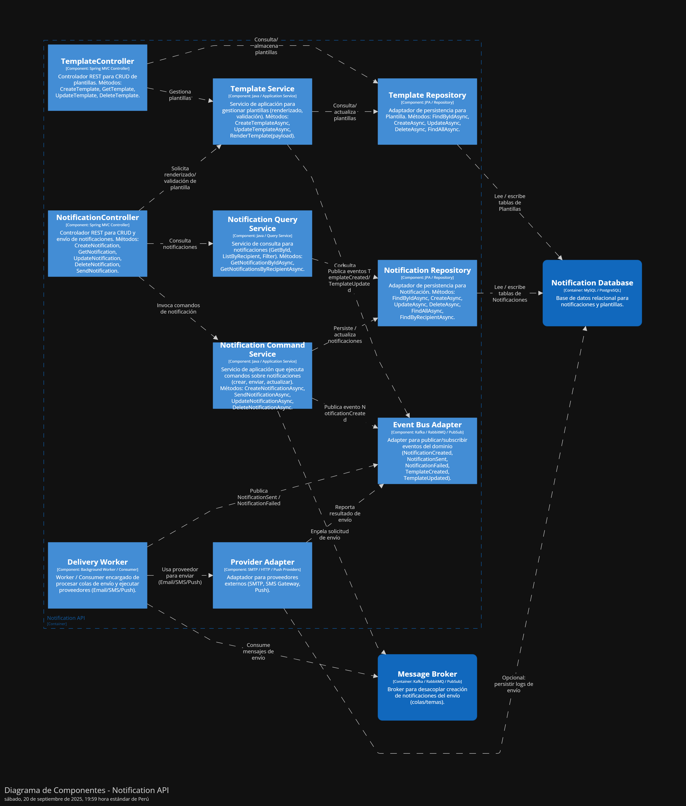</img>

#### 4.2.3.6. Bounded Context Software Architecture Code Level Diagrams
##### 4.2.3.6.1. Bounded Context Domain Layer Class Diagrams
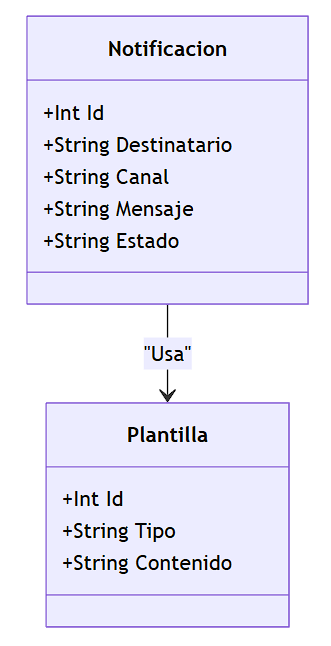</img>

##### 4.2.3.6.2. Bounded Context Database Design Diagram
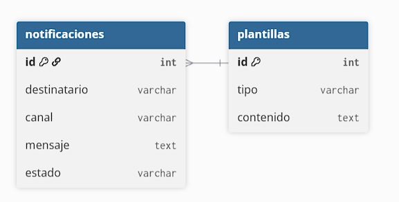</img>

### 4.2.4. Bounded Context: Inventario <Bounded Context Name>

#### 4.2.4.1. Domain Layer
### Entity
| Nombre         | Categoría | Propósito |
|----------------|-----------|-----------|
| ItemInventario | Aggregate | Representa un recurso físico en el inventario (equipo, insumo). |
| Movimiento     | Entity    | Registra un cambio en el stock (entrada/salida/consumo). |
| Proveedor      | Entity    | Representa un proveedor de insumos o dispositivos. |

### Atributos – ItemInventario
| Nombre    | Tipo de dato | Visibilidad | Descripción |
|-----------|--------------|-------------|-------------|
| Id        | Int          | Public      | Identificador único del ítem. |
| Nombre    | String       | Public      | Nombre del recurso. |
| Cantidad  | Int          | Public      | Stock disponible. |
| Ubicación | String       | Public      | Lugar físico donde está almacenado. |
| Estado    | String       | Public      | Estado (Disponible, En uso, Dañado). |

### Atributos – Movimiento
| Nombre   | Tipo de dato | Visibilidad | Descripción |
|----------|--------------|-------------|-------------|
| Id       | Int          | Public      | Identificador del movimiento. |
| Tipo     | String       | Public      | Entrada, salida o consumo. |
| Fecha    | DateTime     | Public      | Fecha del movimiento. |
| Cantidad | Int          | Public      | Cantidad movida. |

### Atributos – Proveedor
| Nombre   | Tipo de dato | Visibilidad | Descripción |
|----------|--------------|-------------|-------------|
| Id       | Int          | Public      | Identificador del proveedor. |
| Nombre   | String       | Public      | Nombre del proveedor. |
| Contacto | String       | Public      | Información de contacto (teléfono, correo). |

#### 4.2.4.2. Interface Layer

| **Componente**    | **Descripción**                                                  | **Endpoints/Interfaces**                                                                                                                                                                          |
|-------------------|------------------------------------------------------------------|---------------------------------------------------------------------------------------------------------------------------------------------------------------------------------------------------|
| **REST APIs**     | Define los puntos de acceso para interactuar con el sistema de inventario. | - `POST /items`: Crear un nuevo ítem de inventario.  - `GET /items/{id}`: Obtener información de un ítem.  - `PUT /items/{id}`: Actualizar la información de un ítem.  - `POST /movements`: Registrar un nuevo movimiento.  - `GET /movements/{id}`: Obtener detalles de un movimiento. |
| **Inventario**    | Gestionar los ítems de inventario.                              | - `POST /items/{id}/update`: Actualizar la cantidad o estado de un ítem.  - `POST /movements/{id}/create`: Registrar un movimiento (entrada/salida). |
| **Proveedores**   | Gestionar los proveedores de insumos.                            | - `POST /suppliers`: Crear un proveedor.  - `GET /suppliers/{id}`: Obtener información del proveedor. |
---

#### 4.2.4.3. Application Layer

### Servicios

| **Componente**               | **Descripción**                                           | **Funcionalidad**                                                                                                                                                                      |
|------------------------------|-----------------------------------------------------------|-----------------------------------------------------------------------------------------------------------------------------------------------------------------------------------------|
| **Servicio de Gestión de Inventario** | Gestionar los ítems de inventario.               | - Crear, actualizar y eliminar ítems del inventario.  - Gestionar la cantidad y ubicación de los ítems.  - Emitir eventos como `ItemCreated`, `ItemUpdated`. |
| **Servicio de Movimiento**    | Gestionar los movimientos de inventario.                    | - Registrar movimientos (entrada, salida, consumo).  - Emitir eventos como `MovementCreated`, `MovementUpdated`. |
| **Servicio de Proveedores**    | Gestionar los proveedores.                    | - Crear, actualizar y eliminar proveedores.  - Emitir eventos como `SupplierCreated`, `SupplierUpdated`. |

### Funciones del Servicio

1. **Gestionar Ítem de Inventario:**
    - Validar los parámetros de entrada (nombre, cantidad, ubicación).
    - Crear o actualizar un ítem en el inventario.
    - Emitir evento `ItemCreated` o `ItemUpdated`.

2. **Registrar Movimiento:**
    - Validar los parámetros del movimiento (tipo, cantidad).
    - Crear un movimiento (entrada, salida o consumo).
    - Emitir evento `MovementCreated`.

3. **Gestionar Proveedor:**
    - Validar los parámetros del proveedor (nombre, contacto).
    - Crear o actualizar un proveedor.
    - Emitir evento `SupplierCreated` o `SupplierUpdated`.

---
#### 4.2.4.4. Infrastructure Layer

### Repositorio – Ítem de Inventario

**Nombre:** `ItemRepository`  
**Categoría:** Repository  
**Propósito:** Gestionar las operaciones de persistencia y consulta para los ítems de inventario.

##### Métodos del Repositorio

| **Nombre**               | **Tipo de retorno**              | **Visibilidad** | **Descripción**                                                                                           |
|--------------------------|----------------------------------|-----------------|-----------------------------------------------------------------------------------------------------------|
| `FindByIdAsync`          | `Task<Item?>`                    | Public          | Recupera un ítem por su `Id`.                                                                             |
| `CreateAsync`            | `Task<Item>`                     | Public          | Crea un nuevo ítem en el inventario.                                                                      |
| `UpdateAsync`            | `Task<Item>`                     | Public          | Actualiza un ítem existente.                                                                              |
| `DeleteAsync`            | `Task<bool>`                     | Public          | Elimina un ítem del inventario.                                                                           |
| `FindAllAsync`           | `Task<List<Item>>`               | Public          | Lista todos los ítems del inventario.                                                                    |

**Nombre:** `MovementRepository`  
**Categoría:** Repository  
**Propósito:** Gestionar las operaciones de persistencia y consulta para los movimientos de inventario.

##### Métodos del Repositorio

| **Nombre**               | **Tipo de retorno**              | **Visibilidad** | **Descripción**                                                                                           |
|--------------------------|----------------------------------|-----------------|-----------------------------------------------------------------------------------------------------------|
| `FindByIdAsync`          | `Task<Movement?>`                | Public          | Recupera un movimiento por su `Id`.                                                                       |
| `CreateAsync`            | `Task<Movement>`                 | Public          | Crea un nuevo movimiento en el inventario.                                                                 |
| `FindAllAsync`           | `Task<List<Movement>>`           | Public          | Lista todos los movimientos realizados.                                                                  |

**Nombre:** `SupplierRepository`  
**Categoría:** Repository  
**Propósito:** Gestionar las operaciones de persistencia y consulta para los proveedores.

##### Métodos del Repositorio

| **Nombre**               | **Tipo de retorno**              | **Visibilidad** | **Descripción**                                                                                           |
|--------------------------|----------------------------------|-----------------|-----------------------------------------------------------------------------------------------------------|
| `FindByIdAsync`          | `Task<Supplier?>`                | Public          | Recupera un proveedor por su `Id`.                                                                        |
| `CreateAsync`            | `Task<Supplier>`                 | Public          | Crea un nuevo proveedor.                                                                                   |
| `UpdateAsync`            | `Task<Supplier>`                 | Public          | Actualiza un proveedor existente.                                                                         |
| `DeleteAsync`            | `Task<bool>`                     | Public          | Elimina un proveedor.                                                                                     |

**Nombre:** `ItemController`  
**Propósito:** Exponer los endpoints de REST para la gestión de ítems de inventario.

##### Métodos del Controlador

| **Nombre**               | **Método HTTP**                 | **Descripción**                                                                                           |
|--------------------------|----------------------------------|-----------------------------------------------------------------------------------------------------------|
| `CreateItem`             | `POST`                          | Crear un nuevo ítem en el inventario.                                                                      |
| `GetItem`                | `GET`                           | Obtener un ítem por su `Id`.                                                                               |
| `UpdateItem`             | `PUT`                           | Actualizar un ítem existente.                                                                              |
| `DeleteItem`             | `DELETE`                        | Eliminar un ítem del inventario.                                                                           |

**Nombre:** `SupplierController`  
**Propósito:** Exponer los endpoints de REST para la gestión de proveedores.

##### Métodos del Controlador

| **Nombre**               | **Método HTTP**                 | **Descripción**                                                                                           |
|--------------------------|----------------------------------|-----------------------------------------------------------------------------------------------------------|
| `CreateSupplier`         | `POST`                          | Crear un nuevo proveedor.                                                                                 |
| `GetSupplier`            | `GET`                           | Obtener un proveedor por su `Id`.                                                                         |
| `UpdateSupplier`         | `PUT`                           | Actualizar un proveedor existente.                                                                        |
| `DeleteSupplier`         | `DELETE`                        | Eliminar un proveedor.                                                                                   |

#### 4.2.4.5. Bounded Context Software Architecture Component Level Diagrams
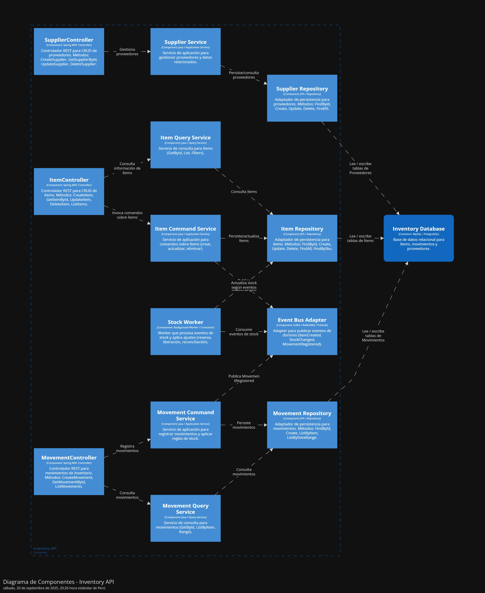</img>

#### 4.2.4.6. Bounded Context Software Architecture Code Level Diagrams
##### 4.2.4.6.1. Bounded Context Domain Layer Class Diagrams
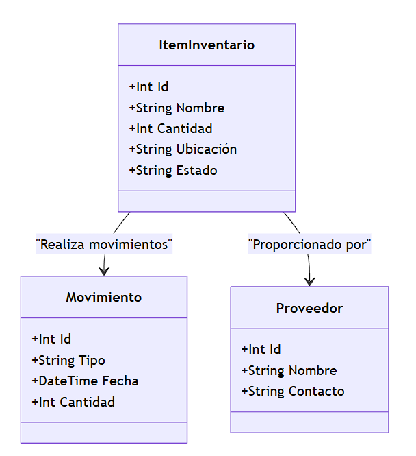</img>

##### 4.2.4.6.2. Bounded Context Database Design Diagram
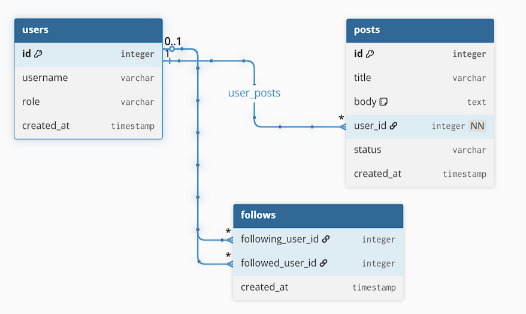</img>

# Capítulo V: Solution UI/UX Design

## 5.1. Style Guidelines
### 5.1.1. General Style Guidelines
### 5.1.2. Web, Mobile and IoT Style Guidelines

## 5.2. Information Architecture
### 5.2.1. Organization Systems
### 5.2.2. Labeling Systems
### 5.2.3. SEO Tags and Meta Tags
### 5.2.4. Searching Systems
### 5.2.5. Navigation Systems

## 5.3. Landing Page UI Design
### 5.3.1. Landing Page Wireframe
### 5.3.2. Landing Page Mock-up

## 5.4. Applications UX/UI Design
### 5.4.1. Applications Wireframes
### 5.4.2. Applications Wireflow Diagrams
### 5.4.3. Applications Mock-ups
### 5.4.4. Applications User Flow Diagrams

## 5.5. Applications Prototyping

# Capítulo VI: Product Implementation, Validation & Deployment

## 6.1. Software Configuration Management
### 6.1.1. Software Development Environment Configuration
### 6.1.2. Source Code Management
### 6.1.3. Source Code Style Guide & Conventions
### 6.1.4. Software Deployment Configuration

## 6.2. Landing Page, Services & Applications Implementation
### 6.2.X. Sprint n
#### 6.2.X.1. Sprint Planning n
#### 6.2.X.2. Aspect Leaders and Collaborators
#### 6.2.X.3. Sprint Backlog n
#### 6.2.X.4. Development Evidence for Sprint Review
#### 6.2.X.5. Testing Suite Evidence for Sprint Review
#### 6.2.X.6. Execution Evidence for Sprint Review
#### 6.2.X.7. Services Documentation Evidence for Sprint Review
#### 6.2.X.8. Software Deployment Evidence for Sprint Review
#### 6.2.X.9. Team Collaboration Insights during Sprint

## 6.3. Validation Interviews
### 6.3.1. Diseño de Entrevistas
### 6.3.2. Registro de Entrevistas
### 6.3.3. Evaluaciones según heurísticas

## 6.4. Video About-the-Product

# Conclusiones
## Conclusiones y recomendaciones

## Video About-the-Team

# Bibliografía

# Anexos