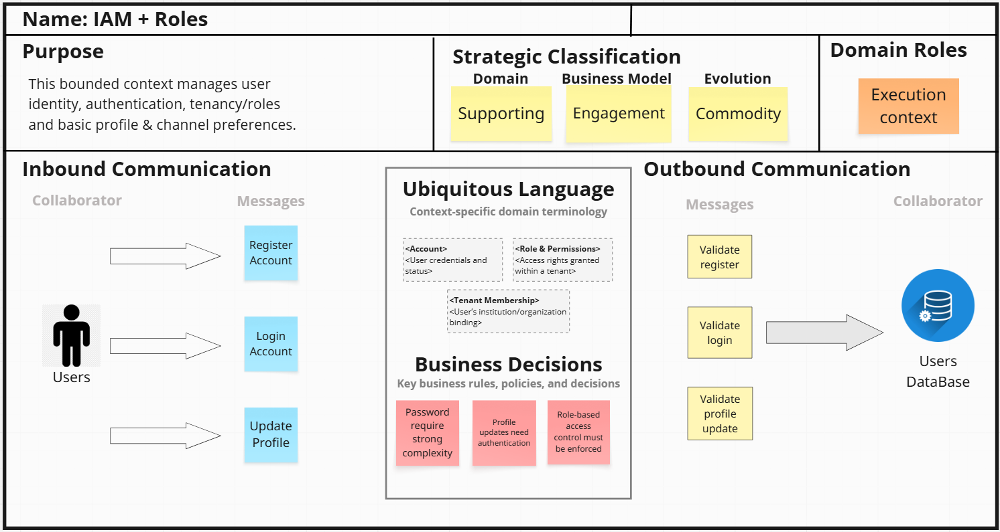
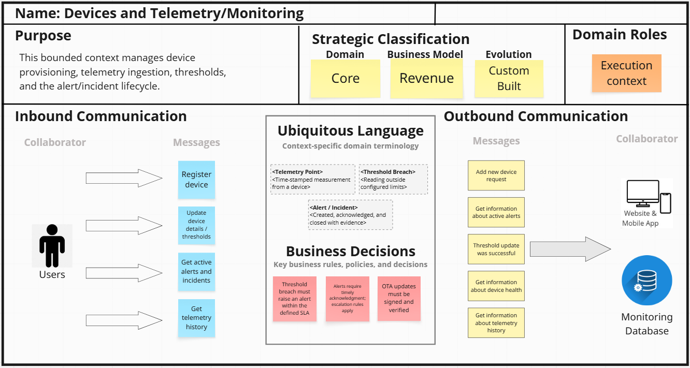
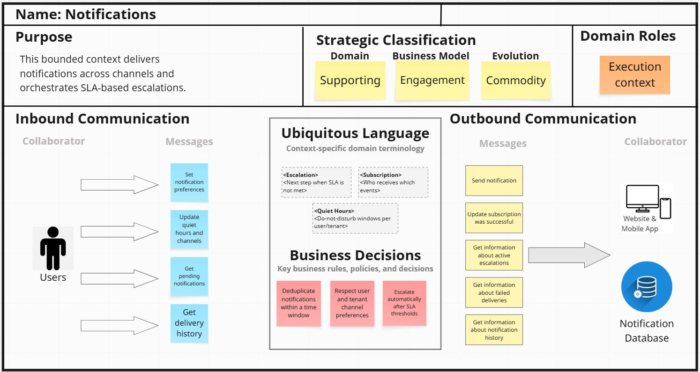
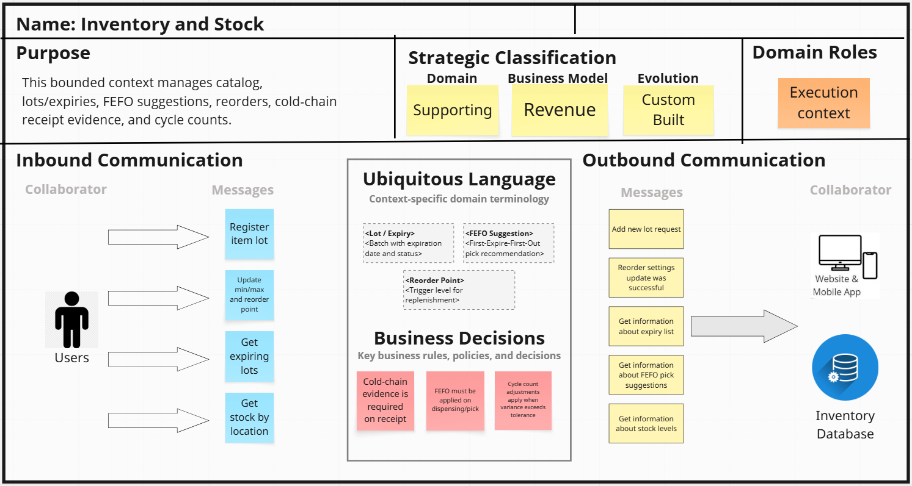

# 
COURSE PROJECT

    <strong>Universidad Peruana de Ciencias Aplicadas</strong> 
    </img> 
    <strong>Ingeniería de Software - 2025-20</strong> 
    <strong>Desarrollo de Soluciones IoT - 3428</strong> 
    <strong>Profesor: Leon Baca, Marco Antonio</strong> 

    <strong>Startup: HealthSync</strong> 
    <strong>Producto: MediTrack</strong>

    <h3>Team Members:</h3>
    <table align="center">
        <tr>
            <th style="text-align:center;">Member</th>
            <th style="text-align:center;">Code</th>
        </tr>
        <tr>
            <td>Ayquipa Ubaldo, Abraham Israel</td>
            <td>U202218475</td>
        </tr>
        <tr>
            <td>Cruz Ticona, Aaron Alejandro</td>
            <td>U202213502</td>
        </tr>
        <tr>
            <td>Durand Vera, Gianfranco Angel</td>
            <td>U20201f640</td>
        </tr>
        <tr>
            <td>Luza Carhuamaca, Jose Adrian</td>
            <td>U202213404</td>
        </tr>
        <tr>
            <td>Ticona Panduro, Estrella del Pilar</td>
            <td>U202210659</td>
        </tr>
    </table>

<b>
Septiembre, 2025
</b>

 

<h1 align="center">Registro de versiones del Informe</h1>
 
<table>
  <thead>
    <tr>
      <th>Versión</th>
      <th>Fecha</th>
      <th>Autor</th>
      <th>Descripción de modificaciones</th>
    </tr>
  </thead>
  <tbody>
    <tr>
      <td></td>
      <td></td>
      <td></td>
      <td></td>
    </tr>
  </tbody>
</table>

# Project Report Collaboration Insights

  

# Contenido
[Student Outcome](#student-outcome)

[Capítulo I: Introducción](#capitulo-i-introducción)
- [1.1. Startup Profile](#11-startup-profile)
  - [1.1.1. Descripción de la Startup](#111-descripción-de-la-startup)
  - [1.1.2. Perfiles de integrantes del equipo](#112-perfiles-de-integrantes-del-equipo)
- [1.2. Solution Profile](#12-solution-profile)
  - [1.2.1 Antecedentes y problemática](#121-antecedentes-y-problemática)
  - [1.2.2 Lean UX Process](#122-lean-ux-process)
    - [1.2.2.1. Lean UX Problem Statements](#1221-lean-ux-problem-statements)
    - [1.2.2.2. Lean UX Assumptions](#1222-lean-ux-assumptions)
    - [1.2.2.3. Lean UX Hypothesis Statements](#1223-lean-ux-hypothesis-statements)
    - [1.2.2.4. Lean UX Canvas](#1224-lean-ux-canvas)
- [1.3. Segmentos objetivo](#13-segmentos-objetivo)

[Capítulo II: Requirements Elicitation & Analysis](#capítulo-ii-requirements-elicitation--analysis)
- [2.1. Competidores](#21-competidores)
  - [2.1.1. Análisis competitivo](#211-análisis-competitivo)
  - [2.1.2. Estrategias y tácticas frente a competidores](#212-estrategias-y-tácticas-frente-a-competidores)
- [2.2. Entrevistas](#22-entrevistas)
  - [2.2.1. Diseño de entrevistas](#221-diseño-de-entrevistas)
  - [2.2.2. Registro de entrevistas](#222-registro-de-entrevistas)
  - [2.2.3. Análisis de entrevistas](#223-análisis-de-entrevistas)
- [2.3. Needfinding](#23-needfinding)
  - [2.3.1. User Personas](#231-user-personas)
  - [2.3.2. User Task Matrix](#232-user-task-matrix)
  - [2.3.3. User Journey Mapping](#233-user-journey-mapping)
  - [2.3.4. Empathy Mapping](#234-empathy-mapping)
- [2.4. Big Picture EventStorming](#24-big-picture-eventstorming)
- [2.5. Ubiquitous Language](#25-ubiquitous-language)

[Capítulo III: Requirements Specification](#capítulo-iii-requirements-specification)
- [3.1. To-Be Scenario Mapping](#31-to-be-scenario-mapping)
- [3.2. User Stories](#32-user-stories)
- [3.3. Product Backlog](#33-product-backlog)

[Capítulo IV: Solution Software Design](#capítulo-iv-solution-software-design)
- [COURSE PROJECT](#course-project)
- [Project Report Collaboration Insights](#project-report-collaboration-insights)
- [Contenido](#contenido)
- [Student Outcome](#student-outcome)
- [Capítulo I: Introducción](#capítulo-i-introducción)
  - [1.1. Startup Profile](#11-startup-profile)
    - [1.1.1. Descripción de la Startup](#111-descripción-de-la-startup)
    - [1.1.2. Perfiles de integrantes del equipo](#112-perfiles-de-integrantes-del-equipo)
  - [1.2. Solution Profile](#12-solution-profile)
    - [1.2.1. Antecedentes y problemática](#121-antecedentes-y-problemática)
    - [1.2.2. Lean UX Process](#122-lean-ux-process)
      - [1.2.2.1. Lean UX Problem Statements](#1221-lean-ux-problem-statements)
      - [1.2.2.2. Lean UX Assumptions](#1222-lean-ux-assumptions)
      - [1.2.2.3. Lean UX Hypothesis Statements](#1223-lean-ux-hypothesis-statements)
      - [1.2.2.4. Lean UX Canvas](#1224-lean-ux-canvas)
  - [1.3. Segmentos objetivo](#13-segmentos-objetivo)
- [Capítulo II: Requirements Elicitation \& Analysis](#capítulo-ii-requirements-elicitation--analysis)
  - [2.1. Competidores](#21-competidores)
    - [2.1.1. Análisis competitivo](#211-análisis-competitivo)
    - [2.1.2. Estrategias y tácticas frente a competidores](#212-estrategias-y-tácticas-frente-a-competidores)
  - [2.2. Entrevistas](#22-entrevistas)
    - [2.2.1. Diseño de entrevistas](#221-diseño-de-entrevistas)
    - [2.2.2. Registro de entrevistas](#222-registro-de-entrevistas)
    - [2.2.3. Análisis de entrevistas](#223-análisis-de-entrevistas)
  - [2.3. Needfinding](#23-needfinding)
    - [2.3.1. User Personas](#231-user-personas)
    - [2.3.2. User Task Matrix](#232-user-task-matrix)
    - [2.3.3. User Journey Mapping](#233-user-journey-mapping)
    - [2.3.4. Empathy Mapping](#234-empathy-mapping)
    - [2.3.5. As-is Scenario Mapping](#235-as-is-scenario-mapping)
  - [2.4. Big Picture EventStorming](#24-big-picture-eventstorming)
  - [2.5. Ubiquitous Language](#25-ubiquitous-language)
- [Capítulo III: Requirements Specification](#capítulo-iii-requirements-specification)
  - [3.1. To-Be Scenario Mapping](#31-to-be-scenario-mapping)
  - [3.2. User Stories](#32-user-stories)
  - [3.3. Product Backlog](#33-product-backlog)
- [Capítulo IV: Solution Software Design](#capítulo-iv-solution-software-design)
  - [4.1. Strategic-Level Domain-Driven Design](#41-strategic-level-domain-driven-design)
    - [4.1.1. Design-Level EventStorming](#411-design-level-eventstorming)
      - [4.1.1.1. Candidate Context Discovery](#4111-candidate-context-discovery)
      - [4.1.1.2. Domain Message Flows Modeling](#4112-domain-message-flows-modeling)
      - [4.1.1.3. Bounded Context Canvases](#4113-bounded-context-canvases)
  - 
    - [4.1.2. Context Mapping](#412-context-mapping)
    - [4.1.3. Software Architecture](#413-software-architecture)
      - [4.1.3.1. Software Architecture System Landscape Diagram](#4131-software-architecture-system-landscape-diagram)
      - [4.1.3.2. Software Architecture Context Level Diagrams](#4132-software-architecture-context-level-diagrams)
      - [4.1.3.3. Software Architecture Container Level Diagrams](#4133-software-architecture-container-level-diagrams)
      - [4.1.3.4. Software Architecture Deployment Diagrams](#4134-software-architecture-deployment-diagrams)
  - [4.2. Tactical-Level Domain-Driven Design](#42-tactical-level-domain-driven-design)
    - [4.2.1. Bounded Context: IAM + roles ](#421-bounded-context-iam--roles-)
      - [4.2.1.1. Domain Layer](#4211-domain-layer)
    - [Entity](#entity)
    - [Atributos – Usuario](#atributos--usuario)
      - [4.2.1.2. Interface Layer](#4212-interface-layer)
      - [4.2.1.3. Application Layer](#4213-application-layer)
      - [4.2.1.4. Infrastructure Layer](#4214-infrastructure-layer)
      - [4.2.1.5. Bounded Context Software Architecture Component Level Diagrams](#4215-bounded-context-software-architecture-component-level-diagrams)
      - [4.2.1.6. Bounded Context Software Architecture Code Level Diagrams](#4216-bounded-context-software-architecture-code-level-diagrams)
        - [4.2.1.6.1. Bounded Context Domain Layer Class Diagrams](#42161-bounded-context-domain-layer-class-diagrams)
        - [4.2.1.6.2. Bounded Context Database Design Diagram](#42162-bounded-context-database-design-diagram)
    - [4.2.2. Bounded Context: Dispositivos y Telemetria/Monitoreo ](#422-bounded-context-dispositivos-y-telemetriamonitoreo-)
      - [4.2.2.1. Domain Layer](#4221-domain-layer)
    - [Entity](#entity-1)
    - [Atributos – Dispositivo](#atributos--dispositivo)
    - [Atributos – Telemetría](#atributos--telemetría)
      - [4.2.2.2. Interface Layer](#4222-interface-layer)
      - [4.2.2.3. Application Layer](#4223-application-layer)
      - [4.2.2.4. Infrastructure Layer](#4224-infrastructure-layer)
      - [4.2.2.5. Bounded Context Software Architecture Component Level Diagrams](#4225-bounded-context-software-architecture-component-level-diagrams)
      - [4.2.2.6. Bounded Context Software Architecture Code Level Diagrams](#4226-bounded-context-software-architecture-code-level-diagrams)
        - [4.2.2.6.1. Bounded Context Domain Layer Class Diagrams](#42261-bounded-context-domain-layer-class-diagrams)
        - [4.2.2.6.2. Bounded Context Database Design Diagram](#42262-bounded-context-database-design-diagram)
    - [4.2.3. Bounded Context: Notificaciones ](#423-bounded-context-notificaciones-)
      - [4.2.3.1. Domain Layer](#4231-domain-layer)
    - [Entity](#entity-2)
    - [Atributos – Notificación](#atributos--notificación)
    - [Atributos – Plantilla](#atributos--plantilla)
      - [4.2.3.2. Interface Layer](#4232-interface-layer)
      - [4.2.3.3. Application Layer](#4233-application-layer)
      - [4.2.3.4. Infrastructure Layer](#4234-infrastructure-layer)
      - [4.2.3.5. Bounded Context Software Architecture Component Level Diagrams](#4235-bounded-context-software-architecture-component-level-diagrams)
      - [4.2.3.6. Bounded Context Software Architecture Code Level Diagrams](#4236-bounded-context-software-architecture-code-level-diagrams)
        - [4.2.3.6.1. Bounded Context Domain Layer Class Diagrams](#42361-bounded-context-domain-layer-class-diagrams)
        - [4.2.3.6.2. Bounded Context Database Design Diagram](#42362-bounded-context-database-design-diagram)
    - [4.2.4. Bounded Context: Inventario ](#424-bounded-context-inventario-)
      - [4.2.4.1. Domain Layer](#4241-domain-layer)
    - [Entity](#entity-3)
    - [Atributos – ItemInventario](#atributos--iteminventario)
    - [Atributos – Movimiento](#atributos--movimiento)
    - [Atributos – Proveedor](#atributos--proveedor)
      - [4.2.4.2. Interface Layer](#4242-interface-layer)
      - [4.2.4.3. Application Layer](#4243-application-layer)
      - [4.2.4.4. Infrastructure Layer](#4244-infrastructure-layer)
      - [4.2.4.5. Bounded Context Software Architecture Component Level Diagrams](#4245-bounded-context-software-architecture-component-level-diagrams)
      - [4.2.4.6. Bounded Context Software Architecture Code Level Diagrams](#4246-bounded-context-software-architecture-code-level-diagrams)
        - [4.2.4.6.1. Bounded Context Domain Layer Class Diagrams](#42461-bounded-context-domain-layer-class-diagrams)
        - [4.2.4.6.2. Bounded Context Database Design Diagram](#42462-bounded-context-database-design-diagram)
- [Capítulo V: Solution UI/UX Design](#capítulo-v-solution-uiux-design)
  - [5.1. Style Guidelines](#51-style-guidelines)
    - [5.1.1. General Style Guidelines](#511-general-style-guidelines)
    - [5.1.2. Web, Mobile and IoT Style Guidelines](#512-web-mobile-and-iot-style-guidelines)
  - [5.2. Information Architecture](#52-information-architecture)
    - [5.2.1. Organization Systems](#521-organization-systems)
    - [5.2.2. Labeling Systems](#522-labeling-systems)
    - [5.2.3. SEO Tags and Meta Tags](#523-seo-tags-and-meta-tags)
    - [5.2.4. Searching Systems](#524-searching-systems)
    - [5.2.5. Navigation Systems](#525-navigation-systems)
  - [5.3. Landing Page UI Design](#53-landing-page-ui-design)
    - [5.3.1. Landing Page Wireframe](#531-landing-page-wireframe)
    - [5.3.2. Landing Page Mock-up](#532-landing-page-mock-up)
  - [5.4. Applications UX/UI Design](#54-applications-uxui-design)
    - [5.4.1. Applications Wireframes](#541-applications-wireframes)
    - [5.4.2. Applications Wireflow Diagrams](#542-applications-wireflow-diagrams)
    - [5.4.3. Applications Mock-ups](#543-applications-mock-ups)
    - [5.4.4. Applications User Flow Diagrams](#544-applications-user-flow-diagrams)
  - [5.5. Applications Prototyping](#55-applications-prototyping)
- [Capítulo VI: Product Implementation, Validation \& Deployment](#capítulo-vi-product-implementation-validation--deployment)
  - [6.1. Software Configuration Management](#61-software-configuration-management)
    - [6.1.1. Software Development Environment Configuration](#611-software-development-environment-configuration)
    - [6.1.2. Source Code Management](#612-source-code-management)
    - [6.1.3. Source Code Style Guide \& Conventions](#613-source-code-style-guide--conventions)
    - [6.1.4. Software Deployment Configuration](#614-software-deployment-configuration)
  - [6.2. Landing Page, Services \& Applications Implementation](#62-landing-page-services--applications-implementation)
    - [6.2.X. Sprint n](#62x-sprint-n)
      - [6.2.X.1. Sprint Planning n](#62x1-sprint-planning-n)
      - [6.2.X.2. Aspect Leaders and Collaborators](#62x2-aspect-leaders-and-collaborators)
      - [6.2.X.3. Sprint Backlog n](#62x3-sprint-backlog-n)
      - [6.2.X.4. Development Evidence for Sprint Review](#62x4-development-evidence-for-sprint-review)
      - [6.2.X.5. Testing Suite Evidence for Sprint Review](#62x5-testing-suite-evidence-for-sprint-review)
      - [6.2.X.6. Execution Evidence for Sprint Review](#62x6-execution-evidence-for-sprint-review)
      - [6.2.X.7. Services Documentation Evidence for Sprint Review](#62x7-services-documentation-evidence-for-sprint-review)
      - [6.2.X.8. Software Deployment Evidence for Sprint Review](#62x8-software-deployment-evidence-for-sprint-review)
      - [6.2.X.9. Team Collaboration Insights during Sprint](#62x9-team-collaboration-insights-during-sprint)
  - [6.3. Validation Interviews](#63-validation-interviews)
    - [6.3.1. Diseño de Entrevistas](#631-diseño-de-entrevistas)
    - [6.3.2. Registro de Entrevistas](#632-registro-de-entrevistas)
    - [6.3.3. Evaluaciones según heurísticas](#633-evaluaciones-según-heurísticas)
  - [6.4. Video About-the-Product](#64-video-about-the-product)
- [Conclusiones](#conclusiones)
  - [Conclusiones y recomendaciones](#conclusiones-y-recomendaciones)
  - [Video About-the-Team](#video-about-the-team)
- [Bibliografía](#bibliografía)
- [Anexos](#anexos)
          
[Capítulo V: Solution UI/UX Design](#capítulo-v-solution-uiux-design)
- [5.1. Style Guidelines](#51-style-guidelines)
    - [5.1.1. General Style Guidelines](#511-general-style-guidelines)
    - [5.1.2. Web, Mobile and IoT Style Guidelines](#512-web-mobile-and-iot-style-guidelines)
- [5.2. Information Architecture](#52-information-architecture)
    - [5.2.1. Organization Systems](#521-organization-systems)
    - [5.2.2. Labeling Systems](#522-labeling-systems)
    - [5.2.3. SEO Tags and Meta Tags](#523-seo-tags-and-meta-tags)
    - [5.2.4. Searching Systems](#524-searching-systems)
    - [5.2.5. Navigation Systems](#525-navigation-systems)
- [5.3. Landing Page UI Design](#53-landing-page-ui-design)
    - [5.3.1. Landing Page Wireframe](#531-landing-page-wireframe)
    - [5.3.2. Landing Page Mock-up](#532-landing-page-mock-up)
- [5.4. Applications UX/UI Design](#54-applications-uxui-design)
    - [5.4.1. Applications Wireframes](#541-applications-wireframes)
    - [5.4.2. Applications Wireflow Diagrams](#542-applications-wireflow-diagrams)
    - [5.4.2. Applications Mock-ups](#542-applications-mock-ups)
    - [5.4.3. Applications User Flow Diagrams](#543-applications-user-flow-diagrams)
- [5.5. Applications Prototyping](#55-applications-prototyping)

[Capítulo VI: Product Implementation, Validation & Deployment](#capítulo-vi-product-implementation-validation--deployment)
- [6.1. Software Configuration Management](#61-software-configuration-management)
  - [6.1.1. Software Development Environment Configuration](#611-software-development-environment-configuration)
  - [6.1.2. Source Code Management](#612-source-code-management)
  - [6.1.3. Source Code Style Guide & Conventions](#613-source-code-style-guide--conventions)
  - [6.1.4. Software Deployment Configuration](#614-software-deployment-configuration)
- [6.2. Landing Page, Services & Applications Implementation](#62-landing-page-services--applications-implementation)
  - [6.2.X. Sprint n](#62x-sprint-n)
    - [6.2.X.1. Sprint Planning n](#62x1-sprint-planning-n)
    - [6.2.X.2. Aspect Leaders and Collaborators](#62x2-aspect-leaders-and-collaborators)
    - [6.2.X.3. Sprint Backlog n](#62x3-sprint-backlog-n)
    - [6.2.X.4. Development Evidence for Sprint Review](#62x4-development-evidence-for-sprint-review)
    - [6.2.X.5. Testing Suite Evidence for Sprint Review](#62x5-testing-suite-evidence-for-sprint-review)
    - [6.2.X.6. Execution Evidence for Sprint Review](#62x6-execution-evidence-for-sprint-review)
    - [6.2.X.7. Services Documentation Evidence for Sprint Review](#62x7-services-documentation-evidence-for-sprint-review)
    - [6.2.X.8. Software Deployment Evidence for Sprint Review](#62x8-software-deployment-evidence-for-sprint-review)
    - [6.2.X.9. Team Collaboration Insights during Sprint](#62x9-team-collaboration-insights-during-sprint)
- [6.3. Validation Interviews](#63-validation-interviews)
  - [6.3.1. Diseño de Entrevistas](#631-diseño-de-entrevistas)
  - [6.3.2. Registro de Entrevistas](#632-registro-de-entrevistas)
  - [6.3.3. Evaluaciones según heurísticas](#633-evaluaciones-según-heurísticas)
- [6.4. Video About-the-Product](#64-video-about-the-product)

[Conclusiones](#conclusiones)
- [Conclusiones y recomendaciones](#conclusiones-y-recomendaciones)
- [Video About-the-Team](#video-about-the-team)

[Bibliografía](#bibliografía)

[Anexos](#anexos)

# Student Outcome  
ABET – EAC - Student Outcome 5

**Criterio:** La capacidad de funcionar efectivamente en un equipo cuyos miembros juntos proporcionan liderazgo, crean un entorno de colaboración e inclusivo, establecen objetivos, planifican tareas y cumplen objetivos.

<table>
  <tr>
    <td><b>Criterio específico</b></td>
    <td><b>Acciones realizadas</b></td>
    <td><b>Conclusiones</b></td>
  </tr>
  <tbody>
    <tr>
      <td><b>Trabaja en equipo para proporcionar liderazgo en forma conjunta.</b></td>
      <td>
        
<b>Abraham Ayquipa Ubaldo</b>

        
<b>TB1:</b> [Acciones]

        
<b>TP1:</b> [Acciones]

        
<b>TB2:</b> [Acciones]

        
<b>TF:</b> [Acciones]

         
        
<b>Aaron Cruz Ticona</b>

        
<b>TB1:</b> [Acciones]

        
<b>TP1:</b> [Acciones]

        
<b>TB2:</b> [Acciones]

        
<b>TF:</b> [Acciones]

         
        
<b>Gianfranco Durand Vera</b>

        
<b>TB1:</b> [Acciones]

        
<b>TP1:</b> [Acciones]

        
<b>TB2:</b> [Acciones]

        
<b>TF:</b> [Acciones]

         
        
<b>Jose Luza Carhuamaca</b>

        
<b>TB1:</b> [Acciones]

        
<b>TP1:</b> [Acciones]

        
<b>TB2:</b> [Acciones]

        
<b>TF:</b> [Acciones]

         
        
<b>Estrella Ticona Panduro</b>

        
<b>TB1:</b> [Acciones]

        
<b>TP1:</b> [Acciones]

        
<b>TB2:</b> [Acciones]

        
<b>TF:</b> [Acciones]

      </td>
      <td>
        
<b>TB1:</b> [Conclusiones]

        
<b>TP1:</b> [Conclusiones]

        
<b>TB2:</b> [Conclusiones]

        
<b>TF:</b> [Conclusiones]

      </td>
    </tr>
    <tr>
      <td><b>Crea un entorno colaborativo e inclusivo, establece metas, planifica tareas y cumple objetivos.</b></td>
      <td>
        
<b>Abraham Ayquipa Ubaldo</b>

        
<b>TB1:</b> [Acciones]

        
<b>TP1:</b> [Acciones]

        
<b>TB2:</b> [Acciones]

        
<b>TF:</b> [Acciones]

         
        
<b>Aaron Cruz Ticona</b>

        
<b>TB1:</b> [Acciones]

        
<b>TP1:</b> [Acciones]

        
<b>TB2:</b> [Acciones]

        
<b>TF:</b> [Acciones]

         
        
<b>Gianfranco Durand Vera</b>

        
<b>TB1:</b> [Acciones]

        
<b>TP1:</b> [Acciones]

        
<b>TB2:</b> [Acciones]

        
<b>TF:</b> [Acciones]

         
        
<b>Jose Luza Carhuamaca</b>

        
<b>TB1:</b> [Acciones]

        
<b>TP1:</b> [Acciones]

        
<b>TB2:</b> [Acciones]

        
<b>TF:</b> [Acciones]

         
        
<b>Estrella Ticona Panduro</b>

        
<b>TB1:</b> [Acciones]

        
<b>TP1:</b> [Acciones]

        
<b>TB2:</b> [Acciones]

        
<b>TF:</b> [Acciones]

      </td>
      <td>
        
<b>TB1:</b> [Conclusiones]

        
<b>TP1:</b> [Conclusiones]

        
<b>TB2:</b> [Conclusiones]

        
<b>TF:</b> [Conclusiones]

      </td>
    </tr>
  </tbody>
</table>

# Capítulo I: Introducción
## 1.1. Startup Profile
### 1.1.1. Descripción de la Startup
### 1.1.2. Perfiles de integrantes del equipo
<table>
  <tr>
    <th>
      
    </th>
    <td valign="top">
      
<b></b>

      

    </td>
  </tr>
  <tr>
    <th>
      
    </th>
    <td valign="top">
      
<b></b>

      

    </td>
  </tr>
  <tr>
    <th>
      
    </th>
    <td valign="top">
      
<b></b>

      

    </td>
  </tr>
  <tr>
    <th>
      
    </th>
    <td valign="top">
      
<b></b>

      

    </td>
  </tr>
  <tr>
    <th>
      
    </th>
    <td valign="top">
      
<b></b>

      

    </td>
  </tr>
</table>

## 1.2. Solution Profile
### 1.2.1. Antecedentes y problemática
### 1.2.2. Lean UX Process
#### 1.2.2.1. Lean UX Problem Statements
#### 1.2.2.2. Lean UX Assumptions
#### 1.2.2.3. Lean UX Hypothesis Statements
#### 1.2.2.4. Lean UX Canvas
## 1.3. Segmentos objetivo

# Capítulo II: Requirements Elicitation & Analysis 

## 2.1. Competidores
### 2.1.1. Análisis competitivo
### 2.1.2. Estrategias y tácticas frente a competidores

## 2.2. Entrevistas
### 2.2.1. Diseño de entrevistas
### 2.2.2. Registro de entrevistas
### 2.2.3. Análisis de entrevistas

## 2.3. Needfinding
### 2.3.1. User Personas
### 2.3.2. User Task Matrix
### 2.3.3. User Journey Mapping
### 2.3.4. Empathy Mapping
### 2.3.5. As-is Scenario Mapping

## 2.4. Big Picture EventStorming

## 2.5. Ubiquitous Language

# Capítulo III: Requirements Specification

## 3.1. To-Be Scenario Mapping

## 3.2. User Stories

## 3.3. Product Backlog

# Capítulo IV: Solution Software Design

## 4.1. Strategic-Level Domain-Driven Design

### 4.1.1. Design-Level EventStorming
#### 4.1.1.1. Candidate Context Discovery

Aplicamos **start-with-value** (core orientado a cadena de frío y stock), **look-for-pivotal-events** y **start-with-simple** (timeline por *swimlanes* institucional, dispositivos, inventario, alertas).

| Contexto candidato | Descripción (alcance del dominio) | Historias/Epics que lo sustentan |
| --- | --- | --- |
| **Identity & Access (IAM) + Preferencias** | Registro/login/logout, recuperación y cambio de contraseña, gestión de perfil y preferencias de UI (tema/idioma) y canales base. Emite identidad y *claims* al resto de la plataforma. | **HU002–HU007, HU009–HU010, HU029** (Épica 1) |
| **Gobierno Institucional (Tenancy & Roles)** | Multitenancy: alta de instituciones, membresías, asignación de roles/permisos y *quotas* básicas. | **HU001, HU008** (Épica 1) |
| **Gestión de Dispositivos IoT & Activos** | Provisión/alta de hardware, asignación a ubicaciones, salud de dispositivo, OTA segura y *store-and-forward*. Gestión de calibración. | **HU011–HU015, HU031** (Épica 2) |
| **Telemetría & Monitoreo** | Ingesta de lecturas, configuración de umbrales por ubicación/ítem, detección de excursiones, ACK/cierre con evidencia, SLA/escalamiento y *dashboard* de riesgo. | **HU016–HU017, HU019–HU021** (Épica 3) |
| **Notificaciones & Workflows** | Entrega multicanal (in-app/email/SMS/WhatsApp), ventanas horarias, deduplicación y orquestación de escalados. | **HU018, HU020** (Épica 3) |
| **Inventario & Stock (FEFO y Cadena de Suministro)** | Catálogo de ítems, lotes y vencimientos; mínimos/máximos y punto de reorden; recepción con evidencia de cadena de frío; sugerencia FEFO; conteo cíclico y ajustes. | **HU022–HU027** (Épica 4) |
| **Integraciones & Datos Maestros** | Import/Export de maestros y movimientos hacia/desde ERP/HCE. | **HU029** (Épica 5) |
| **Reportería & Cumplimiento** | Reportes semanales de excursiones/mermas y reportes de cumplimiento normativo (GDP/guías). | **HU028, HU032** (Épica 5) |
| **Auditoría & Analytics** | Bitácora inmutable por estudio/paciente/usuario y KPIs/series temporales para *compliance* y mejora continua. | **HU030** (Épica 5) |

---

#### 4.1.1.2. Domain Message Flows Modeling

**Comandos y eventos del dominio**

| Comando | Evento(s) resultante(s) | Productor | Consumidor(es) |
| --- | --- | --- | --- |
| `RegisterUser` | `UserRegistered` | IAM | Gobierno, Auditoría |
| `LoginUser` | `LoginSucceeded` · `LoginFailed` | IAM | Auditoría |
| `RequestPasswordReset` | `PasswordResetRequested` | IAM | Auditoría |
| `ChangePassword` | `PasswordChanged` | IAM | Auditoría |
| `CreateInstitution` | `InstitutionCreated` | Gobierno | Auditoría |
| `AddMember` | `InstitutionUserAdded` | Gobierno | IAM, Auditoría |
| `AssignRole` | `RoleAssigned` | Gobierno | IAM, Auditoría |
| `ProvisionDevice` | `DeviceProvisioned` | Dispositivos | Telemetría, Auditoría |
| `AssignDeviceToLocation` | `DeviceAssignedToLocation` | Dispositivos | Telemetría, Inventario, Auditoría |
| `UpdateFirmwareOta` | `FirmwareUpdated` · `FirmwareUpdateFailed` | Dispositivos | Auditoría |
| `IngestTelemetry` | `TelemetryIngested` | Telemetría | Telemetría, Auditoría |
| `SetThresholds` | `ThresholdsConfigured` | Telemetría | Auditoría |
| *(policy)* | `ThresholdBreached` → `AlertRaised` | Telemetría | Notificaciones, Auditoría |
| `AcknowledgeAlert` | `AlertAcknowledged` | Telemetría | Notificaciones, Auditoría |
| `CloseAlertWithEvidence` | `AlertClosedWithEvidence` | Telemetría | Auditoría, Reportería |
| *(policy SLA)* | `SlaEscalationRaised` | Notificaciones | Auditoría |
| `SetNotificationPreferences` | `UserPreferencesUpdated` | IAM/Notificaciones | Auditoría |
| `RegisterItemLot` | `ItemLotRegistered` | Inventario | Auditoría |
| `ConfigureMinMaxReorder` | `ReorderSettingsUpdated` | Inventario | Auditoría |
| *(policy)* | `StockLevelChanged` → `ReorderPointReached` | Inventario | Notificaciones, Integraciones, Auditoría |
| *(policy)* | `LotExpiringSoon` → `ExpiryAlertRaised` | Inventario | Notificaciones, Auditoría |
| `SuggestFefoPick` | `FefoSuggestionGenerated` | Inventario | Telemetría, Auditoría |
| `ReceiveGoodsWithEvidence` | `GoodReceivedWithColdChainEvidence` | Inventario | Auditoría, Reportería |
| `CycleCountAdjust` | `StockAdjustedAfterCycleCount` | Inventario | Auditoría, Integraciones |
| `ScheduleCalibration` | `CalibrationScheduled` | Dispositivos | Auditoría |
| *(policy)* | `CalibrationDue` → `CalibrationExpired` | Dispositivos | Notificaciones, Auditoría |
| `GenerateWeeklyExcursionReport` | `WeeklyExcursionReportGenerated` | Reportería | Auditoría |
| `GenerateComplianceReport` | `ComplianceReportGenerated` | Reportería | Auditoría, Gobierno |
| `ImportMasterData` / `ExportMovements` | `ImportCompleted` / `ExportCompleted` | Integraciones | Auditoría |

**Flujos end-to-end (Domain Storytelling)**

1. **Cadena de frío y alertas** *(HU011–HU017, HU018–HU021, HU030)*  
   *TI* da de alta un sensor (`DeviceProvisioned`) y lo asigna a *Cámara 3* (`DeviceAssignedToLocation`). Se ingesta telemetría (`TelemetryIngested`), se detecta excursión (`ThresholdBreached`) y se levanta alerta (`AlertRaised`). Farmacia hace *ACK* (`AlertAcknowledged`), interviene y sube evidencia (`AlertClosedWithEvidence`). Si no hay *ACK*, se dispara `SlaEscalationRaised`. Todo queda auditado.

2. **FEFO y vencimientos** *(HU022–HU027, HU024, HU025)*  
   Inventario registra lotes con fecha (`ItemLotRegistered`). El sistema genera `ExpiryAlertRaised` ante proximidad (30/7/1 días). En dispensación, se emite `FefoSuggestionGenerated`. Durante conteo cíclico, `StockAdjustedAfterCycleCount` corrige desvíos.

3. **Recepción en frío con evidencia** *(HU026, HU030, HU028)*  
   Logística recibe mercancía y captura fotos + T° transporte (`GoodReceivedWithColdChainEvidence`). Se agregan a reportes (`WeeklyExcursionReportGenerated`) y quedan trazas en Auditoría.

#### 4.1.1.3. Bounded Context Canvases

A continuación, los *Bounded Contexts* priorizados con su *canvas* resumido. El diseño siguió los pasos de: **Context Overview → Business Decisions & Ubiquitous Language → Outbound Communication**.

</img>

</img>

</img>

</img>
---

### 4.1.2. Context Mapping
</img>
### 4.1.3. Software Architecture
#### 4.1.3.1. Software Architecture System Landscape Diagram
#### 4.1.3.2. Software Architecture Context Level Diagrams
#### 4.1.3.3. Software Architecture Container Level Diagrams
#### 4.1.3.4. Software Architecture Deployment Diagrams

## 4.2. Tactical-Level Domain-Driven Design

### 4.2.1. Bounded Context: IAM + roles <Bounded Context Name>

#### 4.2.1.1. Domain Layer
### Entity
| Nombre  | Categoría | Propósito |
|---------|-----------|-----------|
| Usuario | Aggregate | Representa a un usuario dentro del sistema con un rol específico. |

### Atributos – Usuario
| Nombre   | Tipo de dato | Visibilidad | Descripción |
|----------|--------------|-------------|-------------|
| Id       | Int          | Public      | Identificador único del usuario. |
| Email    | String       | Public      | Correo electrónico del usuario. |
| Password | String       | Private     | Contraseña encriptada. |
| Rol      | Enum         | Public      | Puede ser "Administrador" o "Personal Médico". |
| Estado   | Boolean      | Public      | Indica si la cuenta está activa o no. |

---

#### 4.2.1.2. Interface Layer
#### 4.2.1.3. Application Layer
#### 4.2.1.4. Infrastructure Layer
#### 4.2.1.5. Bounded Context Software Architecture Component Level Diagrams
#### 4.2.1.6. Bounded Context Software Architecture Code Level Diagrams
##### 4.2.1.6.1. Bounded Context Domain Layer Class Diagrams
##### 4.2.1.6.2. Bounded Context Database Design Diagram

### 4.2.2. Bounded Context: Dispositivos y Telemetria/Monitoreo <Bounded Context Name>

#### 4.2.2.1. Domain Layer
### Entity
| Nombre      | Categoría | Propósito |
|-------------|-----------|-----------|
| Dispositivo | Aggregate | Representa un dispositivo registrado en el sistema para monitoreo. |
| Telemetría  | Entity    | Registra una lectura de telemetría de un dispositivo en un momento dado. |

### Atributos – Dispositivo
| Nombre        | Tipo de dato | Visibilidad | Descripción |
|---------------|--------------|-------------|-------------|
| Id            | Int          | Public      | Identificador único del dispositivo. |
| Tipo          | String       | Public      | Tipo de dispositivo (sensor, monitor, etc.). |
| Estado        | String       | Public      | Estado operativo del dispositivo. |
| Configuración | String       | Private     | Parámetros de configuración del dispositivo. |

### Atributos – Telemetría
| Nombre    | Tipo de dato | Visibilidad | Descripción |
|-----------|--------------|-------------|-------------|
| Id        | Int          | Public      | Identificador de la lectura. |
| Timestamp | DateTime     | Public      | Momento en que se generó la lectura. |
| Métrica   | Float        | Public      | Valor de la métrica registrada. |
| Unidad    | String       | Public      | Unidad de medida de la métrica. |

---
#### 4.2.2.2. Interface Layer
#### 4.2.2.3. Application Layer
#### 4.2.2.4. Infrastructure Layer
#### 4.2.2.5. Bounded Context Software Architecture Component Level Diagrams
#### 4.2.2.6. Bounded Context Software Architecture Code Level Diagrams
##### 4.2.2.6.1. Bounded Context Domain Layer Class Diagrams
##### 4.2.2.6.2. Bounded Context Database Design Diagram

### 4.2.3. Bounded Context: Notificaciones <Bounded Context Name>

#### 4.2.3.1. Domain Layer
### Entity
| Nombre       | Categoría | Propósito |
|--------------|-----------|-----------|
| Notificación | Aggregate | Representa un mensaje enviado a un usuario por un canal específico. |
| Plantilla    | Entity    | Define el contenido base de una notificación (con variables dinámicas). |

### Atributos – Notificación
| Nombre       | Tipo de dato | Visibilidad | Descripción |
|--------------|--------------|-------------|-------------|
| Id           | Int          | Public      | Identificador único de la notificación. |
| Destinatario | String       | Public      | Usuario o rol que recibirá la notificación. |
| Canal        | String       | Public      | Medio de envío (Email, SMS, Push, InApp). |
| Mensaje      | String       | Public      | Contenido de la notificación. |
| Estado       | String       | Public      | Estado de la notificación (Enviada, Fallida, Leída). |

### Atributos – Plantilla
| Nombre    | Tipo de dato | Visibilidad | Descripción |
|-----------|--------------|-------------|-------------|
| Id        | Int          | Public      | Identificador de la plantilla. |
| Tipo      | String       | Public      | Tipo de notificación (Alerta, Recordatorio, Info). |
| Contenido | String       | Public      | Texto base con variables dinámicas. |

---
#### 4.2.3.2. Interface Layer
#### 4.2.3.3. Application Layer
#### 4.2.3.4. Infrastructure Layer
#### 4.2.3.5. Bounded Context Software Architecture Component Level Diagrams
#### 4.2.3.6. Bounded Context Software Architecture Code Level Diagrams
##### 4.2.3.6.1. Bounded Context Domain Layer Class Diagrams
##### 4.2.3.6.2. Bounded Context Database Design Diagram

### 4.2.4. Bounded Context: Inventario <Bounded Context Name>

#### 4.2.4.1. Domain Layer
### Entity
| Nombre         | Categoría | Propósito |
|----------------|-----------|-----------|
| ItemInventario | Aggregate | Representa un recurso físico en el inventario (equipo, insumo). |
| Movimiento     | Entity    | Registra un cambio en el stock (entrada/salida/consumo). |
| Proveedor      | Entity    | Representa un proveedor de insumos o dispositivos. |

### Atributos – ItemInventario
| Nombre    | Tipo de dato | Visibilidad | Descripción |
|-----------|--------------|-------------|-------------|
| Id        | Int          | Public      | Identificador único del ítem. |
| Nombre    | String       | Public      | Nombre del recurso. |
| Cantidad  | Int          | Public      | Stock disponible. |
| Ubicación | String       | Public      | Lugar físico donde está almacenado. |
| Estado    | String       | Public      | Estado (Disponible, En uso, Dañado). |

### Atributos – Movimiento
| Nombre   | Tipo de dato | Visibilidad | Descripción |
|----------|--------------|-------------|-------------|
| Id       | Int          | Public      | Identificador del movimiento. |
| Tipo     | String       | Public      | Entrada, salida o consumo. |
| Fecha    | DateTime     | Public      | Fecha del movimiento. |
| Cantidad | Int          | Public      | Cantidad movida. |

### Atributos – Proveedor
| Nombre   | Tipo de dato | Visibilidad | Descripción |
|----------|--------------|-------------|-------------|
| Id       | Int          | Public      | Identificador del proveedor. |
| Nombre   | String       | Public      | Nombre del proveedor. |
| Contacto | String       | Public      | Información de contacto (teléfono, correo). |
#### 4.2.4.2. Interface Layer
#### 4.2.4.3. Application Layer
#### 4.2.4.4. Infrastructure Layer
#### 4.2.4.5. Bounded Context Software Architecture Component Level Diagrams
#### 4.2.4.6. Bounded Context Software Architecture Code Level Diagrams
##### 4.2.4.6.1. Bounded Context Domain Layer Class Diagrams
##### 4.2.4.6.2. Bounded Context Database Design Diagram

# Capítulo V: Solution UI/UX Design

## 5.1. Style Guidelines
### 5.1.1. General Style Guidelines
### 5.1.2. Web, Mobile and IoT Style Guidelines

## 5.2. Information Architecture
### 5.2.1. Organization Systems
### 5.2.2. Labeling Systems
### 5.2.3. SEO Tags and Meta Tags
### 5.2.4. Searching Systems
### 5.2.5. Navigation Systems

## 5.3. Landing Page UI Design
### 5.3.1. Landing Page Wireframe
### 5.3.2. Landing Page Mock-up

## 5.4. Applications UX/UI Design
### 5.4.1. Applications Wireframes
### 5.4.2. Applications Wireflow Diagrams
### 5.4.3. Applications Mock-ups
### 5.4.4. Applications User Flow Diagrams

## 5.5. Applications Prototyping

# Capítulo VI: Product Implementation, Validation & Deployment

## 6.1. Software Configuration Management
### 6.1.1. Software Development Environment Configuration
### 6.1.2. Source Code Management
### 6.1.3. Source Code Style Guide & Conventions
### 6.1.4. Software Deployment Configuration

## 6.2. Landing Page, Services & Applications Implementation
### 6.2.X. Sprint n
#### 6.2.X.1. Sprint Planning n
#### 6.2.X.2. Aspect Leaders and Collaborators
#### 6.2.X.3. Sprint Backlog n
#### 6.2.X.4. Development Evidence for Sprint Review
#### 6.2.X.5. Testing Suite Evidence for Sprint Review
#### 6.2.X.6. Execution Evidence for Sprint Review
#### 6.2.X.7. Services Documentation Evidence for Sprint Review
#### 6.2.X.8. Software Deployment Evidence for Sprint Review
#### 6.2.X.9. Team Collaboration Insights during Sprint

## 6.3. Validation Interviews
### 6.3.1. Diseño de Entrevistas
### 6.3.2. Registro de Entrevistas
### 6.3.3. Evaluaciones según heurísticas

## 6.4. Video About-the-Product

# Conclusiones
## Conclusiones y recomendaciones

## Video About-the-Team

# Bibliografía

# Anexos